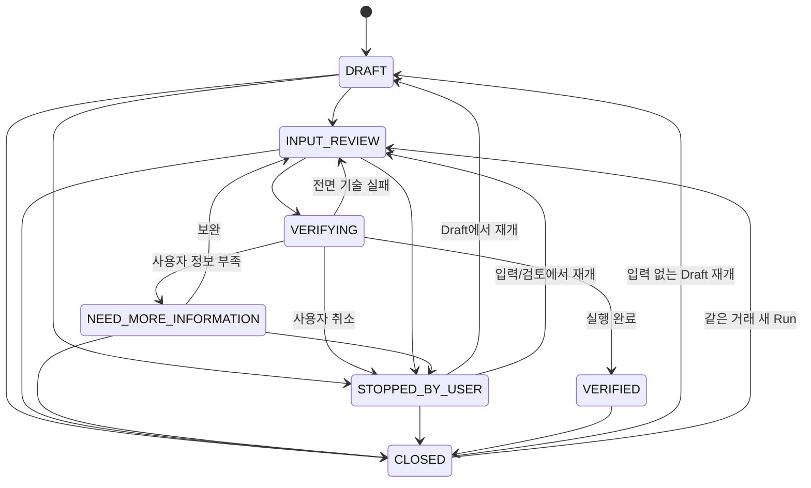

# FinShield 통합 요구사항 명세서

## 0. 문서 개요

| 항목 | 내용 |
|---|---|
| 문서명 | FinShield 통합 요구사항 명세서 |
| 문서 ID | FS-REQ |
| 버전 | v1.0.3 |
| 상태 | 개발 기준선(Baseline) |
| 작성일 | 2026-09-02 |
| 상위 문서 | `docs/01-product-plan.md` |
| 후속 문서 | `docs/03-database-spec.md`, `docs/04-feature-spec.md` |
| 적용 범위 | 2026 금융 AI Challenge 제출 서비스와 이후 확장 |

이 문서는 FinShield의 서비스 범위, 용어, 사용자와 권한, 기능, 화면, 데이터, AI Agent, 외부 연동, 비기능, 보안·개인정보, 예외처리와 우선순위를 하나의 개발 기준으로 고정한다. DB 명세와 기능명세는 이 문서의 요구사항 ID를 참조해야 하며, 구현 편의를 이유로 요구사항의 의미를 바꿀 수 없다.

### 0.1 문서 우선순위

문서와 코드가 충돌할 때 다음 순서를 적용한다.

1. `docs/02-integrated-requirements.md`
2. `docs/01-product-plan.md`
3. `docs/03-database-spec.md`, `docs/04-feature-spec.md`
4. 상위 문서와 충돌하지 않고 Architecture Decision이 `ACCEPTED`인 `docs/adr/*.md`
5. `CLAUDE.md`, `AGENTS.md`
6. 코드와 테스트

과거 PreCase 문서와 `precase.vercel.app`은 재사용 근거와 구현 참고자료다. FinShield 요구사항과 충돌하는 PreCase의 Stateless, 로그인 금지, 파일 업로드 금지, 자체 신뢰도 1~5 정책은 승계하지 않는다.

### 0.2 규범 표현

- **해야 한다**: 해당 우선순위에서 반드시 충족한다.
- **해서는 안 된다**: 안전·범위상 금지한다.
- **할 수 있다**: 선택 구현이다. 필수 수용 기준으로 해석하지 않는다.
- **초기 목표**: 실제 평가 전에 정한 운영 목표다. 신뢰센터에는 실측값만 공개한다.

### 0.3 요구사항 ID

| 접두사 | 범위 | GitHub 영역 라벨 |
|---|---|---|
| `SCP` | 서비스 범위·제약·시나리오 | `SCP 범위` |
| `ROLE` | 사용자·역할·권한 경계 | `SCP 범위`, `SEC 보안` |
| `AUTH` | 인증·계정·금융 프로필 | `F 기능`, `SEC 보안` |
| `CASE` | FinancialCase·상태·목록 | `F 기능`, `D 데이터` |
| `INP` | Text·Image·PDF·URL 입력 | `F 기능`, `SEC 보안` |
| `CLM` | Claim 추출·확인·추가 질문 | `F 기능`, `AI 에이전트` |
| `AI` | Multi-Agent·RAG·CoVe·Red Team | `AI 에이전트` |
| `EV` | Evidence·Evidence Policy | `AI 에이전트`, `D 데이터` |
| `RES` | 결과·행동 가이드 | `F 기능`, `S 화면` |
| `PASS` | Evidence Passport | `F 기능`, `D 데이터` |
| `REV` | 재검증·알림 | `F 기능`, `E 연동` |
| `PC` | FinShield 내부 PreCase | `F 기능`, `AI 에이전트` |
| `S` | 화면·사용자 흐름 | `S 화면` |
| `D` | 논리 데이터·보존 | `D 데이터` |
| `E` | 외부 API·MCP·Tool | `E 연동` |
| `N` | 성능·가용성·품질·접근성 | `N 비기능` |
| `SEC` | 보안·개인정보 | `SEC 보안` |
| `EC` | 예외·실패 안전 처리 | 원인에 따라 `F 기능`·`N 비기능`·`SEC 보안` |

요구사항은 삭제하지 않고 `폐기` 상태와 대체 ID를 남긴다. ID의 의미를 재사용하지 않는다.

### 0.4 P0·P1·P2

| 우선순위 | 의미 | 판정 기준 |
|---|---|---|
| P0 | 공모전 제출과 핵심 가치 입증에 필수 | 누락 시 대표 흐름, 안전성 또는 제출 가능성이 깨짐 |
| P1 | 본선 경쟁력과 운영 편의 강화 | P0 이후 구현하며 빠져도 핵심 흐름은 작동 |
| P2 | 장기 제품 확장 | 공모전 MVP 범위 밖 |

우선순위는 넓은 기능명이 아니라 개별 요구사항에 부여한다. P0 요구사항을 P1 기능으로 대체해 완료 처리할 수 없다.

P0는 이 문서의 대표 시나리오·지원 출처·지원 파일 범위 안에서만 적용한다. 범용 금융 플랫폼 수준의 전체 상품·기관·브라우저·운영 자동화를 뜻하지 않으며, 공통 보안·정책·데이터 장치 하나가 여러 P0 요구사항을 함께 충족할 수 있다. 범위를 벗어난 입력은 억지로 처리하지 않고 지원 범위와 `UNKNOWN`을 표시한다.

---

# 1. 서비스 범위·제약

## 1.1 서비스 정의

FinShield는 금융소비자가 대출·저축성 금융상품·투자 권유를 실행하기 전에 금융정보의 **진위성**, **거래·판매 위험**, **개인 적합성**을 전문 Agent와 공식 Evidence로 검증하고, 검증 결과를 Evidence Passport로 보관하며, 가입 후에는 동일한 FinancialCase 안에서 PreCase 소비자보호 기능으로 이어서 관리하는 계정 기반 금융서비스다.

| ID | 우선순위 | 요구사항 | 수용 기준 |
|---|---|---|---|
| SCP-001 | P0 | 서비스는 거래 실행 전 검증을 핵심 가치로 제공해야 한다. | 새 검증에서 입력→Claim 확인→Agent 검증→3축 결과→Passport가 한 흐름으로 완료된다. |
| SCP-002 | P0 | 결과는 상품 추천·판매가 아니라 의사결정 지원이어야 한다. | 순위, 구매 버튼, 자동 송금·가입·투자 실행이 없고 확인 범위와 한계를 표시한다. |
| SCP-003 | P0 | AI Agent, RAG, CoVe, Red Team, Evidence Policy가 핵심 결과 생성에 실제로 사용돼야 한다. | 대표 Case 실행 기록에서 분리된 Agent와 Tool 호출, 독립 검증, 정책 적용 결과를 확인할 수 있다. |
| SCP-004 | P0 | FinShield 사전 검증과 PreCase 가입 후 보호는 하나의 FinancialCase로 연결돼야 한다. | 별도 PreCase 사이트로 이동하지 않고 Case ID와 Passport를 이어받아 가입 후 점검을 시작한다. |
| SCP-005 | P0 | 사실을 확인하지 못하면 사기·안전·적합을 단정해서는 안 된다. | `UNKNOWN`, `NEED_MORE_INFORMATION`, `CONFLICT`, `WITHHELD`가 정상 결과로 표시된다. |
| SCP-006 | P0 | 실제 입력 P0는 Text·Image·PDF로 제한한다. | 세 입력이 작동하며 URL 콘텐츠 직접 수집은 P1로 표시된다. |
| SCP-007 | P0 | Release-blocking 대표 범위는 하나의 대출 권유 Case를 Text·Image·PDF로 완주하는 흐름이다. | 동일한 대출 시나리오가 세 입력 형식에서 Claim·공식 근거·CoVe·Red Team·Passport·PreCase까지 실제 작동하며 저축·투자 도메인 확장은 P1이다. |
| SCP-008 | P0 | 심사 흐름은 회원가입 메일이나 외부 API 하나의 성공에만 의존해서는 안 된다. | 비회원 격리 Seed 입력 1건은 실제 Agent·RAG·CoVe 파이프라인을 실행하고, 정적 사전계산 Fallback은 장애 시에만 기준일·사전계산 배지를 붙여 별도 제공한다. |
| SCP-009 | P0 | 구현되지 않은 API·정확도·자동 감시를 작동하는 것처럼 표현해서는 안 된다. | UI·기획·신뢰센터가 실제 기능 및 실측값과 일치한다. |
| SCP-010 | P0 | 범위 변경은 이 문서의 요구사항과 우선순위를 먼저 변경한 뒤 코드에 반영해야 한다. | PR에서 변경된 요구사항 ID와 영향 화면·데이터·테스트를 추적할 수 있다. |
| SCP-011 | P1 | P0 대출 수직 흐름 이후 정상 저축성 상품 검증을 확장해야 한다. | 지원 상품·기준일·예금자보호·금리조건·중도해지·유동성 근거와 정상 오탐 평가셋이 준비된다. |
| SCP-012 | P1 | P0 대출 수직 흐름 이후 투자 PDF·OpenDART 검증을 확장해야 한다. | 지원 법인·공시 범위를 공개하고 기업·상장·매출·원금보장 Claim의 확인·모순·미확인을 구분한다. |

## 1.2 대표 시나리오

| 시나리오 | 우선순위·범위 | 완료 판정 |
|---|---|---|
| 대출 권유 | P0 — 동일 Seed/지원 상품의 Text·캡처 Image·PDF, 기관·상품·공식 채널·선입금·긴급성·상환부담 | Claim별 공식 근거와 위험 신호, CoVe·Red Team, 행동 가이드, Passport·수동 재검증·PreCase |
| 저축성 상품 | P1 — 상품명·기본/우대금리·기간·중도해지·예금자보호·유동성 | 정상 상품을 근거 없이 위험 판정하지 않고 조건과 적합성 한계를 구분 |
| 투자 권유 | P1 — PDF의 기업·상장·매출·원금보장 Claim, OpenDART 대조 | DART 지원 범위를 명시하고 확인·모순·미확인을 구분 |

## 1.3 범위 밖

MVP에서는 다음을 구현하거나 암시하지 않는다.

- 금융상품 전체 카탈로그·순위·개인화 추천·중개·판매
- 사용자를 대신한 송금·대출 신청·투자 주문
- 신용평가, 법률 확정 판단, 수익 보장, 사기 확률처럼 보이는 임의의 0~100 점수
- 실시간 주식·가상자산 신호, Open Banking 계좌 연결, 자산관리 대시보드
- 모든 금융회사·비상장기업·금융상품을 포괄한다는 보장
- 원본 파일 장기 보관 기능(P0)
- URL 원문 수집·검증, 자동 재검증 Scheduler, 이메일 알림, Trusted Reviewer(P1)
- 저축성 상품·투자/OpenDART의 실제 도메인 검증(P1). P0의 PDF 입력 지원은 대출 문서로 입증한다.
- 보험·연금·채권·펀드 전체 범위, 다국어, B2B API(P2)

## 1.4 전제와 제약

- 공식 API의 범위·쿼터·키·라이선스는 구현 시점에 확인한다.
- P1 OpenDART에서 찾지 못한 기업·공시는 부존재로 확정하지 않는다.
- 금융회사 상품 API가 없거나 접근할 수 없으면 공식 문서 Snapshot을 사용하고 그 범위를 표시한다.
- 외부 출처가 실패하면 고정된 정상 응답을 실제 조회 결과처럼 제공하지 않는다.
- 업로드 원본은 기본적으로 임시 처리 후 삭제한다.
- 공모전 제출 URL은 2026-09-07 11:00부터 2026-09-11 23:59 KST까지 심사 접근이 가능해야 한다.

---

# 2. 용어 정의

| 용어 | 정의 |
|---|---|
| FinancialCase | 하나의 금융 권유·상품·거래에 대한 사전 검증부터 가입 후 보호까지의 최상위 사용자 기록 |
| Case lifecycle | `DRAFT`부터 `CLOSED`까지 사용자의 금융 의사결정 여정 상태 |
| Verification Run | 한 시점의 Claim·프로필·근거로 수행한 검증 실행. Case lifecycle과 별도 상태를 가진다. |
| Claim | 공식 근거와 대조할 수 있는 최소 사실 단위 |
| Material Claim | 상태가 달라지면 종합 결과나 행동 가이드가 달라질 수 있는 핵심 Claim |
| User-confirmed Claim | OCR·추출 결과를 사용자가 추가·수정·삭제 후 검증 대상으로 확정한 Claim |
| Evidence | Claim을 지지·반박·설명하는 출처 단위 기록 |
| Evidence Gap | 현재 결론을 바꿀 수 있지만 부족한 사용자 정보 또는 공식 근거 |
| Evidence Passport | 특정 Verification Run의 Claim·Evidence·검증 정책·결과를 재현하는 불변 버전 기록 |
| Evidence Policy | 근거 권위성·독립성·충돌·최신성·보류를 코드와 Agent에 강제하는 규칙 |
| Source Snapshot | 조회 당시 공식 원문의 식별자·발행일·조회일·버전·해시 기록 |
| Source Fingerprint | 동일 원문 복제·재게시를 독립 근거로 중복 계산하지 않기 위한 식별값 |
| Authority Level | A(법령·정부·감독기관·공시·금융회사 공식), B(공공 경보·공식 분쟁조정), C(검증된 연구·전문기관), D(일반 웹·언론·커뮤니티) |
| Support / Contradict / Context | Evidence가 Claim을 지지, 반박, 맥락 설명하는 관계 |
| `reference_only` | 유사 사례처럼 현재 거래의 사실·위법성을 직접 증명하지 않는 참고 근거 |
| `STALE` | 허용 Freshness 기준을 넘은 Cache·Snapshot. 조회시점과 한계를 함께 표시한다. |
| RAG | 외부·내부 근거를 검색해 Agent 입력으로 제공하는 구조 |
| Hybrid RAG | Metadata Filter, Keyword Search, Vector Search, Rerank를 결합한 검색 |
| CoVe | 초기 결론을 숨긴 상태에서 별도 질문·검색으로 Material Claim을 독립 재검증하는 단계 |
| Red Team | 초기 판단을 뒤집을 수 있는 공식 반대 가설과 근거를 찾는 단계 |
| Evidence Judge | Claim-Evidence 관계와 Evidence Policy로 최종 Claim 상태를 결정하는 Agent·정책 계층 |
| PreCase 가입 후 보호 | 가입 후 설명 적정성·이해도·계약 차이·정정·분쟁 준비를 FinShield 내부에서 제공하는 모듈 |
| 금융 프로필 | 적합성 판단에 필요한 최소 범주의 소득·부채부담·유동성·목적·기간·위험감수 정보 |
| 프로필 Snapshot | Verification Run 시작 당시 금융 프로필의 불변 복사본 |
| 재검증 | 추적 가능한 공식 근거 또는 사용자 정보가 바뀔 때 영향받은 Claim을 새 Run으로 다시 검증하는 기능 |
| 공개 Demo | 미리 준비된 비식별 Seed Case를 통해 로그인·개인정보 없이 핵심 기능을 체험하는 모드 |

### 2.1 Claim 상태

| 상태 | 의미 |
|---|---|
| `VERIFIED` | 권위 있는 공식 근거로 Claim이 확인됨 |
| `CONTRADICTED` | 권위 있는 공식 근거와 Claim이 명확히 모순됨 |
| `CONFLICT` | 권위 있는 출처끼리 충돌하여 한쪽을 선택할 수 없음 |
| `UNKNOWN` | 외부 근거 또는 서비스 지원 범위가 부족해 확인할 수 없음 |
| `NEED_MORE_INFORMATION` | 결론에 필요한 사용자 정보가 부족함 |
| `WITHHELD` | 안전 정책·도구 예산·형식 오류 등으로 판단을 의도적으로 보류함 |

`UNKNOWN`과 `NEED_MORE_INFORMATION`은 원인이 다르므로 서로 대체하지 않는다. Case lifecycle의 `VERIFIED`는 UI에서 **검증 완료**로 표기하며 모든 Claim이 `VERIFIED`라는 뜻이 아니다.

### 2.2 종합 결과 표현

종합 결과는 다음 우선순위 Matrix로 코드에서 결정한다. 더 높은 행의 조건이 하나라도 있으면 그 범주를 주 결과로 사용하고, 낮은 행의 미확인·부분실패는 보조 경고로 함께 보존한다.

| 우선 | 종합 결과 | 결정 조건 |
|---:|---|---|
| 1 | 중대한 위험 신호 발견 | 중대한 `CONTRADICTED` 또는 송금·원격제어·원금보장 등 승인된 고위험 규칙이 존재 |
| 2 | 높은 주의가 필요한 거래 | 비중대한 위험 신호 또는 결과를 바꿀 권위 출처 `CONFLICT`가 존재 |
| 3 | 정보 부족으로 판단 보류 | Material Claim에 `UNKNOWN`, `NEED_MORE_INFORMATION`, `WITHHELD` 또는 핵심 Agent 부분실패가 존재 |
| 4 | 진행 전 확인 필요 | Material Claim Coverage는 충족하지만 실행 전 확인·조건 이행 행동이 남음 |
| 5 | 확인된 범위에서 특별한 위험 신호 없음 | 필수 Material Claim Coverage 충족, 중대 모순·위험·충돌·보류 없음 |

“특별한 위험 신호 없음”은 안전·수익·적합을 보증하지 않는다.

---

# 3. 사용자·역할·권한

## 3.1 역할

| 역할 | 기본 권한 | 제한 |
|---|---|---|
| 비회원 | 공개 소개, 신뢰센터, 공개 Seed Demo | 실제 입력·저장·재검증·가입 후 보호 불가 |
| 회원 | 본인 Case·Profile·Passport·알림·PreCase 관리 | 다른 사용자의 데이터 접근 불가 |
| Trusted Reviewer | 공유받은 Case의 허용된 읽기 또는 의견 작성(P1) | 재공유·삭제·재검증·가입등록·전체 프로필 접근 불가 |
| 운영자 | 공용 Knowledge Base·Tool 상태·평가셋 운영 | 사용자 원본과 Case 본문 기본 접근 불가 |
| 시스템 서비스 | 서버 전용 검증·스케줄·정리 작업 | 브라우저에 Service Role·Secret 노출 불가 |

## 3.2 권한 요구사항

| ID | 우선순위 | 요구사항 | 수용 기준 |
|---|---|---|---|
| ROLE-001 | P0 | 비회원은 격리된 공개 Live Seed Demo를 실행할 수 있어야 한다. | 미리 정한 Seed 입력이 실제 Agent 파이프라인을 실행하고 종료 후 개인 입력·프로필·Case가 회원 데이터로 남지 않는다. |
| ROLE-002 | P0 | 회원은 본인 소유 데이터만 조회·변경·삭제해야 한다. | 목록, 직접 URL, API, DB RLS 테스트에서 다른 `owner_id` 접근이 모두 거부된다. |
| ROLE-003 | P0 | 심사 체험은 SMTP 성공에 의존하지 않아야 한다. | 한 번의 동작으로 세션 격리 Live Seed Demo가 시작되고, 파이프라인 장애 때만 명확한 정적 Fallback을 선택할 수 있다. |
| ROLE-004 | P0 | 공용 Demo 계정을 제공하면 사용자 간 기록이 섞여서는 안 된다. | 쓰기 금지 Seed 또는 실행별 격리·자동 초기화가 적용된다. |
| ROLE-005 | P1 | 회원은 Trusted Reviewer에게 Case별 최소 권한을 공유할 수 있어야 한다. | READ/COMMENT, 만료일, 회수, 접근 로그가 적용되고 원본·전체 프로필은 공유되지 않는다. |
| ROLE-006 | P0 | 운영자는 사용자 원본·Case 본문을 기본 열람할 수 없어야 한다. | P0 운영 화면·API에 사용자 본문 지원 조회 경로가 없고, P1에 추가할 때만 SEC-OPS-005를 적용한다. |
| ROLE-007 | P0 | Service Role과 외부 API Key는 서버에서만 사용해야 한다. | 클라이언트 번들·네트워크 응답·로그에서 Secret이 검출되지 않는다. |
| ROLE-008 | P0 | 운영자 등 권한 역할은 클라이언트에서 수정할 수 없어야 한다. | 역할 부여·변경은 서버 전용 또는 수동 승인 경로만 허용되고 자기 계정의 Role 변조가 거부된다. |
| ROLE-009 | P0 | 역할 변경은 즉시 다음 요청부터 적용돼야 한다. | 기존 세션으로 재시도해도 변경 전 권한으로 보호 자원에 접근할 수 없다. |
| ROLE-010 | P1 | Trusted Reviewer 공유 권한 회수는 즉시 적용돼야 한다. | 회수된 링크·세션으로 재시도해도 Case 접근이 거부된다. |

## 3.3 접근 매트릭스

| 기능 | 비회원 | 회원 | Trusted Reviewer | 운영자 |
|---|---:|---:|---:|---:|
| 공개 소개·신뢰센터 | 읽기 | 읽기 | 읽기 | 관리 |
| Seed Demo | 실행 | 실행 | 실행 | 관리 |
| 실제 Text·Image·PDF 검증 | 불가 | 본인만 | 불가 | 불가 |
| Case·Passport | 불가 | 본인 CRUD | 공유 범위 읽기 | 기본 불가 |
| 금융 프로필 | 불가 | 본인 CRUD | 전체 접근 불가 | 불가 |
| 수동 재검증 | 불가 | 본인만 | 불가 | 불가 |
| 가입 후 보호 | 불가 | 본인만 | 공유 범위 읽기(P1) | 불가 |
| 공용 KB·평가셋·Tool 상태 | 읽기 일부 | 읽기 일부 | 읽기 일부 | 관리 |

---

# 4. 사용자 시나리오·상태 흐름

## 4.1 기본 사용자 흐름

1. 비회원은 공개 Demo를 실행하거나 회원가입·로그인한다.
2. 회원은 새 Case의 시나리오, 현재 단계(거래 전·가입 완료·송금/피해 의심), Text·Image·PDF 입력을 선택한다.
3. 시스템은 File Gateway/OCR·Parsing을 거쳐 비모델 PII Gate에서 마스킹한 뒤, 마스킹 텍스트만 Intake Agent에 전달한다. 외부 OCR에 원본을 보내는 경우에는 별도 고지·동의를 먼저 받는다.
4. 사용자는 추출된 Claim과 불확실한 숫자·기관·URL을 확인한다.
5. 시스템은 필요한 최소 추가 질문을 제시하며 사용자는 건너뛸 수 있다.
6. Orchestrator가 필요한 Domain Agent를 실행한다.
7. Material Claim은 CoVe와 필요 시 Red Team을 거친다.
8. Evidence Judge가 Claim 상태를 결정하고 3축 결과와 행동 가이드를 만든다.
9. 회원은 Passport와 기록을 저장·조회·수동 재검증한다.
10. 가입했다면 검증 결과 상태와 무관하게 같은 Case에서 PreCase 가입 후 보호를 시작한다. 송금·피해 의심이면 가입으로 간주하지 않고 공식 긴급 행동을 먼저 표시한다.

## 4.2 Case lifecycle

| Case lifecycle | 의미 | 허용되는 다음 행동 |
|---|---|---|
| `DRAFT` | 입력을 시작했으나 Claim 확인 전 | 수정, 삭제, 입력 검토, 중단 |
| `INPUT_REVIEW` | 추출·마스킹 결과와 Claim을 사용자 확인 중 | 검증 시작, 수정, 중단 |
| `VERIFYING` | 활성 초기 Verification Run 실행 중 | 진행 조회, 취소 요청 |
| `VERIFIED` | 검증 실행이 완료되어 결과 버전이 존재 | 결과·Passport 조회, 수동 재검증, 가입 등록, 종료 |
| `NEED_MORE_INFORMATION` | 사용자 정보가 부족한 핵심 Claim이 있음 | 추가정보 입력, 확인 가능한 결과 조회, 중단 |
| `STOPPED_BY_USER` | 사용자가 흐름을 중단함 | 저장된 `resume_state`로 재개, 삭제 |
| `CLOSED` | 사용자가 Case를 종료함 | 읽기, 입력 없는 Draft는 `DRAFT`, 같은 거래 재검증은 `INPUT_REVIEW`, 다른 거래는 새 Case |

가입·피해 사실은 검증 완료 여부와 다른 축이므로 Case lifecycle에 합치지 않는다.

| Journey stage | 의미 | 다음 행동 |
|---|---|---|
| `PRE_TRANSACTION` | 아직 가입·송금 전 | 사전 검증, 조건 확인 |
| `ENROLLED` | 실제 금융상품 가입 사실을 확인 | 같은 Case에서 PreCase 점검 시작 |
| `FUNDS_SENT_OR_DAMAGE_SUSPECTED` | 송금했거나 피해가 의심되나 가입 여부는 미확정 | 공식 긴급 행동 우선, 필요 시 가입 사실 별도 확인 |

| Aftercare status | 의미 | 허용 전이 |
|---|---|---|
| `NOT_STARTED` | 가입 후 보호 미시작 | `IN_PROGRESS` |
| `IN_PROGRESS` | PreCase 점검 진행 | `ACTION_REQUIRED`, `COMPLETED` |
| `ACTION_REQUIRED` | 정정·문의·신고·분쟁 준비 행동이 남음 | 자료 보완 후 `IN_PROGRESS`, 행동 완료 후 `COMPLETED` |
| `COMPLETED` | 현재 가입 후 점검을 완료 | 새 자료가 있으면 `IN_PROGRESS` |

## 4.3 실행 상태

- Verification Run: `QUEUED`, `RUNNING`, `COMPLETED`, `PARTIAL`, `FAILED`, `CANCELLED`
- Revalidation Job: `QUEUED`, `RUNNING`, `NO_CHANGE`, `CHANGED`, `FAILED`
- Case lifecycle, Journey stage, Aftercare status, Verification Run, Claim 상태를 하나의 `status` 컬럼으로 합치지 않는다.
- 수동 재검증 중에도 성공 Passport가 있는 Case lifecycle은 `VERIFIED`를 유지하고 Revalidation Job 상태만 바뀐다. 실패해도 이전 Passport와 Case lifecycle을 보존한다.

## 4.4 상태 요구사항

| ID | 우선순위 | 요구사항 | 수용 기준 |
|---|---|---|---|
| CASE-001 | P0 | 회원은 여러 Case를 생성·임시저장·재개·목록조회·삭제할 수 있어야 한다. | 날짜·시나리오·상태가 보이고 최신순 정렬과 상태 필터가 작동한다. |
| CASE-002 | P0 | Case lifecycle, Journey stage, Aftercare, Run, Claim 상태는 분리해야 한다. | 사용자 확정 Material Claim 중 정보 부족 항목이 남으면 Run은 `PARTIAL`, Case는 `NEED_MORE_INFORMATION`으로 매핑한다. 사용자가 오추출 Claim을 삭제하거나 비Material Claim을 제외한 사실만으로 보류하지 않는다. |
| CASE-003 | P0 | Case당 활성 초기 Verification Run은 하나만 허용해야 한다. | 중복 클릭·네트워크 재시도에 같은 Idempotency Key가 사용되고 중복 Run이 생기지 않는다. |
| CASE-004 | P0 | 완료된 Case·Passport는 페이지 이탈·다른 기기 로그인 후 복원해야 한다. | 새 세션에서 완료 결과와 최신·과거 버전이 동일하게 조회된다. 진행 중 Job의 Cross-device 복원은 P1이다. |
| CASE-005 | P0 | 전면 기술 실패는 Case를 확정 결과로 만들지 않아야 한다. | Run은 `FAILED`, Case는 재시도 가능한 `INPUT_REVIEW`가 되고 실패 Claim을 확정하지 않는다. |
| CASE-006 | P0 | 사용자 Claim 수정·프로필 변경·재검증은 과거 결과를 덮어쓰지 않아야 한다. | 새 Run·Passport 버전이 생성되고 이전 버전이 그대로 조회된다. |
| CASE-007 | P0 | 검증 가능한 Claim과 정보 부족 Claim이 함께 있으면 가능한 부분은 계속 검증해야 한다. | 전체 Case를 실패시키지 않고 Claim별 상태와 누락 영향을 표시한다. |
| CASE-008 | P0 | 새 Case 시작 시 `PRE_TRANSACTION`, `ENROLLED`, `FUNDS_SENT_OR_DAMAGE_SUSPECTED`를 구분해야 한다. | 이미 가입한 사용자는 최소 Claim 확인 후 검증 상태와 무관하게 Aftercare를 시작하고, 송금·피해 의심은 가입 처리 없이 공식 긴급 행동을 먼저 본다. |
| CASE-009 | P0 | 가입 사실과 PreCase 시작 자격은 Case `VERIFIED` 여부에 종속돼서는 안 된다. | `NEED_MORE_INFORMATION` 또는 부분 결과가 있어도 실제 가입 확인 후 같은 Case에서 Aftercare를 시작할 수 있다. |
| CASE-010 | P0 | 닫힌 Case를 재개하면 과거 이벤트와 `resume_state`를 유지해야 한다. | 입력 없는 Draft는 `DRAFT`, 동일 거래 재검증은 `INPUT_REVIEW`와 새 Run, 다른 상품·거래는 새 Case로 안내하며 과거 Passport를 덮어쓰지 않는다. |
| CASE-011 | P0 | 중단·종료 시 마지막으로 재개 가능한 상태를 `resume_state`로 저장해야 한다. | 입력·Claim이 없는 Case를 `INPUT_REVIEW`로 보내지 않고 허용된 상태만 복원한다. |

---

# 5. 기능 요구사항

## 5.1 인증·계정·금융 프로필

| ID | 우선순위 | 요구사항 | 수용 기준 |
|---|---|---|---|
| AUTH-001 | P0 | 이메일·비밀번호 회원가입, 로그인, 로그아웃을 제공해야 한다. | 가입 후 본인 세션에서 보호 화면에 접근하고 로그아웃 후 접근이 차단된다. |
| AUTH-002 | P0 | 세션 갱신·만료와 보호 경로 복귀를 지원해야 한다. | 미인증 사용자는 로그인 후 원래 요청한 안전한 경로로 돌아간다. |
| AUTH-003 | P1 | 비밀번호 재설정을 제공해야 한다. | 재설정 토큰의 만료·재사용이 차단되고 공개 Demo와 기존 로그인은 SMTP 장애와 독립적으로 작동한다. |
| AUTH-004 | P0 | 동일 계정은 다른 기기에서 동일한 Case와 Passport를 조회해야 한다. | 두 브라우저에서 소유 데이터와 최신 버전이 일치한다. |
| AUTH-005 | P0 | 회원은 Case 삭제와 회원 탈퇴를 수행할 수 있어야 한다. | 확인 절차 후 소유 데이터와 파생 Embedding이 보존정책에 따라 제거되고 재접근이 차단된다. |
| AUTH-006 | P0 | 금융 프로필은 최소 범주와 수집 목적을 설명해야 한다. | 소득·부채부담·비상자금·목적·기간·유동성·손실감내 항목별 목적이 표시된다. |
| AUTH-007 | P0 | 금융 프로필 입력은 건너뛸 수 있어야 한다. | 미입력이어도 진위성·거래위험 검증은 진행되고 적합성만 `NEED_MORE_INFORMATION`이 된다. |
| AUTH-008 | P0 | 검증 시작 시 금융 프로필 Snapshot을 고정해야 한다. | 이후 프로필 수정이 과거 Passport를 바꾸지 않는다. |
| AUTH-009 | P0 | 비밀번호·Secret·정확한 금융정보를 로그에 남겨서는 안 된다. | 로그 정책 테스트에서 금지 필드가 마스킹 또는 제외된다. |
| AUTH-010 | P1 | 신규 가입 이메일 확인을 제공할 수 있어야 한다. | 확인 토큰의 만료·재사용·재전송이 통제되고 미확인 정책을 사용자에게 명시한다. |
| AUTH-011 | P0 | 계정 탈퇴와 민감 설정 변경에는 최근 재인증을 요구해야 한다. | 오래된 세션만으로 탈퇴·이메일/비밀번호 변경을 수행할 수 없고 재인증 후 원래 작업으로 복귀한다. |

## 5.2 입력·파일 처리

| ID | 우선순위 | 요구사항 | 수용 기준 |
|---|---|---|---|
| INP-001 | P0 | 실제 검증 입력으로 Text·JPEG/PNG Image·PDF를 지원해야 한다. | 각 형식으로 Case를 생성하고 Claim 확인 단계까지 진행한다. |
| INP-002 | P1 | URL 원문 수집·검증을 지원할 수 있어야 한다. | SSRF 방어와 공식/비공식 출처 구분 후 Snapshot을 남긴다. |
| INP-003 | P0 | 파일 확장자, MIME, Magic Byte를 함께 검증해야 한다. | 서로 불일치하거나 허용되지 않은 형식은 Parser 실행 전에 거부된다. |
| INP-004 | P0 | 초기 운영 제한은 파일 10MB, PDF 30쪽으로 설정하되 구성값으로 관리해야 한다. | UI와 API가 같은 제한값을 사용하고 초과 사유를 표시한다. |
| INP-005 | P0 | 암호화·손상·실행성 콘텐츠가 포함된 PDF를 안전하게 처리해야 한다. | 해제 비밀번호를 수집하지 않고 거부 또는 안전한 텍스트 직접입력 경로를 제공한다. |
| INP-006 | P0 | Image OCR과 PDF Text Parsing을 수행하고 페이지·영역 위치를 보존해야 한다. | 원본 삭제 전 Claim 확인 화면에서 페이지·영역을 대조하고, 삭제 후에는 마스킹된 발췌와 Locator만 조회한다. |
| INP-007 | P0 | 낮은 추출 신뢰도의 숫자·기관명·상품명·URL을 강조해야 한다. | 사용자가 원문과 대조해 수정하며 미확인 항목은 자동 확정되지 않는다. |
| INP-008 | P1 | OCR·Parsing 실패 페이지를 개별 표시하고 페이지별 재시도를 제공해야 한다. | 일부 페이지 실패가 전체 파일의 성공으로 숨겨지지 않는다. P0는 전체 재업로드·Text 직접입력으로 복구한다. |
| INP-009 | P0 | PII는 비모델 PII Gate에서 Intake LLM·Embedding·Domain Agent·Tool보다 먼저 마스킹해야 한다. | 동의한 외부 OCR 예외를 제외하고 테스트 PII가 Model 입력·Embedding·Trace·로그에서 검출되지 않는다. |
| INP-010 | P0 | 원본 기본 미보관과 임시 처리 정책을 업로드 전에 고지해야 한다. | 동의 화면에 저장 대상과 삭제 시점이 구분되어 있다. |
| INP-011 | P0 | P0에서는 원본을 장기 보관하지 않아야 한다. | Claim 확인 완료·사용자 중단·Case 삭제 중 먼저 도달한 시점에 삭제를 시도하고, 어떤 경우든 임시 객체는 최대 24시간 TTL로 만료되며 실패는 운영 경보가 된다. |
| INP-012 | P0 | 외부 문서 안의 명령문을 데이터로 취급하고 Prompt로 실행해서는 안 된다. | Injection Fixture가 미허용 Tool·정책·역할·Secret 또는 다른 Case 접근을 바꾸지 못하고 탐지 기록만 남긴다. |
| INP-013 | P0 | 입력 처리 순서는 `Private Quarantine→File 검사/OCR·Parsing→PII Gate→Masked Intake`로 고정해야 한다. | 상태를 건너뛴 Model·Embedding 호출이 차단되고, 외부 OCR 원본 전송은 SEC-PRI-010 동의가 있을 때만 허용된다. |

## 5.3 Claim 추출·확인·추가 질문

| ID | 우선순위 | 요구사항 | 수용 기준 |
|---|---|---|---|
| CLM-001 | P0 | Intake Agent는 입력을 검증 가능한 최소 Claim으로 분리해야 한다. | 기관·상품·수치·기간·URL·행동요구가 복합 문장에서 분리된다. |
| CLM-002 | P0 | Claim마다 입력 위치, 추출 방법, 사용자 수정 여부를 기록해야 한다. | Image/PDF Claim에서 페이지·영역과 수정 이력을 조회한다. |
| CLM-003 | P0 | 사용자는 Claim을 추가·수정·삭제·검증대상 선택·확정할 수 있어야 한다. | 이번 Run에 선택된 Material Claim만 `user_confirmed=true`를 요구하며, 미확정 Claim은 제외·`NEED_MORE_INFORMATION` 처리하고 확인된 Claim 검증은 계속한다. |
| CLM-004 | P0 | 숫자·단위·부정 표현·조건부 표현을 보존해야 한다. | `2.1%`, `최대`, `원금 보장 아님` 등이 의미 반전 없이 구조화된다. |
| CLM-005 | P1 | Evidence Gap Resolver는 결과를 바꿀 Material 정보만 질문해야 한다. | 질문마다 영향받는 Claim과 질문 이유가 연결된다. P0는 부족 항목과 영향만 표시하고 사용자가 Claim을 직접 보완한다. |
| CLM-006 | P1 | 사용자는 동적 추가 질문을 건너뛸 수 있어야 한다. | 해당 Claim만 `NEED_MORE_INFORMATION`이 되고 다른 검증은 계속된다. |
| CLM-007 | P1 | 보완 입력 후 전체가 아니라 영향받은 Claim·Agent만 증분 재실행할 수 있어야 한다. | 새 Run에서 재실행 범위와 이전 결과 재사용 여부가 Trace에 남는다. P0는 지원 범위 전체 재실행을 허용한다. |
| CLM-008 | P0 | 모델이 추출하지 않은 Claim을 후속 Agent가 새 사실로 생성해서는 안 된다. | 최종 Claim은 사용자 확정 목록 또는 명시된 파생 Claim과 연결된다. |
| CLM-009 | P0 | 월·분기처럼 날짜가 불완전한 입력에 임의의 일자를 부여해서는 안 된다. | 적용 법령·상품조건의 경계일에 영향이 있으면 기간으로 보존하거나 추가 질문 후 해당 Claim을 보류한다. |

## 5.4 Multi-Agent·RAG·검증

### 5.4.1 Agent 책임

| Agent | 책임 | P0 핵심 Tool 범위 |
|---|---|---|
| File Gateway·PII Gate | 원본 격리, 파일 검사, OCR·Parsing, 결정적 PII 마스킹 | OCR·Parser·PII Filter(비모델 전처리) |
| Intake Agent | 마스킹된 텍스트 이해, 엔터티·Claim 후보 추출 | Masked Input·Claim Schema |
| Orchestrator Agent | 시나리오·Materiality 분류, Agent 선택, 예산·시간 관리 | Agent Registry |
| Product & Institution Agent | 기관·기업·상품·조건·공식 채널 확인 | P0 대출 공식 문서·Structured Adapter; OpenDART는 P1 |
| Fraud & Channel Agent | 사칭·URL 문자열·계좌·선입금·원격제어·긴급성 분석 | P0 URL Host/Scheme Parser·공식 채널 Registry·Warning/Pattern; 외부 Fetch·Reputation은 P1 |
| Sales Conduct Agent | 설명·권유 과정·오인·누락 검토 | PreCase `analyze_risk_pattern`, `check_documents` |
| Regulation & Dispute Agent | 법령·판례·분쟁조정·약관 검색 | `lookup_statute`, `search_precedent`, `search_case` |
| Profile Policy Validator (비모델) | 프로필 Snapshot과 부담·유동성·위험을 결정적 규칙으로 비교하고, 미입력 시 적합성 축만 보류 | Profile Policy |
| CoVe Agent | Material Claim 독립 질문·검색·재검증 | 초기 Query와 분리된 Retrieval |
| Red Team Agent | 초기 판단을 뒤집는 공식 반대 근거 탐색 | 반대 가설 Retrieval |
| Evidence Judge | Evidence Policy에 따른 Claim 상태·종합 결과 결정 | Policy Validator |
| Action Guide Agent | 확인·중단·문의·신고·정정·분쟁 준비 안내 | 승인된 공식 채널 Registry |

### 5.4.2 AI 요구사항

| ID | 우선순위 | 요구사항 | 수용 기준 |
|---|---|---|---|
| AI-001 | P0 | 각 Agent는 별도 실행 단위, Agent ID, 입력·출력 JSON Schema를 가져야 한다. | `agent_runs`에 개별 시작·종료·상태가 있고 하나의 Prompt를 여러 Agent처럼 복제 표시하지 않는다. |
| AI-002 | P0 | Agent마다 Tool Allowlist를 코드로 강제해야 한다. | 허용되지 않은 Tool 호출은 실행 전 차단되고 감사 가능한 오류로 남는다. |
| AI-003 | P1 | Orchestrator는 Case에 필요한 3~6개 Domain Agent를 동적으로 선택해야 한다. | 선택 이유와 생략 Agent가 기록된다. P0 대출 범위는 고정된 3~4개 실제 Domain Agent 파이프라인을 사용한다. |
| AI-004 | P1 | 독립적인 Domain Agent는 가능한 경우 병렬 실행해야 한다. | 실행 시간선에서 병렬 구간을 확인하고 공유 mutable state로 결과가 오염되지 않는다. P0는 시간 상한 안의 순차 실행을 허용한다. |
| AI-005 | P0 | Agent 실행에는 모델·Prompt/Schema 버전, Tool, 시간, 상태, 비용·토큰, 실패 이유를 저장해야 한다. | Passport 재현에 필요한 버전 정보가 있고 원문·PII·Chain-of-thought는 저장하지 않는다. |
| AI-006 | P0 | Structured Retrieval을 정확한 식별자·수치 조회에 우선해야 한다. | 기관·공시·상품 식별에서 Vector 유사도만으로 사실을 확정하지 않는다. |
| AI-007 | P0 | 비정형 자료는 Metadata Filter→Keyword→Vector→Authority/Freshness/Relevance Rerank를 사용해야 한다. | 검색 Trace에 단계별 후보 수와 최종 Evidence 선택 근거가 남는다. |
| AI-008 | P0 | 공용 Knowledge Base와 사용자 문서·Embedding을 분리해야 한다. | 사용자 데이터가 공용 검색에 나타나지 않고 owner·case RLS 또는 Ephemeral 삭제가 적용된다. |
| AI-009 | P0 | Material Claim에는 CoVe 독립 검증을 수행해야 한다. | 초기 자연어 결론을 입력하지 않은 검증 질문·별도 검색과 유지/반박/미확인 결과가 남는다. |
| AI-010 | P0 | 고위험·고비용 Material Claim에는 Red Team 반대 가설을 적용해야 한다. | 대출 선입금·원격제어·사칭 공식채널 등 P0 대표 Claim에서 공식 반대 근거 탐색 기록이 존재하며 투자 원금보장은 P1 평가에서 확장한다. |
| AI-011 | P0 | CoVe·Red Team이 반대 근거를 찾지 못했다는 이유만으로 Claim을 확정해서는 안 된다. | 지지 공식 근거가 없으면 `UNKNOWN` 또는 `WITHHELD`다. |
| AI-012 | P0 | Evidence Judge의 정책 불변식은 모델 응답 이후 코드 Validator로 다시 확인해야 한다. | 근거 없는 `VERIFIED`, 잘못된 Citation, 금지 상태 전이가 저장 전에 거부된다. |
| AI-013 | P0 | Evidence Judge에는 가능한 한 사용자 원문 대신 확인된 Claim·Evidence 구조를 전달해야 한다. | Judge 입력 Schema에 Raw File·원문 PII 필드가 없다. |
| AI-014 | P0 | 사용자에게 내부 Chain-of-thought를 노출하지 않아야 한다. | 화면에는 Agent·Tool·출처·정책·성공/실패의 감사 가능한 요약만 표시된다. |
| AI-015 | P0 | 일부 Agent 실패는 담당 Claim만 안전하게 저하시켜야 한다. | 성공 Agent 결과는 표시되고 실패 영역은 `UNKNOWN`/`WITHHELD`와 재시도 안내가 된다. |
| AI-016 | P0 | Agent·Tool 예산과 반복 상한을 서버에서 강제해야 한다. | 상한 초과 시 무한 반복 없이 `WITHHELD` 또는 부분 결과로 종료한다. |
| AI-017 | P0 | Model 출력은 Schema Validation과 Citation Validation을 통과해야 한다. | 형식 오류는 제한 재시도 후 보류되며 파싱 실패 문자열이 사용자 판단으로 노출되지 않는다. |
| AI-018 | P0 | 기존 PreCase의 `LIKELY/UNLIKELY`와 자기평가 1~5를 FinShield 최종 상태로 재사용해서는 안 된다. | 사용자 결과는 6개 Claim 상태와 3축 범주형 결과만 사용하고 Legacy 값은 이관 완료 전 내부 호환에만 한정된다. |
| AI-019 | P0 | 보안 Prompt Red Team 테스트와 의사결정 Red Team Agent를 구분해야 한다. | 고위험 Claim Run에 반대가설·검색·Judge 재계산 기록이 있고 보안 테스트 통과를 대신 제시하지 않는다. |
| AI-020 | P0 | Orchestrator는 Domain 결론을 직접 생성해서는 안 된다. | 선택·예산·병합만 수행하고 최종 사실 상태는 Evidence Judge·Policy Validator가 결정한다. |
| AI-021 | P0 | P0 대출 흐름은 시나리오 버전에 고정된 3~4개 실제 Domain Agent를 실행해야 한다. | Product/Institution, Fraud/Channel, PreCase 기반 Sales/Regulation 중 정의된 Agent가 별도 실행·Schema·Run 기록을 만들고 하나의 Prompt 결과를 여러 Agent처럼 표시하지 않는다. |

## 5.5 Evidence·Evidence Policy

### 5.5.1 출처 권위성

| 등급 | 출처 | 사용 원칙 |
|---|---|---|
| A | 법령 원문, 정부·감독기관 API, OpenDART 공시, 금융회사 공식 문서 | 사실 Claim의 우선 근거 |
| B | 공공기관 보도자료·소비자경보·공식 분쟁조정 | 사실·위험 맥락의 권위 근거 |
| C | 검증된 연구·전문기관 자료 | 보조 설명, 단독 확정은 Claim 유형에 따라 제한 |
| D | 일반 웹·블로그·커뮤니티·언론 요약 | 탐색·맥락만 허용, 단독 확정 금지 |

### 5.5.2 Evidence 요구사항

| ID | 우선순위 | 요구사항 | 수용 기준 |
|---|---|---|---|
| EV-001 | P0 | 모든 핵심 사실 판단은 하나 이상의 Claim-Evidence 연결을 가져야 한다. | 결과 카드에서 해당 Evidence를 직접 열 수 있고 누락 시 확정 상태가 저장되지 않는다. |
| EV-002 | P0 | Evidence는 출처 유형·등급·제목·URL/공식 ID·원문 위치·발행일·조회일·버전/해시를 가져야 한다. | 필수 필드 누락은 화면에 `근거 메타데이터 불완전`으로 표시되고 A/B 확정 근거로 승격되지 않는다. |
| EV-003 | P0 | Claim과 Evidence 관계를 `SUPPORT`, `CONTRADICT`, `CONTEXT`로 저장해야 한다. | 같은 Evidence를 관계 없이 단순 목록으로만 표시하지 않는다. |
| EV-004 | P0 | 사실 Claim 확정 근거는 권위 등급 외 직접성·완전성·최신성·대상 일치 조건을 모두 충족해야 한다. | `citable=true`, `reference_only=false`, `incomplete=false`, 허용 Freshness, 동일 기관·상품·기간, Claim 직접 지지/반박을 모두 만족해야 하며 소비자경보·분쟁조정 B등급이라는 이유만으로 현재 거래를 확정하지 않는다. |
| EV-005 | P0 | 권위 출처가 충돌하면 평균·다수결로 해결해서는 안 된다. | Claim은 `CONFLICT`가 되고 양쪽 원문과 날짜를 함께 표시한다. |
| EV-006 | P0 | 동일 원문 복제·재게시를 독립 근거로 계산해서는 안 된다. | Source Fingerprint 중복이 독립 근거 수에서 하나로 계산된다. |
| EV-007 | P0 | 유사 분쟁·사기 사례는 `reference_only`로 표시해야 한다. | 유사 사례만으로 현재 거래를 사기·위법·부적합으로 확정하지 않는다. |
| EV-008 | P0 | 경고 검색 결과가 없다는 사실을 안전 근거로 사용해서는 안 된다. | `검색 결과 없음`은 검색 범위와 함께 표시되고 안전 결론을 자동 생성하지 않는다. |
| EV-009 | P0 | Cache·Snapshot의 Freshness와 조회시점을 표시해야 한다. | 만료 자료는 `STALE`이고 최신 조회 실패 이유와 함께 제공된다. |
| EV-010 | P0 | Citation은 Tool이 반환한 원문 범위와 일치해야 한다. | 존재하지 않는 조문·공시·수치·URL은 Citation Validator에서 차단된다. |
| EV-011 | P0 | Claim 상태의 이유를 사용자 정보 부족과 근거 부족으로 구분해야 한다. | 사용자 입력 부족은 `NEED_MORE_INFORMATION`, 지원범위·외부 근거 부족은 `UNKNOWN`이다. |
| EV-012 | P0 | 안전 정책·예산·형식 문제로 판단할 수 없으면 `WITHHELD`를 사용해야 한다. | 보류 이유와 필요한 다음 행동이 함께 표시된다. |
| EV-013 | P0 | Citation은 `evidence_id`, `source_id`, 원문 Locator의 Typed Reference로 렌더해야 한다. | 법령은 법령명과 조문번호를 함께 대조하며 다른 법률의 동일 조문번호가 통과하지 않는다. |
| EV-014 | P0 | 판례·분쟁 자료에 본문·판시·원문 위치가 없으면 직접 사실근거로 사용해서는 안 된다. | 메타데이터만 있는 자료는 `reference_only`이며 Material Claim 확정 근거가 되지 않는다. |
| EV-015 | P0 | 비포괄 검색의 미검색 결과를 부존재·반박 Evidence로 사용해서는 안 된다. | 검색 결과 0건은 지원 범위와 Query를 남긴 `UNKNOWN`이며 `CONTRADICTED` 관계를 만들지 않는다. |
| EV-016 | P0 | 시나리오별 Material Claim Coverage 계약을 버전 관리해야 한다. | 필수 Claim 유형·확인 조건·제외 사유·Coverage 분모가 정책 버전에 고정되고 `특별한 위험 신호 없음` 판정을 재현할 수 있다. |

### 5.5.3 Evidence Policy 규칙

| 정책 | 강제 규칙 |
|---|---|
| EP-01 No Evidence, No Claim | 근거 없는 Claim 확정 금지 |
| EP-02 Primary Source First | 공식 1차 근거 우선 |
| EP-03 Conflict Preservation | 권위 출처 충돌 보존 |
| EP-04 Freshness | 발행·조회·버전 표시 |
| EP-05 Independent Verification | 복제 출처 중복 제거, CoVe 독립성 |
| EP-06 Abstention | 근거·정보·안전 문제 시 보류 |
| EP-07 Citation Required | 사용자 핵심 판단과 출처 직접 연결 |
| EP-08 Similar Case Is Not Proof | 유사 사례의 참고 한계 강제 |
| EP-09 Absence of Warning Is Not Safety | 미검색 결과를 안전 보증으로 사용 금지 |

## 5.6 결과·행동 가이드

| ID | 우선순위 | 요구사항 | 수용 기준 |
|---|---|---|---|
| RES-001 | P0 | 결과는 진위성·거래/판매 위험·개인 적합성 3축으로 분리해야 한다. | 축별 Claim·상태·근거·한계가 있고 한 축 결과를 다른 축에 복제하지 않는다. |
| RES-002 | P0 | 종합 결과는 정의된 범주형 상태를 사용해야 한다. | 임의의 사기확률·안전점수·신뢰도 0~100이 없다. |
| RES-003 | P0 | `특별한 위험 신호 없음`은 Material Claim Coverage가 충족되고 중대 모순·위험이 없을 때만 사용해야 한다. | 바로 옆에 확인 범위와 안전 보증이 아니라는 문구가 표시된다. |
| RES-004 | P0 | 중대한 `CONTRADICTED` 또는 고위험 행동요구는 행동 가이드에 우선 반영해야 한다. | 선입금·원격제어·원금보장 모순이 결론 아래에서 숨겨지지 않는다. |
| RES-005 | P0 | 결과 첫 화면은 지금 할 행동을 결론과 동급 또는 우선 노출해야 한다. | 공식 확인, 중단, 문의, 신고, 정정 중 근거에 맞는 행동이 첫 화면에 있다. |
| RES-006 | P0 | 위험·사기·위법을 공식 근거 없이 단정해서는 안 된다. | 표현 테스트에서 `사기 확정`, `불법 확정`, `무조건 안전`이 정책 없이 생성되지 않는다. |
| RES-007 | P0 | 공식 확인·문의·신고 채널은 승인된 Registry와 출처를 사용해야 한다. | 모델이 전화번호·URL을 생성하지 않고 공식 식별자와 조회일을 표시한다. |
| RES-008 | P0 | 부분 실패·STALE·미확인 범위를 결과 상단에서 알 수 있어야 한다. | 사용자가 상세를 열지 않아도 제한 상태와 영향 축을 인지한다. |
| RES-009 | P0 | 결과는 Claim별 근거 상세과 CoVe·Red Team·정책 적용 요약으로 이동할 수 있어야 한다. | 핵심 Claim에서 한 번의 동작으로 상세 출처를 연다. |
| RES-010 | P0 | 결과에는 금융·법률 전문가를 대체하지 않는다는 한계와 공식 채널을 제공해야 한다. | 면책이 행동 안내를 가리거나 단순 책임회피 문구로만 끝나지 않는다. |
| RES-011 | P0 | 단일 종합 결과는 2.2의 코드 Policy Matrix로 결정해야 한다. | 같은 Claim 상태·정책 버전은 항상 같은 주 결과를 만들고, 더 낮은 우선순위의 미확인·부분실패는 보조 경고로 보존하며 Agent가 임의로 범주를 선택하지 않는다. |

## 5.7 Evidence Passport·검증기록

| ID | 우선순위 | 요구사항 | 수용 기준 |
|---|---|---|---|
| PASS-001 | P0 | 완료·부분완료·보류 결과마다 Evidence Passport를 생성해야 한다. | Case ID, 시간, 확정 Claim, 상태·Evidence, CoVe·Red Team·정책, 3축 결과·행동, 엔진·프로필 버전이 포함된다. |
| PASS-002 | P0 | Passport 버전은 생성 후 수정해서는 안 된다. | 정정·재검증은 새 버전을 만들고 이전 해시와 내용이 유지된다. |
| PASS-003 | P0 | 불변성은 사용자의 전체 Case 삭제권을 막지 않아야 한다. | Passport 개별 덮어쓰기는 불가하지만 소유 Case 삭제 시 정책에 따라 함께 삭제된다. |
| PASS-004 | P0 | Passport는 다른 기기에서 조회 가능해야 한다. | 동일 계정의 두 세션에서 같은 버전·Evidence 메타데이터를 본다. |
| PASS-005 | P1 | Passport는 인쇄와 파일 다운로드를 지원해야 한다. | 민감정보 마스킹·생성일·버전·한계가 포함된 사용자용 문서가 생성된다. P0는 반응형 HTML Passport 조회를 제공한다. |
| PASS-006 | P0 | 검증기록은 최신 버전과 과거 버전을 명확히 구분해야 한다. | 목록·상세에 최신/과거 Badge와 검증시각이 표시된다. |
| PASS-007 | P0 | Passport 공유는 기본 비공개여야 한다. | 인증되지 않은 URL로 본인 Passport가 노출되지 않는다. |
| PASS-008 | P1 | 만료·회수 가능한 Passport 공유 링크를 제공할 수 있어야 한다. | 최소 정보, 만료, 회수, 접근 기록이 적용된다. |

## 5.8 재검증·알림

| ID | 우선순위 | 요구사항 | 수용 기준 |
|---|---|---|---|
| REV-001 | P0 | 회원은 결과가 있는 Case의 수동 재검증을 내구성 있는 서버 Job으로 시작할 수 있어야 한다. | 중복 요청이 제한되고 Queue/Worker의 Lease·Heartbeat·Retry로 페이지 이동 후에도 같은 기기 Dashboard에서 상태·완료 결과를 확인한다. 진행률의 다른 기기 복원은 P1이다. |
| REV-002 | P0 | 수동 재검증은 추적 가능한 Source Snapshot을 다시 조회해야 한다. | 임의 웹 전체 감시를 암시하지 않고 조회 가능 출처와 실패 출처를 구분한다. |
| REV-003 | P1 | 영향받은 Claim·Agent·CoVe·Judge만 증분 재실행해야 한다. | 재실행 범위, 재사용 Evidence, 새 Evidence가 Run 기록에 남는다. P0 수동 재검증은 지원 범위 전체 재실행을 허용한다. |
| REV-004 | P0 | 재검증은 이전 Passport를 덮어쓰지 않아야 한다. | 새 버전과 이전 버전의 상태·근거·결론·행동 차이를 조회한다. |
| REV-005 | P0 | 수동 재검증 완료와 결과에 영향을 준 변경을 앱 내 알림으로 알려야 한다. | 알림에서 해당 버전 비교로 이동하고 읽음 처리할 수 있다. |
| REV-006 | P0 | 변경이 없으면 불필요한 위험 알림을 만들지 않아야 한다. | Job은 `NO_CHANGE`로 끝나고 완료 상태만 조용히 표시된다. |
| REV-007 | P0 | P0 화면에서 자동 감시 중이라고 표현해서는 안 된다. | 자동 변경 감지 설정은 숨기거나 P1 예정으로 명확히 표시된다. |
| REV-008 | P1 | 공식 출처 Polling/Event 기반 자동 재검증을 제공할 수 있어야 한다. | Material Change만 알리고 출처·주기·마지막 확인시각을 표시한다. |
| REV-009 | P1 | 이메일 알림과 Digest를 제공할 수 있어야 한다. | 동의·해지·발송 실패·중복 억제가 적용된다. |

## 5.9 FinShield 내부 PreCase 가입 후 보호

| ID | 우선순위 | 요구사항 | 수용 기준 |
|---|---|---|---|
| PC-001 | P0 | `이 상품에 가입했어요`와 `이미 송금했어요/피해가 의심돼요`를 서로 다른 흐름으로 제공해야 한다. | 가입만 Journey stage `ENROLLED`로 기록하고, 송금·피해 의심은 `FUNDS_SENT_OR_DAMAGE_SUSPECTED`와 공식 긴급 행동을 우선하며 가입 사실을 별도로 확인한다. |
| PC-002 | P0 | 사용자를 `precase.vercel.app`으로 Redirect하거나 별도 계정을 요구해서는 안 된다. | FinShield URL·세션·FinancialCase 안에서 전 흐름이 완료된다. |
| PC-003 | P0 | 가입 후 점검은 설명받은 손실·중도해지·우대조건·위험과 실제 이해도를 확인해야 한다. | 단순 가입 여부 설문이 아니라 조건별 이해·설명 답변이 저장된다. |
| PC-004 | P0 | 사전 Claim과 실제 계약 조건의 차이를 확인해야 한다. | 차이가 있는 Claim, 계약 조건, 확인 필요 행동이 연결된다. |
| PC-005 | P0 | Sales Conduct Agent와 Regulation & Dispute Agent 및 기존 PreCase Tool을 실제 실행해야 한다. | 실행 기록에 재사용 Agent·Tool·Evidence가 남는다. |
| PC-006 | P0 | 가입 후 결과는 정상 관리·추가 설명·정정/문의·분쟁 준비 중 근거 기반 행동을 제공해야 한다. | 결과마다 이유·공식 채널·필요 자료가 있으며 유사 사례만으로 분쟁 가능성을 확정하지 않는다. |
| PC-007 | P0 | PreCase에는 Case ID, 마스킹 Claim·Evidence·Passport·프로필 Snapshot·동의 자료만 전달해야 한다. | 원본·불필요한 PII·다른 Case 정보가 Agent 입력과 저장소에 없다. |
| PC-008 | P0 | 가입 후 새 Image·PDF도 동일한 임시 업로드·마스킹·삭제 정책을 적용해야 한다. | 계약 문서가 예외적으로 영구 보관되지 않고 Claim 확인·중단·최대 24시간 기준으로 삭제된다. |
| PC-009 | P0 | 가입 등록 오입력은 과거 이벤트 삭제 대신 정정 이벤트로 처리해야 한다. | 원래 등록과 정정 시각·내용이 Timeline에 남고 최신 상태가 구분된다. |
| PC-010 | P0 | 이미 금전 피해가 의심되면 예방 안내보다 공식 긴급 행동을 우선해야 한다. | 지급정지·기관 확인·신고 등 승인된 채널이 우선 표시된다. |
| PC-011 | P0 | 원본 계약·권유 자료는 사용자가 본인 기기에 별도 보관하도록 안내해야 한다. | 업로드 전과 가입 후 보호 화면에 서버 원본 미보관·삭제 시점과 분쟁 준비를 위한 로컬 원본 보관 안내가 표시된다. |

## 5.10 신뢰센터·운영 투명성

| ID | 우선순위 | 요구사항 | 수용 기준 |
|---|---|---|---|
| OPS-001 | P0 | 신뢰센터는 비회원도 접근할 수 있어야 한다. | 로그인 없이 평가·지원범위·한계·Tool 상태를 조회한다. |
| OPS-002 | P0 | FinShield 전용 실제 측정값만 공개해야 한다. | 평가셋 버전·크기·날짜·산식·표본·한계가 있고 PreCase 수치를 전체 정확도로 재사용하지 않는다. |
| OPS-003 | P0 | 성공뿐 아니라 `UNKNOWN`·`CONFLICT`·보류·실패 사례를 공개해야 한다. | 대표 실패 안전 Case와 기대 동작이 신뢰센터에 있다. |
| OPS-004 | P0 | Live Seed 실행·정적 Fallback·Snapshot·Cache·실시간 조회 상태를 구분해야 한다. | Demo와 결과에 실행 모드 Badge, 기준일, 마지막 조회일이 표시되고 사전계산 결과를 Agent 실시간 실행으로 표현하지 않는다. |
| OPS-005 | P0 | 외부 Tool·Source의 현재 상태와 확인시각을 표시해야 한다. | 장애 중인 Tool을 정상으로 표시하지 않고 결과 영향 범위를 설명한다. |
| OPS-006 | P0 | 운영자 Admin UI는 P0 범위가 아니다. | 공용 KB·평가셋·상태 갱신은 검증된 서버 경로·스크립트로 가능하고 사용자 화면에 미구현 메뉴를 노출하지 않는다. |

---

# 6. 화면 요구사항

화면은 논리 단위다. 구현 시 탭·Stepper·Modal·상세 Panel로 합칠 수 있지만 각 화면의 상태와 수용 기준은 유지해야 한다.

## 6.1 화면 목록

| ID | 우선순위 | 논리 화면 | 핵심 내용 | 수용 기준 |
|---|---|---|---|---|
| S-001 | P0 | 공개 Landing·심사 Demo | 서비스 정의, 지원범위, 비목표, Live Seed·정적 Fallback | 개인정보 입력 금지와 실제 실행/사전계산 구분이 보이고 한 번의 동작으로 Live Seed 파이프라인을 시작한다. |
| S-002 | P0 | 로그인·회원가입 | 이메일·비밀번호, 오류, 보호 경로 복귀 | 성공·실패·진행 상태가 명확하고 로그인 후 원래 경로로 복귀한다. |
| S-003 | P1 | 비밀번호 재설정 | 재설정 메일, 토큰 만료, 비밀번호 변경 | SMTP 실패가 공개 Demo와 기존 회원 로그인을 막지 않으며 실패 복구를 제공한다. |
| S-022 | P1 | 신규 가입 이메일 확인 | 확인·재전송, 토큰 만료, 미확인 상태 | 이메일 확인을 활성화해도 공개 Demo와 기존 회원 로그인이 장애에 종속되지 않는다. |
| S-004 | P0 | 금융 프로필 온보딩·설정 | 최소 수집 이유, 범주형 입력, 건너뛰기, Snapshot 안내 | 건너뛰어도 새 검증으로 진행하며 적합성 제한을 설명한다. |
| S-005 | P0 | My FinShield | 새 검증 CTA, 최근 Case, 상태·시나리오·날짜 필터, 빈 상태 | 여러 Case와 최신/과거 결과를 구분하고 다른 기기에서도 동일하게 보인다. |
| S-006 | P0 | 새 검증 Stepper | 시나리오, Text·Image·PDF, 제한, 원본 삭제 정책 | 지원되지 않는 URL은 P0 입력처럼 보이지 않고 업로드 전에 정책을 확인한다. |
| S-007 | P0 | 추출·마스킹 처리 | 파일 검사, OCR/Parsing, PII 마스킹, 전체 상태 | 가짜 퍼센트 대신 실제 단계를 보이고 전체 재업로드·취소·Text 직접입력을 제공하며 페이지별 재시도는 P1이다. |
| S-008 | P0 | Claim 확인·Evidence Gap | 원문 위치, 불확실 항목, 추가·수정·삭제·검증대상 확정 | 선택한 Material Claim 확정 전 검증 불가, 부족 정보와 영향 Claim을 표시하며 동적 추가 질문은 P1이다. |
| S-009 | P0 | Agent 분석 진행 | 선택·대기·실행·완료·부분실패 Agent, Tool·출처 요약 | 연결 중 실제 진행을 표시하고 연결 단절을 성공으로 위장하지 않으며 재시도/상태확인 경로를 제공한다. 진행 중 Cross-device 복원은 P1이고 Chain-of-thought·PII는 노출하지 않는다. |
| S-010 | P0 | 종합 결과 Hub | 지금 할 행동, 결론, 3축, 핵심 발견, 제한, 가입 등록 CTA | 위험·부분실패·보류와 공식 행동이 상세를 열지 않아도 보인다. |
| S-011 | P0 | Claim-Evidence 상세 | 상태, 관계, 출처 권위·날짜·위치, CoVe·Red Team·정책 | Material Claim마다 출처 원문/공식 ID와 검증 요약을 추적한다. |
| S-012 | P0 | Evidence Passport | 버전, 엔진, 프로필 Snapshot, 반응형 HTML 조회 | 최신/과거 버전과 생성시각·한계를 명확히 표시하며 인쇄·파일 다운로드는 P1이다. |
| S-013 | P0 | Case 상세·생애주기 | 입력 요약, Run·Passport·Aftercare Timeline, 재개·닫기·삭제 | 상태 전이와 정정 이벤트를 시간순으로 확인하고 허용되지 않은 행동은 차단한다. |
| S-014 | P0 | 재검증 비교·알림센터 | 수동 실행, 비동기 상태, 변경/추가/삭제 Diff, 읽음 처리 | 이전·현재 Claim·Evidence·결론·행동 차이로 이동한다. |
| S-015 | P0 | 가입·송금/피해 사실 등록 | 가입일·채널·최종 조건 또는 송금·피해 의심, 확인 | 가입만 `ENROLLED`, 피해 의심은 긴급 행동 Journey로 기록하며 정정 경로가 있다. |
| S-016 | P0 | 가입 후 PreCase 점검·결과 | 설명·이해도·계약 차이·보유자료, 행동·근거 | 같은 Case에서 실제 Agent를 실행하고 외부 사이트로 이동하지 않으며 서버 원본 미보관과 로컬 원본 보관을 안내한다. |
| S-017 | P0 | 개인정보·보안·데이터 설정 | 저장 자료, 현재 세션 로그아웃, Case·계정 삭제, 앱 알림 | 삭제 대상·영향·완료 상태를 알 수 있고 민감정보가 기본 마스킹되며 탈퇴 전 재인증한다. |
| S-018 | P0 | 신뢰센터 | 평가셋·실측지표·한계·지원범위·Tool 상태 | 로그인 없이 접근하고 Seed·Cache·실시간 및 조회일을 구분한다. |
| S-019 | P1 | Trusted Review 공유·검토 | READ/COMMENT, 만료·회수, 접근 기록 | 공유 범위 밖 화면·데이터를 직접 URL로도 열 수 없다. |
| S-020 | P1 | 자동 재검증·이메일 설정 | 출처·주기·마지막 확인, 알림 채널 | P0 수동 재검증과 혼동되지 않고 동의·해지가 가능하다. |
| S-021 | P1 | 쉬운 설명·TTS | 금융 초보·고령자 문장, 용어 풀이, 읽기 | 설명 방식만 바뀌고 Claim 상태·Evidence Policy는 바뀌지 않는다. |

## 6.2 공통 화면 요구사항

| ID | 우선순위 | 요구사항 | 수용 기준 |
|---|---|---|---|
| S-COM-001 | P0 | 모든 핵심 화면은 Loading·Empty·Error·Partial·STALE·Permission 상태를 정의해야 한다. | 성공 화면의 빈 영역으로 실패를 숨기지 않는다. |
| S-COM-002 | P0 | 모바일·태블릿·데스크톱 반응형이어야 한다. | 360px 폭에서 핵심 CTA·표·출처가 가로 잘림 없이 사용 가능하다. |
| S-COM-003 | P0 | 색상만으로 상태를 전달해서는 안 된다. | 아이콘·텍스트·상태명과 충분한 대비를 함께 사용한다. |
| S-COM-004 | P0 | 키보드로 핵심 흐름과 Modal을 조작할 수 있어야 한다. | Focus 순서·Escape·Focus 복귀·Label이 작동한다. |
| S-COM-005 | P0 | 직접 URL·새로고침에서도 서버 권한을 검증해야 한다. | 클라이언트 메뉴 숨김과 무관하게 미인가 응답은 401/403이다. |
| S-COM-006 | P0 | 기술용어와 상세 Trace는 접어두고 쉬운 요약을 우선해야 한다. | 용어 풀이를 열 수 있으나 핵심 위험·행동·한계는 접히지 않는다. |
| S-COM-007 | P0 | 저장·삭제·공유·재검증 상태를 명확히 알려야 한다. | 성공 Toast만이 아니라 서버 반영 상태와 실패 복구를 표시한다. |
| S-COM-008 | P0 | 민감값은 기본 마스킹하고 필요 최소 범위에서만 재표시해야 한다. | 계좌·전화·식별번호가 화면 Capture와 오류 메시지에 평문 노출되지 않는다. |
| S-COM-009 | P0 | 긴 작업은 실제 단계·경과·복귀 가능성을 보여야 한다. | 첫 진행 피드백 후 무단계 Spinner만 계속되지 않고 완료 알림·대시보드 상태가 갱신된다. |
| S-COM-010 | P0 | 최신 결과와 과거 결과를 혼동시키지 않아야 한다. | 모든 결과 화면에 Version·검증시각·최신 여부가 보인다. |

---

# 7. 데이터 요구사항

## 7.1 데이터 분류

| 등급 | 예 | 기본 처리 |
|---|---|---|
| PUBLIC | 공공 법령·공시·공식 상품문서·평가 결과 | 라이선스·버전·출처 보존 |
| ACCOUNT | 이메일, 환경설정, 알림 상태 | 인증·RLS·최소 수집 |
| SENSITIVE | 금융 프로필, 마스킹 Claim, Case·PreCase 결과 | 소유자 RLS·암호화·로그 제외 |
| TEMP_RAW | 원본 Image·PDF, OCR 중간 산출물, 임시 Embedding | 격리 저장·짧은 TTL·처리 후 삭제 |
| SECRET | Service Role, AI/API Key, Webhook Secret | 서버 Secret Manager, DB·클라이언트·로그 저장 금지 |

## 7.2 논리 데이터 집합

- 사용자: `profiles`, `financial_profiles`, `financial_profile_versions`
- Case: `financial_cases`, `case_inputs`, `case_events`
- 검증: `claims`, `verification_runs`, `final_claim_versions`
- Evidence: `evidences`, `claim_evidences`, `source_snapshots`
- Agent: `agent_runs`, `tool_runs`
- 결과: `evidence_passports`, `action_guides`
- 재검증·알림: `revalidation_jobs`, `revalidation_events`, `notifications`, `notification_preferences`
- PreCase: `precase_assessments`, `precase_answers`, `action_checklists`
- 공유(P1): `trusted_access`, `shared_comments`, `access_audits`
- RAG: `knowledge_documents`, `knowledge_chunks`, `knowledge_embeddings`

실제 Table·Column·FK·Index·RLS Policy는 DB 명세서에서 확정한다.

## 7.3 데이터 요구사항

| ID | 우선순위 | 요구사항 | 수용 기준 |
|---|---|---|---|
| D-001 | P0 | 모든 사용자 소유 데이터는 `owner_id` 또는 소유 관계를 가져야 한다. | 소유자를 결정할 수 없는 사용자 레코드가 생성되지 않는다. |
| D-002 | P0 | 노출 가능한 모든 사용자 테이블에 RLS를 적용해야 한다. | 다른 사용자의 목록·단건·Join·RPC·Storage 접근이 정책 테스트에서 거부된다. |
| D-003 | P0 | FinancialCase는 시나리오·입력 채널·lifecycle·소유자·생성/수정시각을 가져야 한다. | 목록과 상태 전이를 단일 Case ID로 추적한다. |
| D-004 | P0 | Verification Run은 Case lifecycle과 별도 상태·버전을 가져야 한다. | 실패 Run이 이전 성공 Passport나 Case 의미를 덮어쓰지 않는다. |
| D-005 | P0 | Case 생성·검증 시 금융 프로필 Snapshot을 저장해야 한다. | Snapshot이 원본 프로필 수정과 독립적이고 Passport에서 참조된다. |
| D-006 | P0 | Claim 최종 상태는 Run별 버전으로 저장해야 한다. | 같은 Claim의 과거·현재 상태와 변경 이유를 비교한다. |
| D-007 | P0 | Claim과 Evidence는 다대다 관계와 관계 유형을 가져야 한다. | 하나의 Evidence가 여러 Claim에 연결되고 각 관계가 독립적으로 조회된다. |
| D-008 | P0 | Evidence는 출처 Provenance와 Source Snapshot을 참조해야 한다. | 원문 위치·버전·해시·조회일 없이 핵심 Evidence가 생성되지 않는다. |
| D-009 | P0 | Source Fingerprint로 동일 원문 중복을 식별해야 한다. | 재게시 URL이 달라도 동일 원문이면 독립 근거 수가 증가하지 않는다. |
| D-010 | P0 | Agent·Tool Run은 입력 Schema 버전, 실행 상태, 시간, 모델·비용, 오류코드를 저장해야 한다. | 재현·비용 분석은 가능하지만 Raw Prompt·Chain-of-thought·PII는 없다. |
| D-011 | P0 | 완료된 Passport와 결과 버전은 Update 대신 새 버전을 생성해야 한다. | DB 권한·서비스 로직 테스트가 기존 버전 내용 변경을 막는다. |
| D-012 | P0 | Raw File·임시 텍스트·임시 Embedding은 영속 Case 데이터와 분리해야 한다. | 영속 테이블에 원본 Binary·전체 OCR 원문이 남지 않는다. |
| D-013 | P0 | 사용자 Embedding은 공용 Knowledge Base와 물리·논리적으로 격리해야 한다. | 공용 검색과 다른 사용자 검색에서 노출되지 않고 삭제 시 함께 제거된다. |
| D-014 | P0 | Case 삭제·탈퇴는 파생 데이터까지 삭제해야 한다. | Claim, Evidence 연결, Passport, Agent Run, Notification, Sharing, Embedding, 임시 객체에 대한 삭제 검증이 있다. |
| D-015 | P1 | 삭제된 Case에서 참조한 공용 출처 Snapshot은 사용자 PII가 없을 때만 공용 자산으로 유지할 수 있다. | 사용자 원문·Case ID가 제거된 공식 출처 Provenance만 남는다. P0는 Case 전용 연결을 함께 삭제하고 사전 적재 공용 KB만 별도 유지한다. |
| D-016 | P0 | 중복 실행 방지를 위한 Idempotency Key와 활성 Run 제약을 가져야 한다. | 같은 요청의 재전송이 하나의 Run 결과를 반환한다. |
| D-017 | P1 | 여러 기기 동시 수정은 Optimistic Version으로 충돌을 감지해야 한다. | Claim 동시 수정 시 무고지 Last-write-wins 대신 버전 비교와 충돌 안내가 나온다. P0는 완료 기록 Cross-device 조회만 보장한다. |
| D-018 | P0 | Case·Run·Claim·Job Enum Namespace를 분리해야 한다. | 동일 문자열을 쓰더라도 타입·DB 제약이 섞이지 않는다. |
| D-019 | P0 | 모든 시간은 UTC로 저장하고 사용자 화면에서 지역시간으로 표시해야 한다. | 재검증·Passport 순서가 기기 시간대와 무관하게 일관된다. |
| D-020 | P0 | 감사·운영 로그는 PII 없는 사건 ID·상태·오류코드 중심이어야 한다. | 원본·마스킹 전 값·Secret이 Log Sink에서 검출되지 않는다. |
| D-021 | P0 | 공용 Knowledge Base는 문서 버전·라이선스·수집일·출처를 가져야 한다. | 삭제·개정 문서를 이전 버전과 구분하고 재적재 이력을 추적한다. |
| D-022 | P0 | 공개 Demo 데이터는 회원 데이터와 분리해야 한다. | Demo Reset과 실제 회원 조회가 서로 영향을 주지 않는다. |
| D-023 | P0 | 가입 등록·정정·재검증은 Timeline Event로 남겨야 한다. | 과거 이벤트를 삭제하지 않고 최신 유효 상태를 계산할 수 있다. |
| D-024 | P1 | 전체 계정 데이터 Export는 사람이 읽을 수 있는 결과와 구조화 데이터의 범위를 정의해야 한다. | Passport HTML 조회와 전체 계정 Export의 포함·제외 항목이 구분되고 비동기 Export가 다른 사용자 데이터를 포함하지 않는다. |
| D-025 | P0 | FinShield 운영 DB·Storage·자격증명은 기존 PreCase Production과 분리해야 한다. | FinShield Migration·삭제·테스트가 PreCase 저장소와 배포 데이터에 영향을 주지 않는다. |
| D-026 | P0 | `profiles.id`는 Auth 사용자와 연결하고 이메일·비밀번호를 앱 테이블에 복제해서는 안 된다. | Auth 탈퇴·RLS 소유권과 일관되며 Credential 평문·중복 컬럼이 없다. |
| D-027 | P0 | 자식 데이터는 부모 ID와 Owner가 교차 연결되지 않도록 DB 제약을 가져야 한다. | 다른 사용자의 Case ID로 Claim·Evidence·Embedding을 INSERT/UPSERT할 수 없다. |
| D-028 | P1 | 사용자 문서 Fingerprint를 저장한다면 Owner·Case Scope HMAC 등 교차사용자 동일문서 추론을 막는 방식이어야 한다. | 공격자가 해시 조회로 다른 사용자의 동일 파일 보유 여부를 알 수 없다. P0는 사용자 원본 Fingerprint를 영속 저장하지 않는다. |
| D-029 | P0 | Storage 경로는 Owner·Case·Random ID로 구성하고 사용자 파일명·이메일을 포함해서는 안 된다. | 경로 추측과 이름 기반 PII 노출이 차단된다. |
| D-030 | P0 | 파일 처리 상태는 `QUARANTINED→VALIDATED→EXTRACTED→MASKED→CLAIM_CONFIRMED→RAW_DELETED` 순서를 가져야 한다. | `MASKED` 이전 Agent/RAG 실행과 상태 건너뛰기·역행이 거부된다. |
| D-031 | P0 | Journey stage는 Case lifecycle과 별도 필드·이벤트로 저장해야 한다. | 가입·송금/피해 사실 변경이 Verification 상태를 덮어쓰지 않고 등록·정정 이력이 남는다. |
| D-032 | P0 | Aftercare status는 Case lifecycle과 별도로 저장해야 한다. | 검증 `PARTIAL`·`NEED_MORE_INFORMATION`에서도 가입 확인 후 `IN_PROGRESS`를 시작하고 행동 후 재점검할 수 있다. |

## 7.4 보존·파기

| 데이터 | P0 보존 원칙 |
|---|---|
| 계정·금융 프로필 | 사용자 탈퇴·삭제 전까지, 프로필 버전은 이를 참조하는 Case와 함께 보존 |
| Case·Claim·Evidence·Passport·PreCase | 사용자가 Case 또는 계정을 삭제하기 전까지 |
| 원본 Image·PDF | Claim 확인 완료·사용자 중단·Case 삭제 중 먼저 도달한 시점에 삭제 시도, 어떤 경우든 임시 저장 최대 24시간 TTL |
| 임시 OCR·사용자 Embedding | 처리/세션 종료 후 삭제, 최대 24시간 TTL |
| 공용 공식 Source Snapshot·KB | 라이선스와 개정 정책에 따라 버전 보존 |
| 민감하지 않은 운영 로그 | 운영 목적의 제한 기간만 보존하며 기간은 DB·운영 명세에서 확정 |
| Secret | DB에 저장하지 않고 배포 환경 Secret으로만 관리 |

“영구 보관”은 **사용자가 삭제하기 전까지 계정에서 지속 조회 가능**하다는 뜻이며 법적·기술적으로 삭제할 수 없다는 뜻이 아니다.

---

# 8. 외부 API·MCP·Tool 연동

## 8.1 연동 지도

| 연동 | 우선순위 | 용도 | 한계·Fallback |
|---|---|---|---|
| Supabase Auth | P0 | 회원가입·로그인·세션 | 공개 Demo는 SMTP에 의존하지 않음 |
| Supabase Postgres·RLS | P0 | 사용자·Case·Evidence·실행 기록 | DB 장애 시 새 검증 저장 중단, 과거 결과를 성공처럼 생성하지 않음 |
| pgvector | P0 | 공용 KB Hybrid RAG | Keyword·Structured 검색과 결합, 사용자 Vector 격리 |
| AI Model Provider | P0 | Intake·Orchestrator·Domain Agent·CoVe·Judge·Guide | Provider Adapter와 공통 예산·Timeout, 장애 시 보류 |
| OCR·PDF Parser | P0 | Image·PDF 텍스트·위치 추출 | 실패 페이지와 직접 Claim 입력 |
| OpenDART | P1 | 투자 시나리오 기업·공시·재무 Claim | DART 대상·공시 범위 밖은 `UNKNOWN` |
| 국가법령정보 공동활용 API | P0 | 법령·판례·법령해석례 | 기존 Snapshot/Cache를 `STALE`로 구분 |
| PreCase 공용 코퍼스 | P0 | 분쟁조정·약관·위험패턴 | 유사 사례는 `reference_only` |
| 금융회사·기관 공식 문서 Snapshot | P0 | 지원 대출 상품·조건·공식 채널 | 지원 목록·기준일 공개, 부재를 사기 증거로 사용 금지 |
| 금융당국 소비자경보 Snapshot | P0 | 사기·판매위험 패턴 | 발행일·원문·수집일 보존, 검색 결과 없음은 안전 근거 아님 |
| 내부 MCP Tool Registry | P0 | Agent Tool Schema·Allowlist·실행 통합 | Payload·Batch·Timeout·오류 정규화 |
| URL Reputation·Safe Fetch | P1 | URL 직접 검증 | SSRF·라이선스·상업 사용 조건 확인 후 활성화 |
| Auth·Notification SMTP | P1 | 비밀번호 재설정, 신규 가입 확인, 재검증 알림·Digest | 앱 내 알림·가입·로그인·공개 Demo는 전달 장애와 독립적으로 작동 |

## 8.2 Tool 계약

### 8.2.1 PreCase 재사용 Tool

- `lookup_statute`
- `search_precedent`
- `search_case`
- `check_documents`
- `analyze_risk_pattern`

### 8.2.2 FinShield 신규 Tool

- `search_financial_product`
- `verify_financial_institution`
- `search_company`(P1)
- `search_disclosure`(P1)
- `search_consumer_warning`
- `inspect_url`(P1)
- `get_source_snapshot`

Tool 이름은 기능명세에서 변경할 수 있지만 입력·출력 Schema, 출처 Provenance, 오류 의미와 요구사항 연결은 유지한다.

## 8.3 연동 요구사항

| ID | 우선순위 | 요구사항 | 수용 기준 |
|---|---|---|---|
| E-001 | P0 | 모든 외부 연동은 서버 전용 Adapter를 통해 호출해야 한다. | 클라이언트가 API Key나 원본 Provider 응답을 직접 다루지 않는다. |
| E-002 | P0 | Tool은 명시적 입력·출력 JSON Schema와 허용 크기를 가져야 한다. | 추가 필드·과대 본문·잘못된 Enum이 호출 전에 거부된다. |
| E-003 | P0 | Tool 결과는 출처·조회시각·Freshness·지원범위를 포함해야 한다. | Agent가 Provenance 없는 문자열을 Evidence로 승격하지 못한다. |
| E-004 | P1 | OpenDART는 기업·공시 미검색을 부존재로 확정해서는 안 된다. | 대상·조회조건·오류를 표시하고 해당 Claim을 `UNKNOWN`으로 처리한다. |
| E-005 | P0 | 법령 조회는 기준일과 현행·연혁 범위를 구분해야 한다. | 결과에 법령명·조문·시행일·기준일·공식 ID가 있다. |
| E-006 | P0 | 기존 PreCase Tool은 현재 Claim의 직접 증거와 유사사례를 구분해야 한다. | `search_case`·위험패턴 결과는 `reference_only`로 전달된다. |
| E-007 | P0 | 금융상품·기관 검증은 확인된 공식 소스 목록 안에서만 확정해야 한다. | 미지원 상품을 모델 상식으로 생성하지 않고 확인 범위를 표시한다. |
| E-008 | P0 | 외부 호출에는 Timeout, 제한 Retry, Circuit Breaker가 있어야 한다. | 동일 장애를 무한 호출하지 않고 정규화된 실패·재시도 가능시각을 반환한다. |
| E-009 | P0 | Cache 사용 시 원본 조회일과 `STALE` 여부를 보존해야 한다. | Cache를 실시간 조회로 표시하지 않는다. |
| E-010 | P0 | 모든 AI Model 호출은 공통 Model Gateway를 거쳐야 한다. | 토큰·비용·Timeout·모델 버전이 누락되는 우회 호출이 테스트에서 검출된다. |
| E-011 | P0 | Tool Budget 소진 신호는 Orchestrator와 Evidence Judge에 전달해야 한다. | 예산 소진을 무시하고 확정 결과를 만들지 않으며 `WITHHELD` 이유에 반영한다. |
| E-012 | P0 | MCP Batch와 병렬 Tool 호출 수·본문 길이를 제한해야 한다. | 무제한 `Promise.all`이나 무제한 원문 반환이 없고 초과 요청은 413/429 계열로 정규화된다. |
| E-013 | P0 | 외부 Tool 원문은 비신뢰 데이터로 필터링해야 한다. | Prompt Injection 문구가 지시로 실행되지 않고 탐지 메타데이터만 남는다. |
| E-014 | P0 | 외부 오류 원문을 사용자·MCP 응답에 그대로 노출해서는 안 된다. | Secret·DB·Stack·원문 PII 없이 안정된 오류코드와 사용자 메시지만 반환한다. |
| E-015 | P0 | 공식 확인·신고·문의 채널은 별도 승인 Registry에서 제공해야 한다. | 모델이 전화번호·URL을 임의 생성할 수 없다. |
| E-016 | P0 | 연동별 라이선스·상업 사용·재배포 조건을 기록해야 한다. | 공용 KB 문서에 라이선스와 원문 링크가 있고 허용되지 않은 전문 재배포가 없다. |
| E-017 | P0 | API가 구성되지 않았으면 기능을 `연동 예정` 또는 `현재 확인 불가`로 표시해야 한다. | API가 있다는 가정의 Demo 응답이나 성공 배지를 만들지 않는다. |
| E-018 | P1 | URL Fetch는 HTTP/HTTPS만 허용하고 SSRF·Redirect·DNS Rebinding을 방어해야 한다. | Private/Loopback/Metadata IP와 비허용 Content-Type이 차단된다. |
| E-019 | P0 | MCP는 운송 방식일 뿐 출처 권위로 취급해서는 안 된다. | Citation은 MCP 서버가 아니라 원 법령·공시·공식 문서를 가리킨다. |
| E-020 | P0 | 내부 Function Registry 사용을 실제 MCP 사용으로 오표현해서는 안 된다. | 실제 MCP Client 호출이면 `transport=MCP` 실행 기록이 있고, 아니면 사용자 UI에는 `내부 도구`로 표시한다. 명시적 MCP conformance를 통과한 내부 Tool만 개발자 실행 기록에서 `MCP-compatible Tool`로 분류한다. |
| E-021 | P0 | 공개 `/api/mcp`를 유지한다면 공용 Read-only KB Tool만 노출해야 한다. | 사용자 Case·파일·프로필 Tool이 없고 인증·64KiB Body·Batch 20·동시 5 이하·호출별 Quota가 적용되며, 미충족 시 Endpoint를 비활성화한다. |
| E-022 | P0 | 입력 문서에서 추출된 URL은 외부 접속 없이 문자열 수준에서 분석해야 한다. | Scheme·정규화 Host·IDN/Punycode·공식 채널 Registry 정확 일치 여부만 확인하고, Reputation·본문·Redirect를 조회했다고 표현하지 않는다. |

---

# 9. 비기능 요구사항

수치 목표는 기준 환경에서 측정한다. 신뢰센터에는 목표가 아니라 실제 측정값, 표본 수, P50/P95, 측정일을 표시한다.

## 9.1 성능·용량

| ID | 우선순위 | 요구사항 | 수용 기준 |
|---|---|---|---|
| N-PERF-001 | P0 | 사용자 동작의 UI 수신 피드백은 P95 1초 이내를 목표로 한다. | 업로드·검증 시작 클릭 후 버튼 상태나 진행 상태가 즉시 바뀐다. |
| N-PERF-002 | P0 | Agent 검증의 첫 의미 있는 진행 이벤트는 P95 5초 이내를 목표로 한다. | 단계명 또는 Queue 상태가 전달되고 빈 Spinner만 보이지 않는다. |
| N-PERF-003 | P1 | Text Case 완료는 기준 Demo 환경에서 P95 30초 이내를 목표로 한다. | 동기 Streaming 평가셋으로 측정하고 초과 시 Hard Deadline 안에서 실제 진행·취소·안전한 재시도를 제공한다. |
| N-PERF-004 | P1 | Image·PDF Case 완료는 기준 Demo 환경에서 P95 60초 이내를 목표로 한다. | 업로드 시간과 Agent 시간을 분리 측정하고 초과를 실패로 위장하지 않는다. P0는 180초 Hard Deadline과 진행 표시를 적용한다. |
| N-PERF-005 | P0 | 긴 연결에는 10초 이내 간격의 진행 이벤트 또는 Heartbeat를 제공해야 한다. | 중간 Proxy가 유휴 연결을 끊어도 상태 조회로 복원할 수 있다. |
| N-PERF-006 | P0 | 대시보드와 Case 상세은 정상 데이터 규모에서 P95 2초 이내를 목표로 한다. | Pagination·Index를 적용하고 모든 원문을 목록 쿼리에서 읽지 않는다. |
| N-PERF-007 | P1 | 최소 5개의 동시 대표 검증을 데이터 누출 없이 처리하거나 Queue해야 한다. | Load Test에서 중복 실행·교차 Case·무응답 없이 완료 또는 예상 대기시간을 표시한다. P0는 심사 Live Demo의 단일 실행과 Rate Limit을 보장한다. |
| N-PERF-008 | P0 | Agent·Tool·Token·파일 크기 상한은 서버 구성으로 관리해야 한다. | 클라이언트 값을 우회해도 서버가 동일한 제한을 적용한다. |
| N-PERF-009 | P0 | 한 Run의 Hard Deadline은 Text 120초, Image·PDF 180초로 두되 구성값으로 관리해야 한다. | 초과 시 가짜 완료 없이 확보 Evidence를 보존하고 영향 Claim을 `WITHHELD`로 종료한다. |
| N-PERF-010 | P1 | 독립 Agent 병렬화는 실제 총시간을 단축해야 한다. | 동일한 지연을 가진 두 Agent 테스트에서 총시간이 합이 아니라 긴 작업의 최대값에 근접한다. |

## 9.2 가용성·복구

| ID | 우선순위 | 요구사항 | 수용 기준 |
|---|---|---|---|
| N-AVL-001 | P0 | 저비용 `/api/health`는 앱과 핵심 DB 상태를 민감정보 없이 제공해야 한다. | 요청마다 모든 외부 Provider를 호출하지 않고 필수 앱·DB 비정상에 올바른 HTTP 상태를 반환하며 외부 Tool 상태는 최근 실행/Cache로 별도 표시한다. |
| N-AVL-002 | P0 | 공모전 심사 기간에 제출 URL과 공개 Demo가 접근 가능해야 한다. | 2026-09-07 11:00~09-11 23:59 KST 동안 주기 점검과 장애 대응 경로가 있다. |
| N-AVL-003 | P0 | 외부 API 일부 장애 시 확인된 결과부터 제공해야 한다. | 장애 담당 Claim만 보류되고 전체 성공·전체 실패로 단순화하지 않는다. |
| N-AVL-004 | P1 | 초기 Verification Run의 진행 상태는 새로고침·재접속·다른 기기에서 복원돼야 한다. | Worker Lease·Heartbeat·Retry·Orphan Recovery로 Serverless 인스턴스 메모리 소실 후에도 초기 Run을 이어간다. P0는 완료 결과와 수동 Revalidation Job의 같은 기기 상태 조회만 보장한다. |
| N-AVL-005 | P0 | 재시도 가능한 작업은 Idempotent해야 한다. | Network Retry가 중복 Passport·알림·가입 이벤트를 만들지 않는다. |
| N-AVL-006 | P0 | 배포 직전 DB Migration·환경변수·외부 Key의 Preflight를 수행해야 한다. | 누락 시 부분 배포 대신 명확한 배포 실패 또는 기능 비활성 상태가 된다. |
| N-AVL-007 | P1 | 백업·복구 범위는 사용자 데이터와 공용 KB를 구분해야 한다. | 복구 시험에서 최신 불변 Passport와 RLS가 유지되고 삭제 데이터 재노출 위험을 기록한다. |
| N-AVL-008 | P0 | 초기 Verification Streaming은 `done` 또는 Sanitized `error`로 종료해야 한다. | Silent EOF가 없고 연결 단절·명시적 취소 시 동기 Run을 `FAILED/CANCELLED`로 정리하며 2초 이내 하위 Model·API Abort를 시도한다. 연결과 독립된 수동 Revalidation Job은 계속되고 명시적 Job 취소 API만 중단한다. |
| N-AVL-009 | P1 | Liveness와 전체 의존성 Readiness를 분리해야 한다. | 저비용 `/health/live`와 보호·캐시된 `/health/ready`가 DB·Auth·Storage·AI·법령·DART·OCR 의존성을 구분한다. P0는 저비용 앱·핵심 DB Health를 제공한다. |

## 9.3 품질·검증 가능성

| ID | 우선순위 | 요구사항 | 수용 기준 |
|---|---|---|---|
| N-QLT-001 | P0 | `check` CI는 Typecheck·Lint·Test를 통과해야 한다. | `main` Ruleset이 GitHub Actions `check` 성공을 필수로 요구한다. |
| N-QLT-002 | P0 | P0 기능은 Unit·Integration·RLS·E2E·AI Evaluation 중 관련 테스트를 가져야 한다. | PR에서 요구사항 ID와 테스트 경로를 추적할 수 있다. |
| N-QLT-003 | P0 | P0 대출 범위의 FinShield 전용 Claim-level 평가셋을 구축해야 한다. | 정상·변조·미확인·충돌, Text·Image·PDF, Injection·장애 Case가 포함되며 저축·투자 도메인 평가는 P1로 확장한다. |
| N-QLT-004 | P0 | 최소 Claim Extraction, Verification Precision, Unsupported Claim, Evidence Coverage, Conflict·Abstention, 정상 오탐, OCR, P95·비용을 측정해야 한다. | 각 지표의 분자·분모·산식·표본·버전이 보존된다. |
| N-QLT-005 | P0 | LLM 단독·일반 RAG·RAG+CoVe·전체 구조 비교 실험을 수행해야 한다. | 동일 평가셋으로 실행하고 유리한 일부 Case만 선택하지 않는다. |
| N-QLT-006 | P0 | 기존 PreCase 측정값을 FinShield 전체 성능으로 재사용해서는 안 된다. | 신뢰센터와 제출 문서에서 출처와 평가 범위가 분리된다. |
| N-QLT-007 | P0 | 정책 Fixture는 근거 없음·충돌·유사 사례·경고 없음·Injection을 포함해야 한다. | 정책 위반 결과가 저장·표시 단계 전에 차단된다. |
| N-QLT-008 | P0 | OCR 숫자·부정어·기관명·URL 오류에 대한 회귀 테스트가 있어야 한다. | 한 글자·소수점·부정 표현 오류가 자동 확정되지 않는다. |
| N-QLT-009 | P0 | Release Gate에는 Production Build와 대표 Live Vertical Slice가 포함돼야 한다. | Auth→File→OCR→Mask→Claim→Agent→CoVe/Red Team→Policy→Passport→다른 기기 조회가 통과하고 Skip은 성공으로 계산하지 않는다. |
| N-QLT-010 | P0 | P0 개발 전에 Provider·실행 인프라 Spike Gate를 닫아야 한다. | Model·Embedding·OCR·법령·대출 상품 Snapshot·Rate Store·Job 실행 방식별 키·쿼터·라이선스·Fallback·배포 Timeout 적합성을 기록하고 불가능한 연동은 범위/우선순위를 먼저 변경한다. P1 OpenDART는 별도 Spike를 거친다. |

## 9.4 호환성·접근성·사용성

| ID | 우선순위 | 요구사항 | 수용 기준 |
|---|---|---|---|
| N-UX-001 | P0 | 최신 데스크톱·모바일 Chrome의 핵심 흐름을 지원해야 한다. | 심사 기준 브라우저에서 로그인·업로드·결과·Passport HTML 조회가 작동한다. |
| N-UX-002 | P0 | 기본 언어는 한국어이며 금융용어 풀이를 제공해야 한다. | 핵심 상태와 행동이 영어 Enum만으로 표시되지 않는다. |
| N-UX-003 | P0 | 접근성 핵심 기준은 Keyboard, Label, Focus, Contrast, 비색상 상태 전달이다. | 자동 검사와 핵심 화면 수동 점검 결과가 기록된다. |
| N-UX-004 | P0 | 오류 문구는 사용자 책임을 암시하지 않고 복구 행동을 제공해야 한다. | `저희 쪽 문제`, 재시도, 직접 입력, 공식 확인 등 가능한 다음 단계가 있다. |
| N-UX-005 | P1 | 초기 Verification Run 진행 중 이탈을 허용하고 상태를 복원해야 한다. | Background Job이 실행되어 사용자가 화면에 계속 머물 필요가 없고 다른 기기에서도 진행 상태를 복원한다. P0 수동 재검증 Job의 같은 기기 Dashboard 복원과는 별도다. |
| N-UX-006 | P1 | 최신 Safari·Edge와 모바일 WebView의 핵심 흐름을 지원해야 한다. | 로그인·업로드·결과·Passport 조회의 호환성 Matrix와 알려진 제한이 있다. |

## 9.5 관측성·비용·유지보수

| ID | 우선순위 | 요구사항 | 수용 기준 |
|---|---|---|---|
| N-OPS-001 | P0 | 요청·Case·Run·Agent·Tool 상관 ID를 가져야 한다. | 오류 한 건을 PII 없이 전 구간 추적한다. |
| N-OPS-002 | P0 | AI·Tool 호출 비용·토큰·지연·성공률을 계량해야 한다. | 모든 Model Gateway 호출이 비용 집계에 포함된다. |
| N-OPS-003 | P0 | 일·Case·Run별 Budget과 Rate Limit을 원자적으로 강제해야 한다. | Provider·Model별 micro-cost를 호출 전 원자 예약하고 종료 후 실제 사용량으로 정산하며, 동시 요청에서도 Cap 초과 신규 실행이 0건이다. |
| N-OPS-004 | P0 | Serverless 인스턴스 메모리만으로 Rate Limit·Run 상태를 유지해서는 안 된다. | 다중 인스턴스에서 공유 가능한 저장소 또는 Provider 기반 제한을 사용한다. |
| N-OPS-005 | P0 | Prompt·Schema·Policy·KB 버전을 변경 가능하고 Passport에 고정해야 한다. | 재배포 후에도 과거 결과의 실행 버전을 설명할 수 있다. |
| N-OPS-006 | P0 | 코드·DB·문서 변경은 요구사항 ID와 함께 관리해야 한다. | 기능 PR이 관련 명세와 Migration·Test를 함께 변경한다. |
| N-OPS-007 | P0 | FinShield Vercel·Supabase·환경변수·API Key는 PreCase와 분리해야 한다. | 배포 대상·DSN·Bucket·Secret을 Preflight로 확인하고 `PRECASE_*`는 기능 단위 이관 후 제거한다. |
| N-OPS-008 | P1 | 준비 상태 장애와 Budget 80%·100% 도달은 운영 경보가 되어야 한다. | 5분 이내 감지 가능한 Alert와 상관 ID가 있고 PII는 포함하지 않는다. P0는 심사 URL 단순 Uptime 점검과 하드 Budget 차단을 제공한다. |

---

# 10. 보안·개인정보

## 10.1 인증·권한·웹 보안

| ID | 우선순위 | 요구사항 | 수용 기준 |
|---|---|---|---|
| SEC-AUTH-001 | P0 | 인증은 검증된 Auth Provider를 사용하고 비밀번호 원문을 앱 DB·로그에 저장해서는 안 된다. | Supabase Auth 외 자체 평문·가역 암호 비밀번호 저장이 없다. |
| SEC-AUTH-002 | P0 | 모든 보호 API는 서버에서 사용자와 소유권을 확인해야 한다. | IDOR 테스트에서 타 사용자 UUID·URL·RPC 접근이 401/403으로 거부된다. |
| SEC-AUTH-003 | P0 | RLS는 브라우저 접근 가능 테이블·Storage에 기본 거부로 적용해야 한다. | 정책 없는 신규 사용자 테이블을 CI/DB 검증이 탐지한다. |
| SEC-AUTH-004 | P0 | Service Role은 사용자 세션을 대신하는 범용 우회 경로로 사용해서는 안 된다. | 서버 함수가 owner 조건 없이 임의 Case를 반환하지 않는다. |
| SEC-AUTH-005 | P0 | 세션 Cookie·Token은 Secure·HttpOnly·SameSite 등 Provider 권장 설정을 적용해야 한다. | Production HTTPS에서 Token이 URL·로그·비보안 Cookie에 노출되지 않는다. |
| SEC-WEB-001 | P0 | 상태 변경 요청은 CSRF 또는 동등한 Origin 검증을 적용해야 한다. | 외부 Origin에서 Case 삭제·가입 등록·공유가 실행되지 않는다. |
| SEC-WEB-002 | P0 | 사용자·Tool·Model 문자열은 기본 Escape하고 임의 HTML을 실행해서는 안 된다. | Stored/Reflected XSS Fixture가 Text로 표시되거나 차단된다. |
| SEC-WEB-003 | P0 | 입력은 서버 Schema로 검증하고 Client Validation만 신뢰해서는 안 된다. | 변조 요청의 과대 길이·잘못된 Enum·추가 필드가 거부된다. |

## 10.2 파일·저장소 보안

| ID | 우선순위 | 요구사항 | 수용 기준 |
|---|---|---|---|
| SEC-FILE-001 | P0 | 업로드는 인증된 Case 전용 비공개 경로에 저장해야 한다. | Public Bucket URL로 원본에 접근할 수 없다. |
| SEC-FILE-002 | P0 | 파일명은 서버가 재생성하고 경로·실행 확장자를 신뢰하지 않아야 한다. | Path Traversal·Double Extension이 저장 경로·Parser를 바꾸지 못한다. |
| SEC-FILE-003 | P0 | MIME·Magic Byte·크기·페이지·압축폭탄·손상·암호화를 검사해야 한다. | 검사 전 OCR·PDF Parser·Model에 파일을 전달하지 않는다. |
| SEC-FILE-004 | P0 | PDF Active Content·Embedded File·의심 Signature를 탐지하고 안전하지 않으면 거부해야 한다. | Scanner/검사가 불가능한 의심 파일은 직접 Text 입력 경로로 전환된다. |
| SEC-FILE-005 | P0 | 임시 원본은 짧은 만료의 Private Storage에 두고 Claim 확인·중단·삭제 후 제거해야 한다. | 사용자 대조 전에는 짧은 Signed URL로만 접근하고, 최대 24시간 TTL·삭제 실패 경보·고아 객체 정리 검증이 있다. |
| SEC-FILE-006 | P0 | 원본이 일시적으로 필요할 때만 짧은 만료 Signed URL을 서버에서 생성해야 한다. | 다른 사용자·만료 후·재사용 요청이 거부된다. |
| SEC-FILE-007 | P1 | 전용 Malware Scanner를 추가할 수 있어야 한다. | 감염 Fixture를 격리하고 운영자도 안전 검사 없이 내려받지 못한다. |

## 10.3 AI·RAG·MCP 보안

| ID | 우선순위 | 요구사항 | 수용 기준 |
|---|---|---|---|
| SEC-AI-001 | P0 | 사용자 문서와 Tool 결과를 비신뢰 데이터로 명시해야 한다. | 문서 내 System/User/Tool 위장 지시가 역할·정책을 바꾸지 못한다. |
| SEC-AI-002 | P0 | Prompt Instruction보다 구조적 Schema·Tool Allowlist·Policy Validator로 권한을 강제해야 한다. | Prompt 탈옥 성공을 가정해도 미허용 Tool·원문·Secret 접근이 불가능하다. |
| SEC-AI-003 | P0 | Judge·Guide에 전달하는 데이터는 필요한 Claim·Evidence로 최소화해야 한다. | Raw File·마스킹 전 PII·다른 Case 데이터 필드가 입력 Schema에 없다. |
| SEC-AI-004 | P0 | Model 출력에서 Citation·URL·전화번호·수치·조문을 검증해야 한다. | Tool 반환에 없는 값이 핵심 결과로 렌더되지 않는다. |
| SEC-AI-005 | P0 | 내부 Chain-of-thought와 Raw Prompt를 사용자·로그·Passport에 저장하거나 노출해서는 안 된다. | 감사 로그는 구조화된 결정·근거·정책 요약만 포함한다. |
| SEC-AI-006 | P0 | MCP 호출은 인증·Allowlist·Rate·Batch·Payload·Timeout 제한을 가져야 한다. | 단일 요청으로 무제한 Tool·본문·병렬 작업을 만들 수 없다. |
| SEC-AI-007 | P0 | 외부 Model Provider에는 최소화·마스킹된 데이터만 전송해야 한다. | Provider 요청 Capture에서 마스킹 전 식별정보와 불필요한 전체 문서가 없다. |
| SEC-AI-008 | P0 | Model·OCR Provider의 데이터 사용·보존 설정을 배포 전에 검토해야 한다. | 운영 문서에 Provider별 전송 데이터·보존·학습 사용 여부와 설정이 기록된다. |

## 10.4 개인정보 권리·공유

| ID | 우선순위 | 요구사항 | 수용 기준 |
|---|---|---|---|
| SEC-PRI-001 | P0 | 수집 전 목적·항목·보존·삭제를 이해 가능한 말로 고지해야 한다. | 업로드·금융 프로필·가입 후 보호에서 서로 다른 수집 목적이 구분된다. |
| SEC-PRI-002 | P0 | 정확한 금액보다 범주형 금융정보 등 최소 수집을 우선해야 한다. | 불필요한 주민등록번호·전체 계좌번호·인증서·비밀번호를 요구하지 않는다. |
| SEC-PRI-003 | P0 | PII 마스킹은 Private `TEMP_RAW` Quarantine과 동의한 외부 OCR 예외를 제외한 앱 DB·로그·LLM·Embedding 저장/호출보다 먼저 수행해야 한다. | 마스킹 실패 항목은 영속 저장·후속 Model 호출을 중단하고 사용자 검토 또는 보류 상태가 된다. |
| SEC-PRI-004 | P0 | 사용자는 저장된 Case·프로필·Passport·알림·PreCase 자료를 화면에서 확인할 수 있어야 한다. | 개인정보 설정에서 저장 범주와 연결된 조회·삭제 경로를 제공하고 전체 계정 Export는 P1로 구분한다. |
| SEC-PRI-005 | P0 | Case·계정 삭제는 명확한 확인과 완료 상태를 제공해야 한다. | 삭제 요청 후 재로그인·직접 URL·Cache로 소유 데이터를 조회하지 못한다. |
| SEC-PRI-006 | P0 | 원본 장기보관은 P0에서 제공하지 않아야 한다. | 선택 UI가 없고 임시 처리·삭제가 기본 동작이다. |
| SEC-PRI-007 | P1 | 원본 장기보관을 추가할 경우 별도 Opt-in·암호화·기간·철회·삭제를 제공해야 한다. | 일반 약관 동의만으로 원본을 보관하지 않는다. |
| SEC-PRI-008 | P1 | Trusted Access는 Case별 최소정보·만료·회수·감사를 적용해야 한다. | 가족·상담자에게 전체 계정이나 다른 Case가 노출되지 않는다. |
| SEC-PRI-009 | P0 | 사용자 데이터가 공용 학습·공용 RAG 자산으로 자동 편입되어서는 안 된다. | 공용 KB 적재 경로가 사용자 owner 데이터 입력을 거부한다. |
| SEC-PRI-010 | P0 | 마스킹 전 원본을 외부 OCR·Vision Provider로 전송하면 이를 별도로 고지·동의받아야 한다. | 동의 거절 시 외부 전송이 0회이며, 외부 전송을 하면서 `모델 전 완전 마스킹`이라고 오표현하지 않는다. |
| SEC-PRI-011 | P0 | 잔존 PII가 의심되면 Model·Embedding·영구 저장을 중단해야 한다. | 사용자에게 원문을 되풀이하지 않고 유형·위치만 알려 수정하게 한다. |
| SEC-PRI-012 | P1 | 사용자는 전체 계정 데이터를 구조화 파일로 Export할 수 있어야 한다. | 최근 재인증·비동기 생성·짧은 만료 다운로드·소유권 검증이 적용되고 다른 사용자 자료가 포함되지 않는다. |

## 10.5 운영 보안

| ID | 우선순위 | 요구사항 | 수용 기준 |
|---|---|---|---|
| SEC-OPS-001 | P0 | Secret은 배포 환경에서 관리하고 Repository·DB·Client Bundle에 저장해서는 안 된다. | Secret Scan과 Build Artifact 검사에 실제 Key가 없다. |
| SEC-OPS-002 | P0 | 오류 응답·Trace·Monitoring에 Stack·Query·Secret·원문 PII를 노출해서는 안 된다. | Production 오류는 안정된 코드와 상관 ID만 반환한다. |
| SEC-OPS-003 | P0 | Rate Limit·Budget Limit은 사용자·IP 보조정보·Case·Tool 단위로 다층 적용해야 한다. | 한 사용자나 MCP Batch가 전체 서비스 비용을 독점하지 못한다. |
| SEC-OPS-004 | P0 | Dependency·Migration·RLS·환경설정 보안 검사를 배포 Gate에 포함해야 한다. | 알려진 Critical 취약점·미적용 RLS·기본 비밀번호가 있으면 배포하지 않는다. |
| SEC-OPS-005 | P1 | 운영 지원 접근을 추가한다면 사용자 동의·최소 범위·시간 제한·감사로그가 있을 때만 허용해야 한다. | P0에는 사용자 본문 지원 조회 경로가 없고, P1 지원 접근도 운영자 기본 권한으로 원본을 검색할 수 없다. |
| SEC-OPS-006 | P0 | TLS를 사용하고 Provider 저장 암호화를 활성화해야 한다. | Production HTTP가 HTTPS로 전환되고 비암호화 Public Storage가 없다. |
| SEC-OPS-007 | P0 | 사용자용 Agent 실행 요약과 내부 운영 로그를 분리해야 한다. | 사용자 화면에는 승인된 요약만, 운영 로그에는 PII 없는 단계·지연·오류·비용만 존재한다. |

---

# 11. 예외·실패 안전 처리

## 11.1 공통 원칙

1. 실패를 성공 결과나 Seed Demo 결과로 바꾸지 않는다.
2. 실패 범위와 영향을 Claim·축 단위로 최소화한다.
3. 확인할 수 없으면 `UNKNOWN`, 사용자 정보가 부족하면 `NEED_MORE_INFORMATION`, 정책·예산 문제면 `WITHHELD`를 사용한다.
4. 사용자에게 원인 범주와 가능한 다음 행동을 제공하되 내부 Stack·Secret을 노출하지 않는다.
5. 재시도는 Idempotent하고 과거 Passport를 덮어쓰지 않는다.

## 11.2 예외 매트릭스

| ID | 우선순위 | 조건 | 시스템 동작 | 사용자 복구 |
|---|---|---|---|---|
| EC-001 | P0 | 지원하지 않는 파일 형식·Magic 불일치 | Parser 전 거부, 원본 삭제 Queue | 지원 형식·Text 입력 안내 |
| EC-002 | P0 | 10MB·30쪽 제한 초과 | 413 계열 정규화 오류, 처리 미시작 | 파일 분할·축소 안내 |
| EC-003 | P0 | 암호화·손상·Active Content PDF | 안전 거부, 원본 삭제 Queue | 비암호화 공식 문서·직접 Claim 입력 |
| EC-004 | P1 | OCR·Parsing 일부 페이지 실패 | 성공 페이지 유지, 실패 페이지와 낮은 신뢰도 표시 | 페이지 재업로드·직접 수정; P0는 전체 재업로드·Text 직접입력 |
| EC-005 | P0 | PII 마스킹 불확실 | 불확실 영역을 후속 Agent에 전달하지 않음 | 사용자 마스킹 확인·삭제 |
| EC-006 | P0 | 검증 대상으로 선택된 Material Claim 미확정 | 해당 Claim을 Run에서 제외하고 `NEED_MORE_INFORMATION`; 다른 확인 Claim은 계속 | Claim 검토·확정 또는 제외 영향 확인 |
| EC-007 | P0 | Material 사용자 정보 부족 | 영향 Claim `NEED_MORE_INFORMATION`, 나머지 계속 | 최소 질문 답변 또는 건너뛰기 |
| EC-008 | P0 | 상품·기관 검색 결과 없음 | 부존재·사기 단정 금지, `UNKNOWN` | 정확한 상품명·공식 문서·대표번호 확인 |
| EC-009 | P1 | OpenDART 비대상·미검색 | 지원범위 표시, 관련 Claim `UNKNOWN` | 법인명·사업자/공시 정보 보완, 공식 확인 |
| EC-010 | P0 | 권위 Evidence 충돌 | `CONFLICT`, 출처 양쪽 보존 | 최신 공식 문서·기관 직접 확인 |
| EC-011 | P0 | 외부 API Timeout·Quota·5xx | 제한 Retry 후 Circuit Open, 담당 Claim 보류 | 잠시 후 영향 Claim 재시도 |
| EC-012 | P0 | 최신 조회 실패·Cache 존재 | `STALE`와 조회일 표시, 확정 범위 축소 | 수동 재검증·공식 원문 확인 |
| EC-013 | P0 | 비핵심 Agent 일부 실패 | Run `PARTIAL`, 담당 Claim `UNKNOWN/WITHHELD` | 실패 Agent만 재시도 |
| EC-014 | P0 | Judge·정책 Validator 전면 실패 | 종합 결과 미생성, Run `FAILED`, Case `INPUT_REVIEW` | 동일 입력 재시도·공식 확인 |
| EC-015 | P0 | Tool·Token·일 Budget 소진 | 반복 중단, `claim_status=WITHHELD`, `reason_code=TOOL_BUDGET` | 대기 후 재시도, 입력 범위 축소 |
| EC-016 | P0 | 인증 만료 | 안전한 Draft 상태 보존, 민감 응답 차단 | 재로그인 후 원래 경로 복귀 |
| EC-017 | P0 | Rate Limit | 429와 Retry 시각, 실행 중 Job 중복 생성 금지 | 대기 후 재시도 |
| EC-018 | P1 | 여러 기기 동시 Claim 수정 | Optimistic Conflict, 자동 덮어쓰기 금지 | 버전 비교 후 선택·재적용 |
| EC-019 | P0 | 수동 재검증 실패 | 이전 Passport 유지, Job `FAILED` | 영향 출처·Agent만 재시도 |
| EC-020 | P0 | 앱 알림 생성 실패 | 결과·Diff 저장은 성공 처리, 운영 경보 | 대시보드에서 완료 상태 확인 |
| EC-021 | P0 | 임시 원본 삭제 실패 | 접근 차단·Quarantine·재삭제 Queue·운영 경보 | 사용자에게 처리 상태 제공, 원본 재노출 금지 |
| EC-022 | P0 | 이미 송금·피해 의심 | 가입으로 오인하지 않고 Journey stage를 `FUNDS_SENT_OR_DAMAGE_SUSPECTED`로 기록, 예방 결과보다 긴급 행동 우선 | 공식 지급정지·기관 확인·신고; 실제 가입은 별도 확인 후 PreCase 시작 |
| EC-023 | P0 | Prompt Injection 탐지 | 명령 무시·자료 표식·Trace 기록, Tool 권한 불변 | 필요 시 의심 구간 제외 후 계속 |
| EC-024 | P0 | 모든 외부 근거 사용 불가 | 안전·사기 결론 없이 전체 보류 | 공식 채널 직접 확인·나중에 재검증 |
| EC-025 | P0 | Live Seed Demo 파이프라인 장애 | 실패를 실제 실행 성공으로 바꾸지 않고 `사전 계산 Fallback·기준일` 배지 | 정적 결과 체험 또는 실제 파이프라인 재시도 |
| EC-026 | P1 | URL이 Private IP·Redirect Loop·비HTML | Fetch 차단, Evidence 미생성 | 공식 HTTPS URL 입력 |
| EC-027 | P1 | 이메일 발송 실패 | 앱 기능·공개 Demo 유지, 재전송 Queue | 앱 내 알림·재전송 |
| EC-028 | P0 | RAG 검색 0건·낮은 관련도 | 빈 Evidence로 반환, 모델 상식 보충 금지 | 공식 문서 추가·지원범위 확인 |
| EC-029 | P0 | CoVe·의사결정 Red Team 기술 실패 | 해당 Material/고위험 Claim을 검증 완료로 표시하지 않음 | 검증 단계만 재시도·공식 확인 |
| EC-030 | P0 | Case 삭제 중 Run 실행 | 접근 즉시 차단, 하위 Job 취소, 후속 산출물 Cleanup | 삭제 상태 확인 |
| EC-031 | P0 | Guide만 실패 | 확보된 Claim·Evidence·정책 결과 보존, 행동 가이드만 미완료 | Guide 재생성 또는 공식 채널 직접 확인 |

## 11.3 장애별 서비스 수준

| 장애 범위 | 결과 제공 | 허용되는 표현 |
|---|---|---|
| 한 개 보조 Tool 실패 | 가능 | 확인된 Claim + 실패 Claim `UNKNOWN/WITHHELD` |
| 한 개 핵심 공식 Source 실패 | 부분 가능 | `PARTIAL`, STALE/미확인 범위 상단 표시 |
| OCR 일부 페이지 실패 | 부분 가능 | 사용자 확인된 Claim만 검증 |
| Evidence Judge 실패 | 불가 | 종합 결과 없음, 이전 결과 유지, 재시도 |
| DB 쓰기 실패 | 새 결과 저장 불가 | 성공 Passport를 보여주지 않고 재시도 안내 |
| 모든 공식 Source 실패 | 확정 결과 불가 | 정보 부족 판단 보류 |
| 알림 실패 | 결과 제공 가능 | 대시보드 상태로 확인, 알림 장애 표시 |

---

# 12. P0·P1·P2 범위

## 12.1 P0 — 제출 필수

| 묶음 | 포함 기능 | 핵심 완료 기준 |
|---|---|---|
| 공개 접근 | Landing, Live Seed Demo, 장애 시 정적 Fallback, 신뢰센터 | 로그인·SMTP 없이 실제 Agent 파이프라인과 사전계산 결과를 명확히 구분 |
| 계정 | 가입·로그인·로그아웃, 다른 기기 완료 기록, 삭제 | 본인 데이터 RLS와 완료 Passport Cross-device 조회; 메일 기반 복구는 P1 |
| Case·프로필 | 여러 Case, Lifecycle·Journey·Aftercare, 범주형 금융 프로필, Snapshot | 미입력 시 적합성만 보류, 가입·피해 상태와 검증 상태 분리, 버전 불변 |
| 입력 | Text·Image·PDF, 파일 검사, OCR/Parsing, 비모델 PII Gate | 10MB·30쪽, 전체 재업로드·Text 복구, Claim 확인/중단/최대 24시간 원본 삭제 |
| Claim | 추출, 원문 위치, 사용자 추가·수정·삭제·검증대상 확정 | 사용자 확인 전 검증 금지, 부족 정보는 Claim별 보류; 동적 Gap 질문은 P1 |
| Multi-Agent | P0 대출용 고정 3~4개 Domain Agent, CoVe·Red Team·Evidence Judge·Action Guide | 실제 독립 Run·Schema·Tool Allowlist·비용·실패 기록; 동적 선택·병렬화는 P1 |
| Retrieval | Structured Lookup, Keyword+pgvector Hybrid RAG | 공용 KB와 사용자 데이터 격리, 빈 검색 보충 금지 |
| 독립 검증 | Material Claim CoVe, 고위험 Claim Decision Red Team | 초기 결론과 분리된 Query·반대가설·정책 재계산 |
| Evidence Policy | 권위성·충돌·독립성·Freshness·보류·Typed Citation | 근거 없는 확정과 유사사례·경고 부재 오용 0건 |
| 결과 | 3축·범주형 종합 결과·행동 가이드·공식 채널 | 0~100 임의점수 없음, 부분실패·한계 상단 표시 |
| 기록 | Evidence Passport, History, 반응형 HTML | 다른 기기 완료 기록 조회, 과거 버전 불변 |
| 재검증 | 수동 전체 재실행, Diff, 앱 완료 알림 | 자동 감시·증분 재실행을 암시하지 않고 이전 Passport 보존 |
| PreCase | 같은 Case 가입등록, 설명·이해도·계약차이·행동 점검 | 별도 사이트·계정 없이 실제 재사용 Agent·Tool 실행 |
| Demo | 같은 대출 권유의 Text·Image·PDF 완전 E2E | 지원 밖 `UNKNOWN`, Seed·Snapshot·Live 구분, 가입 후 PreCase 연결 |
| 평가·배포 | 대출 범위 FinShield 전용 평가, CI·Build·Vertical Slice, 제출 URL | 실제 측정만 공개하고 심사 기간 접근 가능 |

P0는 넓은 금융 범용성을 뜻하지 않는다. **하나의 지원 대출 권유를 Text·Image·PDF 세 형식에서 완전하게 구현하고 가입 후 PreCase까지 연결**하는 것이 Release Gate다. 정상 저축과 투자/OpenDART는 이 수직 흐름을 훼손하지 않는 P1 확장이다.

## 12.2 P1 — 본선 경쟁력 강화

- URL 입력·Safe Fetch·URL Reputation
- 정상 저축성 상품 검증과 투자 PDF/OpenDART 도메인 확장
- 동적 Evidence Gap 질문과 페이지별 OCR 재시도
- Orchestrator의 동적 Agent 선택과 독립 Domain Agent 병렬 실행
- 공식 출처 자동 변경 감지 Scheduler와 Material Change 알림
- 신규 가입 이메일 확인·재검증 이메일·Digest
- 비밀번호 재설정
- Trusted Reviewer 가족·상담자 공유와 Comment
- 만료·회수 가능한 Passport 공유 링크, Passport 인쇄·파일 다운로드
- Claim 보완·재검증의 영향 범위 증분 실행
- 진행 중 Background Job의 새로고침·다른 기기 복원과 여러 기기 동시편집 충돌 UX
- 전체 계정 데이터 Export
- Safari·Edge·모바일 WebView 호환성, 동시 5건 Load Test
- 백업 복구시험, 전체 의존성 Readiness, 5분 운영경보
- 사용자 동의 기반 운영 지원 접근
- 금융 초보·고령자 쉬운 설명, TTS, 이해도 강화 질문
- 행동 체크리스트 고도화
- 전용 Malware Scanner
- 원본 장기보관 Opt-in이 정말 필요한 경우 별도 동의·암호화·기간·철회

## 12.3 P2 — 장기 확장

| ID | 우선순위 | 장기 범위 | 진입 조건 |
|---|---|---|---|
| SCP-013 | P2 | 보험·연금·펀드·채권 도메인 전반 | 도메인별 공식 출처·정책·평가셋과 전문 검토를 확보한 뒤 확장 |
| SCP-014 | P2 | Open Banking·계좌 연결 | 사용자 동의·최소권한·금융보안·제휴 요건과 별도 위협모델 확정 |
| SCP-015 | P2 | B2B Verification API | Tenant 격리·SLA·감사·과금·데이터 처리 계약 확정 |
| SCP-016 | P2 | 익명화 위험 패턴 Insight | 재식별 위험 평가와 최소 집계 기준·사용자 정책 확정 |
| SCP-017 | P2 | 외국인·다국어 금융 보호 | 언어별 금융·법률 근거와 번역 평가셋 확보 |
| SCP-018 | P2 | MFA와 조직용 권한 체계 | 계정 복구·Role 관리·감사 정책과 Enterprise 위협모델 확정 |

## 12.4 P0 배포 Gate

다음 중 하나라도 충족하지 못하면 P0 완료 또는 배포 가능으로 표시하지 않는다.

1. Provider·실행 인프라 Spike에서 키·쿼터·라이선스·Fallback·Timeout 적합성이 확인되고 불가능한 연동은 요구사항 범위를 먼저 변경한다.
2. 같은 대출 권유의 Text·Image·PDF Vertical Slice가 실제 Auth·Upload·OCR·Mask·Claim·Agent·CoVe·Red Team·Policy·Passport까지 완주한다.
3. 다른 계정·직접 URL·Vector 검색·Storage에서 사용자 데이터 교차 접근이 0건이다.
4. 근거 없음·충돌·API 장애·Injection·OCR 오류 Fixture가 안전 상태로 종료된다.
5. FinShield 전용 평가셋과 실제 지표가 생성되며 PreCase 수치를 전체 성능으로 재사용하지 않는다.
6. `check`, Production Build, Migration/RLS, 대표 Live Smoke가 통과하며 Skip을 성공으로 계산하지 않는다.
7. 공개 Live Seed가 실제 Agent 파이프라인을 실행하고, 장애 시 정적 Fallback은 사전계산·기준일을 명시한다.
8. FinShield Vercel·Supabase·Storage·Secret이 PreCase Production과 분리된다.
9. 개인정보처리 화면이 실제 회원·파일·저장 정책과 일치한다.
10. 원본·임시 OCR·Embedding 삭제와 고아 객체 Sweeper가 검증된다.
11. 제출 URL이 심사 기간 동안 접근 가능하고 Seed·Snapshot·Live 상태를 정직하게 표시한다.

---

# 13. 요구사항 추적·검증·변경이력

## 13.1 상위 기획 추적

| 기획서 범위 | 요구사항 | 핵심 화면 | 주요 데이터 | 검증 유형 |
|---|---|---|---|---|
| 4~6 목표·사용자·시나리오 | SCP, ROLE, AUTH | S-001~S-006 | profiles, financial_cases | E2E·권한 |
| 7 핵심 검증축 | CLM, EV, RES | S-008, S-010~S-011 | claims, claim_evidences | Policy Fixture·Evaluation |
| 8~10 생애주기·입력·Claim | CASE, INP, CLM | S-005~S-008, S-013 | case_inputs, runs, events | E2E·State·File Security |
| 11 Multi-Agent | AI | S-009 | agent_runs, tool_runs | Contract·Architecture·Cost |
| 12 Retrieval | AI, D, E | S-011, S-018 | knowledge_chunks, embeddings | Retrieval·RLS·Deletion |
| 13~15 Evidence·CoVe·결과 | EV, AI, RES | S-010~S-011 | evidences, final_claim_versions | Citation·Conflict·Abstention |
| 16 Passport | PASS | S-012~S-013 | evidence_passports | Immutability·Cross-device |
| 17 PreCase | PC | S-015~S-016 | precase_assessments, events | E2E·Agent Reuse |
| 18 인증·권한 | ROLE, AUTH, SEC | S-002~S-005, S-017 | auth.users, profiles | Auth·RLS·IDOR |
| 19 재검증·알림 | REV | S-014 | source_snapshots, jobs, notifications | Idempotency·Diff·Failure |
| 20 화면 | S, N-UX | S-001~S-021 | 화면별 Query | Responsive·Accessibility |
| 21 연동 | E | S-009, S-011, S-018 | tool_runs, source_snapshots | Contract·Timeout·Fallback |
| 22 데이터 | D | 전 화면 | 전체 논리 데이터 | Migration·Constraint·RLS |
| 23~24 비기능·예외 | N, SEC, EC | 전 화면 | logs, health, jobs | Load·Security·Chaos |
| 25 신뢰센터 | OPS, N-QLT | S-018 | validation_stats | Reproducibility·Content Audit |
| 26~29 우선순위·Demo·성공 | 12장·Gate | 대표 흐름 | 전체 | Release Vertical Slice |

## 13.2 P0 Vertical Slice 추적

| 단계 | 요구사항 | 화면 | 완료 증거 |
|---|---|---|---|
| 공개 체험·회원 | ROLE-001~004, AUTH-001~002, AUTH-004, AUTH-011 | S-001~S-002, S-004~S-005 | Auth E2E, Live Seed 실제 실행·격리 |
| 파일 입력 | INP-001, INP-003~007, INP-009~013, SEC-FILE | S-006~S-007 | File Fixture, 처리 순서, Raw Delete |
| Claim 확인 | CLM-001~004, CLM-008~009 | S-008 | OCR·선택·수정·부분확정 E2E |
| Agent 실행 | AI-001~002, AI-005~021 | S-009 | 고정 다중 Agent Run·Allowlist·Trace |
| Evidence·정책 | EV-001~016 | S-010~S-011 | Policy·Citation·Coverage Fixture |
| 결과·Passport | RES-001~011, PASS-001~004, PASS-006~007 | S-010~S-013 | 3축·결정 Matrix·불변 버전·다른 기기 조회 |
| 재검증 | REV-001~002, REV-004~007 | S-014 | 전체 Source 재조회·Diff·Idempotent Job |
| 가입 후 보호 | PC-001~011 | S-015~S-016 | Journey 분리·Same Case PreCase E2E |
| 신뢰·배포 | OPS-001~006, N-QLT, 12.4 | S-018 | 실제 평가·Build·Live Smoke |

## 13.3 현재 PreCase 기준선과의 구현 Gap

이 표는 현재 `main` 코드의 재사용 가능성과 신규 구현 범위를 구분한다. 문서가 존재한다는 이유로 구현 완료로 보지 않는다.

| 현재 기준선 | Gap | P0 종결 조건 |
|---|---|---|
| `consult→investigate→judge→guide` 분리 실행 | FinShield Claim 중심 고정 Domain Agent·CoVe·Evidence Judge 부재 | P0 AI-001~002·AI-005~021의 독립 Run·Schema·Allowlist·정책 적용; 동적 선택·병렬화는 P1 |
| 법령·판례·조정례·약관·위험패턴 Tool 5종 | 대출 상품·기관·경보·Source Snapshot Tool 부재 | P0 대출 Adapter 실제 연결·지원범위 공개; DART는 P1 |
| 사건 전체 `LIKELY/UNLIKELY`·자기확신 1~5 | 6개 Claim 상태·3축·범주형 결과와 충돌 | Legacy 사용자 노출 제거, Policy Validator 강제 |
| 메모리 전용 Trace·Stateless Session | 계정·History·Passport 불변 저장과 충돌 | PII 없는 Agent/Tool Run 영속화, Cross-device 복원 |
| 공용 PreCase 코퍼스·Cache 중심 DB | Auth 사용자·Case·Claim·Evidence·Passport·알림·Vector Table 부재 | 별도 FinShield Supabase, Migration, RLS, pgvector |
| 파일 업로드·OCR·PDF 없음 | Image·PDF P0 미구현 | 안전 파일 상태기계·마스킹·Claim 확인·삭제 E2E |
| 공통 Model Gateway 우회 호출 존재 | 일부 토큰·비용·상한 미계량 | 모든 호출 E-010 통과, Architecture Test |
| Tool Budget 소진 신호 일부 미반영 | 예산 초과 후 근거 없는 결론 가능 | E-011·EC-015 회귀 테스트 |
| 조문번호 중심 Citation 경로 | 다른 법률 동일 조문·본문 없는 판례 오인 위험 | EV-013~014 Typed Citation |
| 공개 MCP Batch·오류 경로 | 증폭·본문 상한·원문 오류 노출 위험 | E-012·014·021·SEC-AI-006 또는 Endpoint 비활성화 |
| 기존 Privacy 화면의 회원·파일·저장 없음 정책 | FinShield 실제 처리와 정면 충돌 | SEC-PRI와 일치하도록 기능 배포와 함께 교체 |
| CI Typecheck·Lint·Test | Production Build·Live Vertical Slice 부재 | N-QLT-009 Release Gate 추가 |

## 13.4 확정한 충돌 해소

| 쟁점 | 확정 결정 |
|---|---|
| URL이 입력 목록에 있으나 P0 목록에는 없음 | Text·Image·PDF=P0, URL 직접 수집=P1 |
| 앱 알림 P0와 자동 재검증 P1 | P0=수동 Job 완료·결과 변경 앱 알림, P1=자동 출처 감지·이메일 |
| 검증기록 영구 보관과 삭제권 | 사용자 삭제 전까지 지속 보관, 삭제 요청 시 파생 데이터 포함 제거 |
| Passport 불변성과 삭제권 | 버전 내용 Update 금지와 전체 Case 삭제를 분리 |
| 공용 Demo 계정 데이터 혼선 | Live Seed는 실행별 격리·자동 초기화, 정적 Fallback은 Read-only |
| Case `VERIFIED`의 안전 오인 | UI `검증 완료`; Claim `VERIFIED`와 Namespace·문구 분리 |
| 금융 프로필 온보딩 이탈 | 건너뛰기 허용; 적합성만 `NEED_MORE_INFORMATION` |
| 28개 화면의 P0 오인 | 18개 P0 논리 화면과 P1 화면으로 분리, Route·Tab 통합 가능 |
| 원본 Opt-in 보관 가능 문구 | P0 장기보관 미구현·최대 24시간 임시삭제; 별도 Opt-in은 P1 |
| PreCase 계약 문서와 원본 미전달 | 새 자료도 동일 임시처리·마스킹·삭제 후 Claim만 전달 |
| Agent 실행로그와 Chain-of-thought | 구조화된 실행·Tool·출처·정책 요약만 공개·저장 |
| 외부 OCR·Vision과 모델 전 마스킹 | 원본 외부 전송 시 별도 고지·동의; 불가능한 선마스킹을 주장하지 않음 |
| 내부 Tool과 MCP 사용 주장 | 실제 Client Transport 기록이 있을 때만 MCP 사용으로 표현 |
| 가입·피해 사실과 검증 상태 혼합 | Journey stage와 Aftercare status를 Case lifecycle·Run과 분리; 송금은 가입으로 처리하지 않음 |
| `CLOSED` Case 재개 | 동일 거래는 과거 이벤트를 유지하고 같은 Case의 새 Run으로 재개; 다른 거래는 새 Case |
| Claim 전체확정과 부분검증 충돌 | 이번 Run에 선택한 Material Claim만 사용자 확정 필수; 나머지는 제외·NMI로 보존 |
| 파일 삭제와 OCR 원문 대조 충돌 | Claim 확인·사용자 중단·Case 삭제 중 먼저 도달한 때 삭제, 어떤 경우든 최대 24시간 |
| 페이지 이탈과 Client Abort 충돌 | P0 초기 검증은 동기 Stream이라 연결 단절 시 안전 종료·재시도, 수동 재검증은 연결 독립 서버 Job, 초기 Run의 Background/Cross-device 진행 복원은 P1 |
| PII 마스킹 순서 | Private Quarantine·동의한 OCR 뒤 비모델 PII Gate, 이후 마스킹 텍스트만 LLM·Embedding 사용 |
| 가입 인증 세부 기능 우선순위 | 회원가입·로그인·로그아웃=P0, 비밀번호 재설정·신규가입 이메일 확인=P1, Demo는 SMTP 독립 |
| 전체 계정 Export와 화면 범위 | P0=저장 범주 조회·삭제·Passport HTML, P1=전체 Export·Passport 파일 다운로드 |
| P0 범위 과대 위험 | P0 Release Gate는 하나의 대출 권유 Text·Image·PDF 수직 흐름과 Chrome에만 적용; 저축·투자, 동적/병렬 Agent, 증분 실행·진행 복원·다중 브라우저·운영 자동화는 P1 |
| 정적 Seed와 실제 Agent 증명 | P0 Live Seed는 실제 파이프라인 실행; 정적 결과는 장애 시 사전계산 Fallback으로만 표시 |

## 13.5 P0 Spike Gate와 후속 구현 변수

다음은 제품 범위가 아니라 구현 변수다. **Provider·키·쿼터·라이선스·Fallback·실행 Timeout·Job 실행 방식은 대응 P0 개발 전에 Spike Gate에서 먼저 확정**한다. 나머지 임계값은 DB·기능명세에서 버전 관리하며 지원하지 않는 상태를 숨기지 않는다.

- AI Model·Embedding·OCR Provider와 정확한 모델 버전
- 마스킹 전 외부 OCR 사용 여부와 동의 UX
- P0 지원 금융기관·대출 상품 Snapshot 목록과 기준일
- P1 저축 상품 Snapshot과 OpenDART 대상 법인·공시·재무 API 범위
- 출처 유형별 Cache TTL·Freshness 기준
- Log·Backup 실제 보존기간과 Provider 삭제 지연
- Materiality 규칙·OCR 신뢰도·Retrieval Cutoff·Agent Budget 구성값
- 분산 Rate Store와 P0 수동 Revalidation Job Runner; P1에서는 이를 초기 Verification Run의 이탈·Cross-device 복원까지 확장
- SMTP Provider, 비밀번호 재설정 전달 경로와 신규 가입 이메일 확인 활성 시점(P1)

## 13.6 P0 Definition of Done

P0 요구사항은 다음 조건을 모두 만족할 때 완료다.

- 코드가 존재하고 Feature Flag·환경변수가 운영값으로 연결돼 있다.
- 정상·오류·권한·부분실패·보류 수용 기준을 자동 또는 재현 가능한 수동 테스트로 확인했다.
- 요구사항 ID가 기능명세·DB 명세·Migration·테스트·PR 중 관련 산출물에 연결돼 있다.
- 신뢰센터에 표시하는 값은 동일 버전 평가 결과와 일치한다.
- Seed·Snapshot·Cache·Live 상태와 지원범위가 사용자 화면에 정직하게 표시된다.
- Production Build, Migration, RLS, 대표 Live Vertical Slice와 심사 URL 점검을 통과했다.

## 13.7 변경 이력

| 버전 | 날짜 | 변경 | 상태 |
|---|---|---|---|
| v1.0.3 | 2026-09-03 | P0 고정 4개 Domain Agent와 충돌하던 Suitability 명칭을 비모델 Profile Policy Validator로 정정 | Baseline |
| v1.0.2 | 2026-09-03 | 승인 ADR의 우선순위 경계를 명시해 구현 결정의 권위와 상위 요구사항 비덮어쓰기 원칙 고정 | Baseline |
| v1.0.1 | 2026-09-03 | E-020의 사용자 UI와 개발자 실행 기록 표기를 분리해 미연동 MCP 호환 주장 방지 | Baseline |
| v1.0 | 2026-09-02 | FinShield 기획서와 PreCase 기준선을 통합해 P0/P1/P2 요구사항·수용 기준·충돌 해소·구현 Gap 확정 | Baseline |
