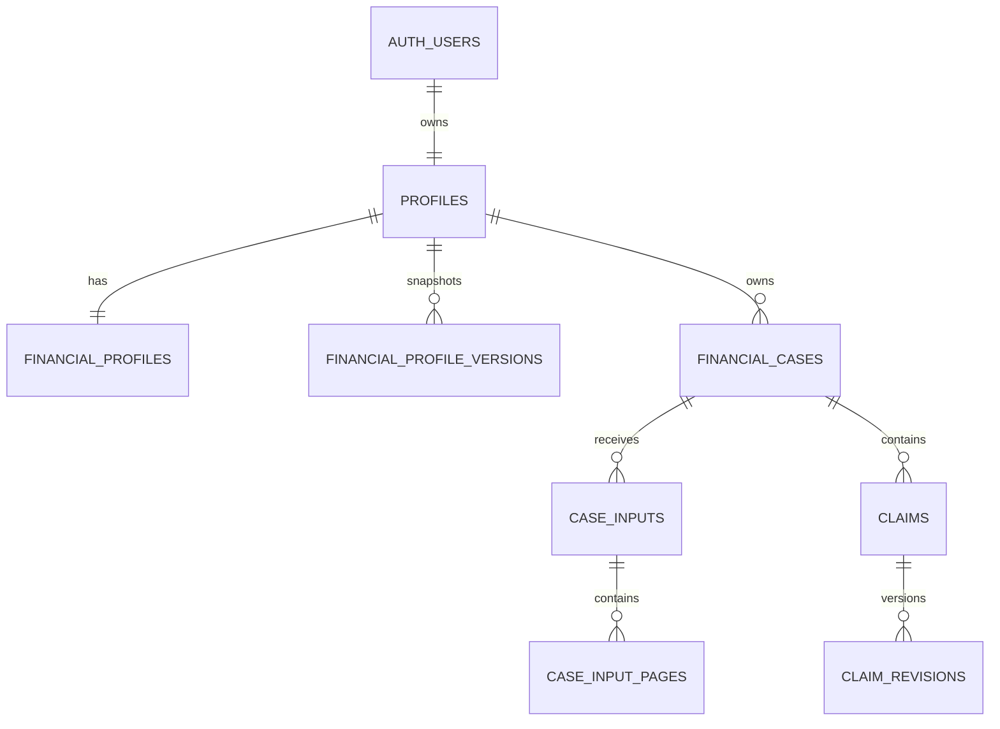
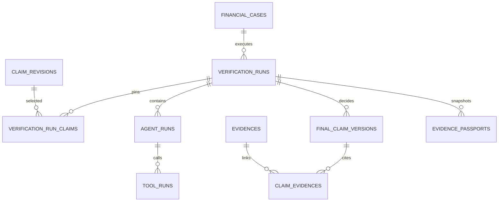
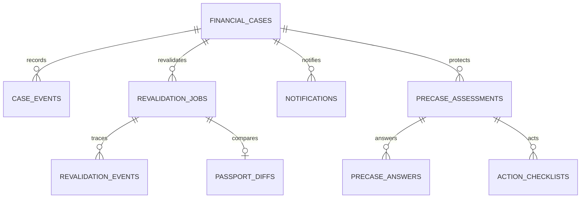
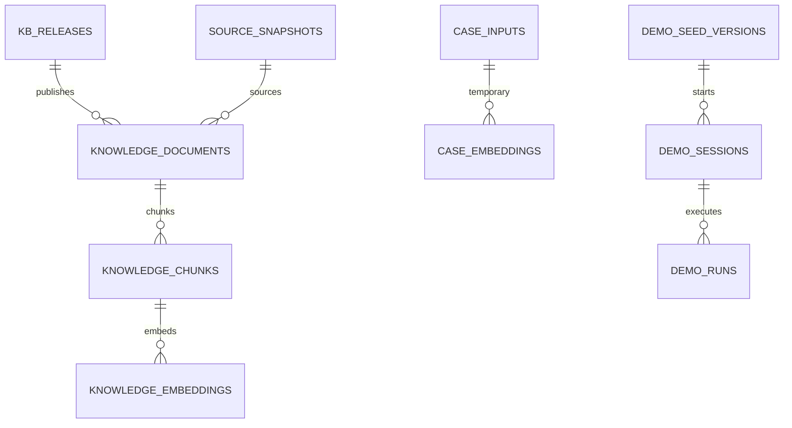

# FinShield 데이터베이스 명세서

## 0. 문서 개요

| 항목 | 내용 |
|---|---|
| 문서명 | FinShield 데이터베이스 명세서 |
| 문서 ID | FS-DB |
| 버전 | v1.0.3 |
| 상태 | 개발 기준선(Baseline) |
| 작성일 | 2026-09-03 |
| 상위 문서 | `docs/02-integrated-requirements.md` v1.0.3, `docs/01-product-plan.md` v1.0 |
| 대상 | FinShield 전용 Supabase Postgres 15+, Auth, Storage, pgvector |
| 후속 산출물 | P0 Provider·인프라 Spike, `docs/04-feature-spec.md`, Supabase Migration·RLS·Storage Policy |

이 문서는 FinShield의 목표 데이터 구조, 소유권, 제약, RLS, Storage, 검색, 버전, 보존·파기와 Migration 순서를 확정한다. 이 문서가 확정돼도 Schema·RLS·Storage가 배포됐거나 기능이 구현됐다는 뜻은 아니다.

### 0.1 우선순위와 변경 규칙

문서가 충돌하면 `docs/02-integrated-requirements.md`를 먼저 적용하고, 그다음 `docs/01-product-plan.md`, 이 문서, 기능명세, 코드·Migration 순으로 판단한다. 이 문서는 상위 요구사항을 축소하거나 우선순위를 바꾸지 않는다.

- 물리 테이블·컬럼·Enum을 바꾸는 PR은 관련 요구사항 ID, Migration, RLS·제약 테스트와 이 문서를 함께 갱신한다.
- 확정된 이름을 구현 편의로 다르게 만들면 이 문서에 물리 매핑을 먼저 남긴다.
- 완료된 결과·Passport·이벤트는 UPDATE하지 않는다. 정정은 새 버전이나 새 이벤트로 남긴다.
- 모든 시각은 `timestamptz`로 UTC 저장하고 표시할 때만 사용자 시간대로 변환한다.
- 이메일·비밀번호·Token·Secret·원본 파일·마스킹 전 PII·Raw Prompt·Chain-of-thought는 앱 영속 테이블에 저장하지 않는다.

### 0.2 범위

P0는 한 개 지원 대출 권유를 Text·Image·PDF로 검증하고, Claim·Evidence·실제 Agent 실행·CoVe·Red Team·Evidence Passport·수동 재검증·앱 알림·동일 Case의 가입 후 보호까지 이어지는 구조다. P1의 URL 수집, 동적 Agent 선택, 증분 재검증, Trusted Reviewer, 이메일·Export는 P0 경계를 깨지 않고 추가할 수 있게 예약한다.

### 0.3 구현 전제와 미확정 운영값

다음 값은 데이터 모델이 아니라 `N-QLT-010` Spike Gate에서 확정할 운영값이다. 확정 전 Migration은 해당 값이 필요한 Index나 Worker를 활성화하지 않는다.

- Embedding Provider·모델·차원과 Vector Index 종류
- OCR Provider, 마스킹 전 외부 전송 여부와 동의 문구 버전
- P0 대출 상품·기관·소비자경보 Snapshot 목록
- 출처 유형별 Freshness TTL
- 분산 Rate Store와 Revalidation Job Runner
- Provider별 Token 단가·비용 상한·Timeout

DB는 이 값을 문자열·버전·정수 컬럼과 불변 실행 Manifest로 받을 수 있게 설계한다. 운영값을 임의로 채운 Seed나 성공 상태는 만들지 않는다.

---

# 1. 핵심 설계 결정

| 결정 | 확정 내용 | 연결 요구사항 |
|---|---|---|
| 인증 정본 | `auth.users`가 인증정보의 유일한 정본이고 `public.profiles.id`와 1:1이다. 앱 테이블에 이메일·비밀번호를 복제하지 않는다. | D-026, SEC-AUTH-001 |
| 소유권 | 모든 회원 데이터에 `owner_id`를 직접 두고 자식은 `(parent_id, owner_id)` 복합 FK로 같은 소유자만 연결한다. | D-001, D-027 |
| 상태 분리 | Case lifecycle, Journey, Aftercare, 입력 단계, Run, Claim, Job 상태를 서로 다른 Enum과 컬럼으로 둔다. | CASE-002, D-018, D-030~D-032 |
| 불변 결과 | Claim 수정 이력, 최종 Claim, 축 결과, Passport, Source Snapshot, Timeline Event는 Append-only다. | CASE-006, D-006, D-011, PASS-002 |
| Run 고정 | Run은 사용한 Claim revision, 프로필 version, 실행 Manifest, 정책·Coverage·KB release를 시작 시점에 고정한다. | AUTH-008, EV-016, N-OPS-005 |
| 원본 격리 | 원본 객체와 전체 OCR 중간물은 `private` 메타데이터와 Private Bucket에만 두며 영속 Case 데이터와 분리한다. | D-012, SEC-FILE-001~006 |
| 삭제 축 분리 | 입력 처리 단계와 원본 삭제 상태를 별도 컬럼으로 둔다. Claim 확인·중단·Case 삭제 중 최초 사건이 삭제를 요청하고 최대 24시간 안에 물리 삭제를 확인한다. | INP-011, D-030, EC-021 |
| KB 격리 | 공용 문서·Vector는 `kb` Schema, 사용자 임시 Vector는 `private.case_embeddings`에 둔다. nullable owner 한 테이블로 합치지 않는다. | AI-008, D-013, SEC-PRI-009 |
| Demo 격리 | 공개 Demo는 `demo` Schema의 Seed·세션·실행 테이블만 쓰고 회원 `financial_cases`를 생성하지 않는다. | ROLE-001, ROLE-004, D-022 |
| 최종화 원자성 | 최종 Claim·Evidence 관계·축 결과·Guide·Passport·Case 상태·알림 Outbox를 한 DB Transaction으로 확정한다. | EV-001, RES-011, N-AVL-005 |
| 재검증 내구성 | 재검증 Job은 Idempotency, Lease, Heartbeat, Fencing token, Retry를 DB에 둔다. | REV-001, N-OPS-004 |
| PreCase 경계 | 가입·피해 사실과 Aftercare는 같은 `financial_cases.id` 아래 별도 이벤트·상태로 저장한다. 별도 계정·Case를 만들지 않는다. | SCP-004, PC-001~PC-009 |
| 운영 분리 | FinShield Supabase Project·Bucket·Secret은 PreCase Production과 물리적으로 분리한다. | D-025, N-OPS-007 |

---

# 2. Schema와 데이터 경계

## 2.1 PostgreSQL Schema

| Schema | 용도 | 브라우저 Data API | 쓰기 주체 |
|---|---|---:|---|
| `public` | 회원 Profile·Case·Claim·Run·Passport·알림·Aftercare | 허용, 모든 테이블 RLS·최소 컬럼 Grant | 본인 또는 소유권을 재검증하는 서버 RPC |
| `private` | 원본 객체 포인터, Worker lease, 임시 Vector, Outbox, Budget·Rate, PII 없는 운영 감사 | 노출 금지 | 서버 `service_role`과 제한된 Worker |
| `kb` | 공용 Source Snapshot·문서·Chunk·Embedding·공식 채널·평가·Tool 상태 | 직접 노출 금지 | 검증된 적재 Job; 조회는 제한 RPC |
| `demo` | 비식별 Seed, Live 실행, 정적 Fallback, 자동 만료 Session | 직접 노출 금지 | 공개 Demo 서버 경로 |
| `auth` | Supabase Auth 관리 영역 | Provider 계약 따름 | Supabase Auth |
| `storage` | Private Bucket 객체 메타데이터 | RLS 적용 | Signed upload/download·서버 Cleanup |

`private`, `kb`, `demo`는 Supabase Exposed Schema 목록에 넣지 않는다. `anon`과 `authenticated`에는 Schema `USAGE`를 주지 않는다. 서버도 사용자 Case를 읽을 때 owner 조건 없는 범용 함수를 사용하지 않는다.

## 2.2 Extension

| Extension | 용도 | 적용 조건 |
|---|---|---|
| `pgcrypto` | `gen_random_uuid()`, Digest/HMAC 지원 | P0 |
| `pg_trgm` | 제목·기관·상품·Keyword fuzzy 검색 | P0 |
| `vector` | 공용 KB Semantic 검색 | Embedding Spike 확정 후 P0 Migration에서 활성 |

DB 함수는 `SECURITY DEFINER`가 꼭 필요한 경우만 사용하고 `search_path=''` 또는 고정된 허용 Schema를 설정한다. 함수 Owner와 실행 Role을 분리하고 `PUBLIC EXECUTE`를 회수한다.

## 2.3 데이터 등급

| 등급 | 저장 위치 | 예 | 기본 보존 |
|---|---|---|---|
| PUBLIC | `kb`, 승인된 공개 View | 법령·공시·공식 상품문서·평가 지표 | 라이선스·개정 정책에 따른 버전 보존 |
| ACCOUNT | `public` | Profile 설정·알림 읽음 | 계정 삭제 전까지 |
| SENSITIVE | `public`, Private Storage 메타데이터 | 금융 Profile Snapshot, 마스킹 Claim·결과 | Case·계정 삭제 전까지 |
| TEMP_RAW | Private Bucket, `private` | 원본 Image/PDF, 전체 OCR 중간물, 사용자 임시 Vector | 최초 삭제 사건에 즉시 삭제 시도, 절대 상한 24시간 |
| SECRET | 배포 Secret Manager | Service Role·Provider Key·Webhook Secret | DB·Repository·Client·로그 저장 금지 |

---

# 3. 전체 데이터 모델

## 3.1 회원·Case·입력·Claim

## 3.2 검증·Evidence·Passport

## 3.3 재검증·알림·가입 후 보호

## 3.4 공용 KB와 사용자 임시 검색

## 3.5 논리 데이터 집합과 물리 매핑

상위 요구사항의 논리 이름은 유지한다. 분리한 보조 테이블은 보안·불변성·Run 재현을 위한 물리 구현이다.

| 논리 데이터 | 물리 테이블·View |
|---|---|
| `profiles` | `public.profiles` |
| `financial_profiles` | `public.financial_profiles` |
| `financial_profile_versions` | `public.financial_profile_versions` |
| `financial_cases` | `public.financial_cases` |
| `case_inputs` | `public.case_inputs`, `public.case_input_pages`, `public.case_input_findings`, `public.processing_consents`, `private.input_objects`, `private.ocr_artifacts` |
| `case_events` | `public.case_events` |
| `claims` | `public.claims`, `public.claim_revisions`, `public.verification_run_claims` |
| `verification_runs` | `public.verification_runs`, `public.verification_axis_results` |
| `final_claim_versions` | `public.final_claim_versions` |
| `evidences` | `public.evidences` |
| `claim_evidences` | `public.claim_evidences` |
| `source_snapshots` | `kb.source_snapshots`, `kb.source_fetch_events`, `public.case_source_snapshots` |
| `agent_runs` | `public.agent_runs`, `public.agent_run_claims` |
| `tool_runs` | `public.tool_runs`, `public.tool_run_claims`, `public.retrieval_steps` |
| `evidence_passports` | `public.evidence_passports` |
| `action_guides` | `public.action_guides`, `public.action_guide_channels` |
| `revalidation_jobs` | `public.revalidation_jobs`, `private.revalidation_job_runtime` |
| `revalidation_events` | `public.revalidation_events`, `public.passport_diffs` |
| `notifications` | `public.notifications` |
| `notification_preferences` | `public.notification_preferences` |
| `precase_assessments` | `public.precase_assessments` |
| `precase_answers` | `public.precase_answers` |
| `action_checklists` | `public.action_checklists` |
| `knowledge_documents` | `kb.knowledge_documents` |
| `knowledge_chunks` | `kb.knowledge_chunks` |
| `knowledge_embeddings` | `kb.knowledge_embeddings`; 사용자 자료는 `private.case_embeddings` |
| `trusted_access` | `public.trusted_access` P1 |
| `shared_comments` | `public.shared_comments` P1 |
| `access_audits` | `public.access_audits` P1 |

---

# 4. Enum·상태·코드

## 4.1 고정 Enum

서로 다른 Namespace는 값이 같아도 별도 PostgreSQL Enum으로 만든다.

| 타입 | 값 | 비고 |
|---|---|---|
| `app_role` | `MEMBER`, `OPERATOR` | Trusted Reviewer는 전역 Role이 아니라 Case별 P1 권한 |
| `explanation_mode` | `STANDARD`, `BEGINNER`, `EASY` | 표현만 바꾸며 판단 정책에는 영향 없음 |
| `case_scenario` | `LOAN`, `SAVINGS`, `INVESTMENT` | P0 실제 지원은 `LOAN` |
| `case_input_type` | `TEXT`, `IMAGE`, `PDF`, `URL` | `URL` 직접 수집은 P1 |
| `case_lifecycle` | `DRAFT`, `INPUT_REVIEW`, `VERIFYING`, `VERIFIED`, `NEED_MORE_INFORMATION`, `STOPPED_BY_USER`, `CLOSED` | 가입·피해·Aftercare와 분리 |
| `case_resume_state` | `DRAFT`, `INPUT_REVIEW` | 다른 값 저장 금지 |
| `journey_stage` | `PRE_TRANSACTION`, `ENROLLED`, `FUNDS_SENT_OR_DAMAGE_SUSPECTED` | 검증 상태와 독립 |
| `aftercare_status` | `NOT_STARTED`, `IN_PROGRESS`, `ACTION_REQUIRED`, `COMPLETED` | 가입 확인 후 검증 상태와 무관하게 시작 가능 |
| `input_stage` | `QUARANTINED`, `VALIDATED`, `EXTRACTED`, `MASKED`, `CLAIM_CONFIRMED`, `RAW_DELETED` | 순방향 단계 |
| `input_outcome` | `ACTIVE`, `REJECTED`, `BLOCKED`, `FAILED`, `CANCELLED` | 실패가 단계를 가장하지 않게 분리 |
| `raw_delete_status` | `PENDING`, `RUNNING`, `SUCCEEDED`, `FAILED` | 영속 원본이 없어도 부재 확인 뒤 `SUCCEEDED`; 처리 단계와 분리 |
| `verification_run_kind` | `INITIAL`, `REVALIDATION` | P0 재검증은 전체 지원범위 재실행 |
| `verification_run_status` | `QUEUED`, `RUNNING`, `COMPLETED`, `PARTIAL`, `FAILED`, `CANCELLED` | Case lifecycle과 분리 |
| `claim_status` | `VERIFIED`, `CONTRADICTED`, `CONFLICT`, `UNKNOWN`, `NEED_MORE_INFORMATION`, `WITHHELD` | 정상 보류 상태 포함 |
| `claim_evidence_relation` | `SUPPORT`, `CONTRADICT`, `CONTEXT` | 관계 없는 목록 금지 |
| `authority_level` | `A`, `B`, `C`, `D` | 권위만으로 확정하지 않음 |
| `freshness_status` | `FRESH`, `STALE`, `UNKNOWN` | Claim 상태가 아님 |
| `result_axis` | `AUTHENTICITY`, `TRANSACTION_SALES_RISK`, `SUITABILITY` | 3축 고정 |
| `overall_result` | `MATERIAL_RISK_FOUND`, `HIGH_CAUTION`, `INSUFFICIENT_INFORMATION`, `VERIFY_BEFORE_PROCEEDING`, `NO_SPECIAL_RISK_IN_VERIFIED_SCOPE` | 요구사항 2.2 우선순위 순서 |
| `evidence_directness` | `DIRECT`, `INDIRECT`, `CONTEXT_ONLY` | `CONTEXT_ONLY`는 단독 확정 불가 |
| `tool_transport` | `FUNCTION`, `MCP` | 실제 MCP Client 호출만 `MCP` |
| `execution_status` | `QUEUED`, `RUNNING`, `SUCCEEDED`, `PARTIAL`, `FAILED`, `BLOCKED`, `CANCELLED` | Agent·Tool 내부 공통 실행 상태 |
| `revalidation_job_status` | `QUEUED`, `RUNNING`, `NO_CHANGE`, `CHANGED`, `FAILED` | 취소는 `FAILED`+`USER_CANCELLED` reason으로 표현 |
| `notification_channel` | `IN_APP`, `EMAIL` | `EMAIL`은 P1 |
| `aftercare_result` | `NORMAL_MANAGEMENT`, `ADDITIONAL_EXPLANATION`, `CORRECTION_OR_INQUIRY`, `DISPUTE_PREPARATION` | 근거 기반 행동 범주 |
| `sharing_permission` | `READ`, `COMMENT` | P1 |

`reason_code`, `error_code`, `claim_type`, `action_code`, `policy_code`는 배포 없이 확장될 수 있어 길이 제한이 있는 `text`와 Registry·Schema validation을 사용한다. 사용자 화면 문구는 Enum 값을 직접 보여주지 않고 기능명세의 한국어 사전을 사용한다.

D-018이 지정한 Case·Run·Claim·Job과 여러 테이블에서 공유하는 폐쇄 상태는 위 PostgreSQL Enum을 사용한다. 특정 테이블에서만 쓰는 `text` 상태도 표에 열거한 값의 `CHECK (... in (...))`를 반드시 두며, 열거하지 않은 자유 문자열을 허용하지 않는다. 반대로 배포 없이 늘어나는 오류·이유·정책 Code만 Registry 검증 `text`로 둔다.

## 4.2 Case 상태 전이

| 현재 | 허용 다음 상태 |
|---|---|
| `DRAFT` | `INPUT_REVIEW`, `STOPPED_BY_USER`, `CLOSED` |
| `INPUT_REVIEW` | `VERIFYING`, `STOPPED_BY_USER`, `CLOSED` |
| `VERIFYING` | `VERIFIED`, `NEED_MORE_INFORMATION`, `INPUT_REVIEW`, `STOPPED_BY_USER` |
| `NEED_MORE_INFORMATION` | `INPUT_REVIEW`, `STOPPED_BY_USER`, `CLOSED` |
| `STOPPED_BY_USER` | 저장된 `resume_state`의 `DRAFT` 또는 `INPUT_REVIEW`, `CLOSED` |
| `VERIFIED` | `CLOSED`; 수동 재검증 중에는 그대로 유지 |
| `CLOSED` | 입력 없는 Draft면 `DRAFT`, 같은 거래 새 Run이면 `INPUT_REVIEW` |

전이는 `private.transition_financial_case(...)` 한 경로에서 행 잠금 후 검증하고 `case_events`를 같은 Transaction에 추가한다. 클라이언트의 임의 `UPDATE lifecycle`은 허용하지 않는다.

## 4.3 입력 상태 전이

- 성공 경로는 `QUARANTINED → VALIDATED → EXTRACTED → MASKED → CLAIM_CONFIRMED → RAW_DELETED`만 허용한다.
- 한 번에 한 단계만 전진한다. 재업로드는 기존 입력을 역행시키지 않고 새 `case_inputs` 행을 만든다.
- 오류는 `input_outcome`에 기록하며 마지막 성공 `input_stage`를 보존한다.
- Claim 확인 전 중단·실패·Case 삭제로 원본을 먼저 지우면 마지막 성공 `input_stage`는 유지하고 `raw_delete_status=SUCCEEDED`만 기록한다. 이 경우 단계를 건너뛰어 `RAW_DELETED`로 바꾸지 않는다.
- `MASKED` 이전에는 Claim extraction LLM, Domain Agent, RAG, Embedding 호출을 생성할 수 없다.
- Text 입력도 원본 문자열을 마스킹하기 전에는 `private` 임시 처리 영역에만 두고 영속 `masked_text`는 `MASKED` 이후 기록한다.
- `raw_delete_status=SUCCEEDED`일 때만 `input_stage=RAW_DELETED`로 전이한다.

## 4.4 Run·Job 종결 규칙

- `verification_runs`는 `QUEUED → RUNNING → COMPLETED|PARTIAL|FAILED|CANCELLED`만 허용한다.
- 전면 Judge·Policy Validator 실패는 `FAILED`이며 Case를 `INPUT_REVIEW`로 되돌리고 Passport를 만들지 않는다.
- 일부 Agent 실패, Material Claim 보류, Budget·Deadline 보류는 `PARTIAL`이며 가능한 결과와 Passport를 만든다.
- Revalidation Job은 `QUEUED → RUNNING → NO_CHANGE|CHANGED|FAILED`다. 사용자 취소 요청은 `cancel_requested_at`을 기록하고 Worker가 `FAILED`, `reason_code=USER_CANCELLED`로 종결한다. 상위 상태 목록을 늘리지 않으면서 명시적 취소를 구분한다.
- 재검증 실패·취소는 이전 Passport와 Case `VERIFIED`를 바꾸지 않는다.

---

# 5. 공통 물리 규칙

## 5.1 키·소유권·시간

- 사용자·Case·Run·결과 PK는 `uuid default gen_random_uuid()`다.
- 작은 Registry·순번 테이블만 `bigint generated always as identity`를 허용한다.
- `owner_id uuid not null references public.profiles(id) on delete cascade`를 회원 데이터에 둔다.
- 모든 소유 부모는 `unique (id, owner_id)`를 추가한다. Case 범위 부모는 `unique (id, owner_id, case_id)`도 두고 자식이 `(parent_id, owner_id, case_id)` 전체를 참조하게 한다.
- Run 범위 부모는 `unique (id, owner_id, case_id, verification_run_id)`까지 두고 Run 자식·Join이 전체 범위를 참조한다. `claim_revisions`는 `unique (id, claim_id, case_id, owner_id)`를 두어 Run이 Claim identity와 revision을 서로 바꿔 끼울 수 없게 한다.
- Join 테이블은 양쪽 부모의 Owner·Case·Run 범위를 모두 복합 FK로 적용한다. 같은 Owner의 다른 Case나 같은 Case의 다른 Run을 조합한 행도 거부한다.
- 생성 시각은 `created_at timestamptz not null default now()`다. 수정 가능한 Draft·설정에만 `updated_at`을 둔다.
- 애플리케이션이 전달한 생성시각으로 감사 순서를 바꾸지 못하게 서버 기본값을 사용한다.

## 5.2 문자열·JSON·해시

- 제목·Code·URL에는 `octet_length` 상한을 둔다. 대형 원문을 일반 `text` 컬럼에 넣지 않는다.
- JSONB는 `schema_version` 컬럼 또는 Payload 내부 `schema_version`을 필수로 하고 `jsonb_typeof(...)` CHECK를 둔다.
- JSONB에는 Secret, 마스킹 전 PII, 전체 원본, Raw Provider error, Raw Prompt, Chain-of-thought를 넣지 않는다.
- 내용 동일성은 SHA-256 hex 64자 또는 `bytea` Digest로 저장한다. 사용자 원본 Fingerprint는 P0에서 영속 저장하지 않는다.
- Idempotency는 `(owner_id, operation_scope, idempotency_key)` Unique와 `request_hash`를 함께 검사한다. 같은 Key에 다른 요청 Hash가 오면 `409`로 거부한다.

## 5.3 삭제와 FK

- Case 소유 파생물은 Case 삭제 시 `ON DELETE CASCADE`가 기본이다.
- 공용 `kb.source_snapshots`·공용 KB는 Case FK의 Cascade 대상이 아니다.
- Profile Snapshot은 참조 Case가 있는 동안 직접 삭제할 수 없다. 계정 삭제에서는 Case를 먼저 제거한 뒤 Cascade한다.
- 불변 행에는 UPDATE 방지 Trigger를 적용하되 Case·계정 삭제 Cascade는 허용한다.
- 외부 Storage 객체는 DB FK로 삭제되지 않으므로 `deletion_requests`와 `private.file_cleanup_jobs` 완료를 확인한 뒤 삭제 완료로 표시한다.

## 5.4 이름 규칙

- 테이블·컬럼·Index·Constraint는 `snake_case` 영어를 사용한다.
- PK는 `id`, FK는 `<entity>_id`, 시간은 `*_at`, 날짜는 `*_date`, Boolean은 `is_*` 또는 의미가 분명한 형식을 사용한다.
- Index는 `idx_<table>__<columns>`, Unique는 `uq_<table>__<columns>`, Check는 `ck_<table>__<rule>`, FK는 `fk_<child>__<parent>` 형식이다.

---

# 6. 테이블·컬럼 명세

표의 `NN`은 `NOT NULL`, `UQ`는 Unique, `IMM`은 종결 후 Update 금지를 뜻한다. 모든 사용자 소유 테이블에는 표에 반복하지 않더라도 `owner_id`, 복합 소유 FK와 RLS가 적용된다.

## 6.1 계정·금융 프로필

### `public.profiles`

| 컬럼 | 타입·제약 | 설명 |
|---|---|---|
| `id` | `uuid PK FK auth.users(id) on delete cascade` | Auth 사용자와 1:1 |
| `app_role` | `app_role NN default MEMBER` | 클라이언트 변경 금지, 매 보호 요청에서 DB 최신값 확인 |
| `explanation_mode` | `explanation_mode NN default STANDARD` | 표현 모드 |
| `locale` | `text NN default 'ko-KR'`, 2~16자 | 기본 언어 |
| `timezone` | `text NN default 'Asia/Seoul'`, 1~64자 | 표시용 IANA timezone |
| `terms_version` | `text`, 최대 64자 | 수락한 서비스 약관 버전 |
| `privacy_notice_version` | `text`, 최대 64자 | 수락한 개인정보 고지 버전 |
| `created_at` | `timestamptz NN default now()` | 생성 시각 |
| `updated_at` | `timestamptz NN default now()` | 설정 수정 시각 |

이메일·비밀번호·Provider Token 컬럼을 만들지 않는다. `app_role` 갱신은 제한된 서버 관리 함수만 수행하며 본인 Profile Update Grant에서 제외한다.

### `public.financial_profiles`

| 컬럼 | 타입·제약 | 설명 |
|---|---|---|
| `id` | `uuid PK` | 현재 편집본 ID |
| `owner_id` | `uuid NN UQ FK profiles` | 사용자당 하나 |
| `schema_version` | `text NN` | 범주·검증 Schema 버전 |
| `income_band` | `text NN` | 정확한 금액 대신 버전별 범주 Code |
| `debt_burden_band` | `text NN` | `UNSPECIFIED|NONE|LOW|MEDIUM|HIGH` |
| `emergency_fund_band` | `text NN` | 버전별 개월 범주 Code |
| `purpose_code` | `text NN` | 대출·저축·투자 목적 범주 |
| `horizon_code` | `text NN` | 사용·상환·보유 기간 범주 |
| `liquidity_need` | `text NN` | `UNSPECIFIED|LOW|MEDIUM|HIGH` |
| `loss_tolerance` | `text NN` | `UNSPECIFIED|LOW|MEDIUM|HIGH` |
| `completeness` | `text NN` | `SKIPPED|PARTIAL|COMPLETE` |
| `revision_no` | `integer NN default 1 check > 0` | P1 Optimistic Lock 기준 |
| `created_at`, `updated_at` | `timestamptz NN` | 생성·수정 시각 |

범주 Code와 의미·임계값은 `schema_version`별 Registry에서 고정한다. 적합성에 불필요한 주민번호·계좌번호·정확한 자산·비밀번호 필드는 금지한다.

### `public.financial_profile_versions`

| 컬럼 | 타입·제약 | 설명 |
|---|---|---|
| `id` | `uuid PK` | 불변 Snapshot ID |
| `owner_id` | `uuid NN FK profiles` | 소유자 |
| `profile_id` | `uuid NN` | 원본 편집 Profile |
| `version_no` | `integer NN check > 0` | 소유 Profile 내 순번 |
| `schema_version` | `text NN` | 범주 Schema 버전 |
| `snapshot` | `jsonb NN check object` | 허용된 범주 필드만 복사 |
| `completeness` | `text NN` | `SKIPPED|PARTIAL|COMPLETE` |
| `content_hash` | `text NN check 64 hex` | Canonical JSON SHA-256 |
| `created_reason` | `text NN` | `CASE_CREATED|RUN_STARTED|PROFILE_UPDATED` |
| `created_at` | `timestamptz NN default now()` | Snapshot 시각 |

제약은 `UQ(owner_id, profile_id, version_no)`, `UQ(id, owner_id)`, `(profile_id, owner_id) → financial_profiles(id, owner_id)`다. Snapshot은 UPDATE하지 않는다. 건너뛰기도 모든 값이 `UNSPECIFIED`인 명시적 `SKIPPED` Snapshot으로 만들어 Run·Passport에서 nullable 의미를 피한다.

## 6.2 FinancialCase·입력

### `public.financial_cases`

| 컬럼 | 타입·제약 | 설명 |
|---|---|---|
| `id` | `uuid PK` | 생애주기 전체 Case ID |
| `owner_id` | `uuid NN FK profiles` | 소유자 |
| `scenario` | `case_scenario NN` | P0 실제 실행은 `LOAN` |
| `primary_input_type` | `case_input_type` | 아직 입력 없으면 null |
| `title_masked` | `text NN`, 최대 160자 | 목록용 PII 없는 제목 |
| `lifecycle` | `case_lifecycle NN default DRAFT` | 검증 여정 상태 |
| `resume_state` | `case_resume_state` | 중단·종료 전 재개 상태 |
| `journey_stage` | `journey_stage NN default PRE_TRANSACTION` | 가입·피해 사실 축 |
| `enrollment_confirmed_at` | `timestamptz` | 불변 가입 확인 Event가 최초로 확정된 시각의 Projection |
| `aftercare_status` | `aftercare_status NN default NOT_STARTED` | 가입 후 보호 축 |
| `initial_profile_version_id` | `uuid NN` | Case 생성 당시 Snapshot |
| `latest_successful_run_id` | `uuid` | 완료·부분완료 최신 Run, 교차 소유 FK |
| `latest_passport_id` | `uuid` | 최신 Passport, 교차 소유 FK |
| `lock_version` | `integer NN default 1 check > 0` | P1 동시 수정 충돌 |
| `deletion_status` | `text NN default 'ACTIVE'` | `ACTIVE|PENDING|PURGING|FAILED` |
| `deleted_at` | `timestamptz` | 설정 즉시 RLS·API에서 접근 차단 |
| `created_at`, `updated_at` | `timestamptz NN` | 생성·수정 시각 |

`latest_*`는 조회 최적화 포인터일 뿐 결과 정본이 아니다. 해당 포인터는 최종화 함수만 갱신하고 같은 Case·Owner를 가리키는 복합 FK를 적용한다. `deleted_at is not null`인 Case와 자식은 일반 읽기 Policy에서 제외한다.

### `public.case_inputs`

| 컬럼 | 타입·제약 | 설명 |
|---|---|---|
| `id` | `uuid PK` | 입력 단위 |
| `owner_id`, `case_id` | `uuid NN`, 복합 FK | 소유 Case |
| `input_type` | `case_input_type NN` | Text·Image·PDF·P1 URL |
| `input_stage` | `input_stage NN` | 마지막 성공 단계 |
| `input_outcome` | `input_outcome NN default ACTIVE` | 실패·취소 별도 축 |
| `raw_delete_status` | `raw_delete_status NN` | 원본 삭제 축 |
| `declared_mime`, `detected_mime` | `text`, 최대 128자 | 선언·실측 MIME |
| `magic_signature` | `text`, 최대 64자 | 허용 Signature Code, 원본 byte 아님 |
| `size_bytes` | `bigint check 0..10485760` | P0 10MB 상한 |
| `page_count` | `integer check 1..10` | PDF P0 10쪽, Image는 1 |
| `masked_text` | `text`, 최대 256KiB | 마스킹 후 영속 입력; 전체 원본 금지 |
| `masked_text_hash` | `text check 64 hex` | 마스킹 결과 Digest |
| `pii_policy_version` | `text` | PII Gate 버전 |
| `pii_scan_status` | `text NN` | `PENDING|PASSED|BLOCKED` |
| `external_ocr_consent_id` | `uuid` | 원본 외부 전송 시 별도 동의 기록 |
| `claim_confirmed_at` | `timestamptz` | Claim 확인 완료 시각 |
| `raw_delete_requested_at` | `timestamptz` | 최초 삭제 사건 |
| `raw_deleted_at` | `timestamptz` | Storage 물리 삭제 확인 시각 |
| `raw_expires_at` | `timestamptz NN` | 생성 후 최대 24시간 |
| `error_code` | `text`, 최대 64자 | Sanitized 오류 Code |
| `created_at`, `updated_at` | `timestamptz NN` | 처리 시각 |

Check는 Image/PDF의 `size_bytes`, Image `page_count=1`, PDF `page_count<=10`, Text의 Storage 객체 부재, `raw_expires_at <= created_at + interval '24 hours'`, `input_stage=RAW_DELETED → raw_delete_status=SUCCEEDED and raw_deleted_at is not null`을 강제한다. 역방향은 정상 경로인 `input_outcome=ACTIVE and claim_confirmed_at is not null`일 때만 적용하고, 조기 중단·실패·삭제에서는 마지막 처리 단계를 보존한 채 원본 삭제 축만 종결한다. P0 `URL` 행은 만들지 않고 P1 Feature Gate가 켜진 뒤에만 서버에서 생성한다.

### `public.case_input_pages`

| 컬럼 | 타입·제약 | 설명 |
|---|---|---|
| `id` | `uuid PK` | 페이지·Image 단위 |
| `owner_id`, `case_id`, `case_input_id` | `uuid NN`, 복합 FK | 소유 입력 |
| `page_no` | `integer NN check 1..10` | 1-based |
| `parse_status` | `text NN` | `PENDING|SUCCEEDED|FAILED|BLOCKED` |
| `width`, `height` | `integer check > 0` | Locator 좌표 기준, 있으면 저장 |
| `masked_text` | `text`, 최대 64KiB | 페이지별 마스킹 발췌 |
| `locator_schema_version` | `text NN` | Bounding box·문단 위치 Schema |
| `low_confidence_count` | `integer NN default 0 check >= 0` | 실제 불확실 영역 수 |
| `error_code` | `text` | 페이지 오류; P0는 전체 재업로드 복구 |
| `created_at` | `timestamptz NN` | 생성 시각 |

`UQ(case_input_id, page_no)`와 Owner·Case 복합 FK를 둔다. P0가 페이지별 재시도를 제공하지 않아도 Claim 위치·실패 범위를 보존하기 위해 존재한다.

### `public.case_input_findings`

| 컬럼 | 타입·제약 | 설명 |
|---|---|---|
| `id` | `uuid PK` | 안전·품질 Finding |
| `owner_id`, `case_id`, `case_input_id` | `uuid NN`, 복합 FK | 소유 입력 |
| `page_id` | `uuid` | 해당 페이지, 없으면 전체 입력 |
| `finding_type` | `text NN` | `PII|LOW_CONFIDENCE|INJECTION|UNSAFE_FILE` |
| `finding_code` | `text NN` | 값이 아닌 유형 Code |
| `locator` | `jsonb NN check object` | 위치만 저장 |
| `severity` | `text NN` | `INFO|WARNING|BLOCKING` |
| `resolution` | `text NN` | `OPEN|MASKED|EXCLUDED|REJECTED` |
| `created_at` | `timestamptz NN` | 생성 시각 |

탐지된 주민번호·전화·계좌 원문은 저장하지 않는다. Prompt Injection 문구도 전문 대신 종류·위치·Digest만 남긴다.

### `private.input_objects`

| 컬럼 | 타입·제약 | 설명 |
|---|---|---|
| `id` | `uuid PK` | 임시 Storage 객체 ID |
| `owner_id`, `case_id`, `case_input_id` | `uuid NN`, 복합 FK | 소유 입력 |
| `bucket_id` | `text NN check = 'finshield-quarantine'` | Private Bucket |
| `object_path` | `text NN UQ` | `<owner>/<case>/<input>/<random>.<safe_ext>`, CHECK로 강제 |
| `slot_state`, `uploaded_at` | `text NN check in (OPEN,UPLOADED,CLOSED)`, `timestamptz` | one-use upload slot. `OPEN`인 본인 slot 경로에만 `storage.objects` INSERT 정책이 허용하고 서버가 객체를 확인하면 `UPLOADED`, 업로드 없이 닫히면 `CLOSED` |
| `safe_extension` | `text NN check in (jpg,jpeg,png,pdf)` | 서버 검증 확장자 |
| `encryption_state` | `text NN check in (UNKNOWN,VERIFIED,FAILED)` | Provider at-rest 암호화 확인 상태 |
| `access_blocked_at` | `timestamptz` | 삭제 요청 즉시 Signed URL 발급 차단 |
| `expires_at` | `timestamptz NN` | 최대 24시간 |
| `deleted_at` | `timestamptz` | `storage.objects` 부재 확인 시각 |
| `created_at` | `timestamptz NN` | 생성 시각 |

원본 파일명·이메일·원본 Hash를 저장하지 않는다. `authenticated`는 이 테이블을 직접 읽을 수 없다.

### `private.ocr_artifacts`

| 컬럼 | 타입·제약 | 설명 |
|---|---|---|
| `id` | `uuid PK` | 전체 OCR 중간물의 삭제 추적 메타데이터 |
| `owner_id`, `case_id`, `case_input_id`, `page_id` | `uuid NN` | 같은 Owner·Case 복합 FK |
| `provider_code`, `provider_request_token` | `text` | Provider와 비가역 요청 식별자; Credential·원문 ID 금지 |
| `storage_object_path` | `text` | 격리 임시 객체를 쓴 경우만 저장; 원문은 DB 컬럼에 저장하지 않음 |
| `status` | `text NN` | `PROCESSING|AVAILABLE|DELETE_REQUESTED|DELETED|FAILED` |
| `access_blocked_at`, `deleted_at` | `timestamptz` | 접근 차단·부재 확인 |
| `expires_at` | `timestamptz NN` | `expires_at <= created_at + interval '24 hours'` |
| `error_code`, `created_at`, `updated_at` | `text`/`timestamptz` | Sanitized 상태와 시각 |

OCR 원문은 이 테이블에 넣지 않는다. 메모리 안에서만 처리해 영속 Artifact가 없을 때도 `status=DELETED`인 메타데이터로 부재 확인을 남길 수 있다. 외부 Provider를 쓴 경우 보존·학습 비활성 설정과 삭제 확인 Code는 해당 Run Manifest·Tool Run에 기록한다.

### `public.case_events`

| 컬럼 | 타입·제약 | 설명 |
|---|---|---|
| `id` | `uuid PK` | Append-only Timeline Event |
| `owner_id`, `case_id` | `uuid NN`, 복합 FK | 소유 Case |
| `event_no` | `bigint NN` | Case 내 단조 증가 순번 |
| `event_type` | `text NN` | `CASE_*`, `JOURNEY_*`, `AFTERCARE_*`, `RUN_*`, `REVALIDATION_*` |
| `actor_type` | `text NN` | `USER|SYSTEM|AGENT` |
| `actor_ref` | `uuid` | Agent Run 등 비식별 참조 |
| `from_state`, `to_state` | `text` | 해당 Namespace의 이전·다음 값 |
| `correction_of_event_id` | `uuid` | 가입 오입력 정정 대상 |
| `payload` | `jsonb NN check object` | 마스킹된 구조화 정보와 Schema version |
| `idempotency_key` | `text NN` | 동일 사건 중복 방지 |
| `created_at` | `timestamptz NN default now()` | 사건 시각 |

`UQ(case_id, event_no)`, `UQ(owner_id, case_id, idempotency_key)`를 둔다. 가입일·채널·최종 조건, 피해 의심, 정정 이유는 정해진 Payload Schema로 저장한다. 기존 이벤트 UPDATE·DELETE는 Case 전체 삭제 외 허용하지 않는다.

## 6.3 Claim·수정·Run 입력 고정

### `public.claims`

| 컬럼 | 타입·제약 | 설명 |
|---|---|---|
| `id` | `uuid PK` | 여러 Run에서 유지되는 Claim identity |
| `owner_id`, `case_id` | `uuid NN`, 복합 FK | 소유 Case |
| `source_input_id`, `source_page_id` | `uuid` | 원문 위치 |
| `parent_claim_id` | `uuid` | 명시적 파생 Claim의 부모 |
| `origin` | `text NN` | `EXTRACTED|USER_ADDED|DERIVED` |
| `claim_type` | `text NN`, 최대 64자 | 기관·상품·수치·채널·행동요구 등 |
| `source_locator` | `jsonb NN check object` | 페이지·영역·문단 위치 |
| `extraction_method` | `text NN` | `MODEL|RULE|USER` |
| `created_at` | `timestamptz NN` | 생성 시각 |

`DERIVED`는 `parent_claim_id`가 필수고 파생 규칙 버전은 revision에 저장한다. 후속 Agent가 부모나 사용자 확정 목록과 연결되지 않은 새 사실 Claim을 생성할 수 없다.

### `public.claim_revisions`

| 컬럼 | 타입·제약 | 설명 |
|---|---|---|
| `id` | `uuid PK` | Append-only Claim 내용 버전 |
| `owner_id`, `case_id`, `claim_id` | `uuid NN`, 복합 FK | Claim 소유권 |
| `revision_no` | `integer NN check > 0` | Claim 내 순번 |
| `statement_masked` | `text NN`, 최대 4KiB | 검증 문장 |
| `structured_value` | `jsonb NN check object` | 숫자·단위·부정·조건·기간 범위 보존 |
| `materiality` | `text NN` | `MATERIAL|NON_MATERIAL|UNDETERMINED` |
| `user_confirmed` | `boolean NN default false` | 사용자 확인 여부 |
| `is_removed` | `boolean NN default false` | 삭제도 새 revision으로 기록 |
| `edit_source` | `text NN` | `EXTRACTION|USER_EDIT|USER_REMOVE|SYSTEM_DERIVATION` |
| `derivation_rule_version` | `text` | 파생 Claim일 때 필수 |
| `content_hash` | `text NN check 64 hex` | Canonical 내용 Hash |
| `created_at` | `timestamptz NN` | 생성 시각 |

`UQ(claim_id, revision_no)`와 `UQ(id, owner_id)`를 둔다. 날짜가 월·분기처럼 불완전하면 `structured_value`에 `precision`과 시작·종료 범위를 보존하고 임의의 일을 생성하지 않는다.

### `public.verification_run_claims`

| 컬럼 | 타입·제약 | 설명 |
|---|---|---|
| `owner_id`, `case_id`, `verification_run_id` | `uuid NN`, 복합 FK | Run |
| `claim_id`, `claim_revision_id` | `uuid NN`, 복합 FK | 시작 시 고정한 Claim 내용 |
| `selected_for_verification` | `boolean NN` | 이번 Run 검증 대상 |
| `materiality` | `text NN` | Coverage 계산 당시 값 |
| `confirmation_state` | `text NN` | `CONFIRMED|EXCLUDED|MISSING` |
| `coverage_item_code` | `text` | Coverage Contract 항목 |
| `exclusion_reason_code` | `text` | 제외·정보 부족 이유 |
| `created_at` | `timestamptz NN` | Run 시작 시각 |

PK는 `(verification_run_id, claim_id)`다. 선택한 Material Claim은 `claim_revision.user_confirmed=true`가 아니면 `CONFIRMED`가 될 수 없다. Run 시작 뒤 행을 수정하지 않는다.

### `public.processing_consents`

| 컬럼 | 타입·제약 | 설명 |
|---|---|---|
| `id` | `uuid PK` | 처리 동의 증적 |
| `owner_id`, `case_id`, `case_input_id` | `uuid NN`, 복합 FK | 해당 입력 |
| `consent_type` | `text NN` | P0는 `EXTERNAL_OCR_RAW_TRANSFER` |
| `notice_version` | `text NN` | 고지 문구 버전 |
| `provider_code` | `text NN` | 전송 Provider 식별자 |
| `data_categories` | `text[] NN` | 전송 범주; 빈 배열 금지 |
| `decision` | `text NN` | `GRANTED|DENIED|REVOKED` |
| `supersedes_consent_id` | `uuid` | 철회·새 동의가 대체한 기록 |
| `created_at` | `timestamptz NN default now()` | 서버가 기록한 결정 시각 |

동의 거절·철회 행도 삭제하지 않는다. 원본 외부 전송은 같은 입력의 가장 최신 유효 동의가 `GRANTED`일 때만 가능하다. 일반 약관 동의를 이 동의로 대체할 수 없다.

## 6.4 Verification·Agent·Tool 실행

### `public.verification_runs`

| 컬럼 | 타입·제약 | 설명 |
|---|---|---|
| `id` | `uuid PK` | 한 시점 검증 실행 |
| `owner_id`, `case_id` | `uuid NN`, 복합 FK | 소유 Case |
| `run_no` | `integer NN check > 0` | Case 내 순번, Case 행 잠금으로 할당 |
| `kind` | `verification_run_kind NN` | 초기·재검증 구분 |
| `status` | `verification_run_status NN` | 실행 상태 |
| `profile_version_id` | `uuid NN` | 시작 시점 Profile Snapshot |
| `execution_manifest_id` | `uuid NN` | 모델·Prompt·Schema·정책·KB 묶음 |
| `parent_run_id` | `uuid` | 재검증·정정의 직전 Run |
| `revalidation_job_id` | `uuid` | 재검증이면 Job 참조 |
| `idempotency_key` | `text NN`, 최대 128자 | 중복 실행 방지 |
| `request_hash` | `text NN check 64 hex` | 같은 Key의 다른 Payload 차단 |
| `overall_result` | `overall_result` | 종결 전 null |
| `coverage_satisfied` | `boolean` | Material Coverage 판정 |
| `partial_reason_codes` | `text[] NN default '{}'` | 부분실패·보류 Code |
| `correlation_id` | `uuid NN` | 전체 Trace 상관 ID |
| `started_at`, `finished_at` | `timestamptz` | 실행 구간 |
| `deadline_at` | `timestamptz NN` | Text 120초, Image·PDF 180초 운영값 |
| `input_tokens`, `output_tokens` | `bigint NN default 0 check >=0` | 집계 Token |
| `cost_microunits` | `bigint NN default 0 check >=0` | 통화 최소단위보다 작은 내부 비용 단위 |
| `error_code`, `reason_code` | `text` | Sanitized 종결 이유 |
| `created_at` | `timestamptz NN default now()` | 생성 시각 |

제약은 `UQ(case_id, run_no)`, `UQ(owner_id, case_id, idempotency_key)`, `UQ(id, owner_id)`, `(profile_version_id, owner_id)` 복합 FK다. `kind=INITIAL and status in (QUEUED,RUNNING)`인 행은 Case당 하나인 Partial Unique Index를 둔다. 같은 Key·같은 Hash는 기존 Run을 반환하고 같은 Key·다른 Hash는 거부한다.

### `public.verification_axis_results`

| 컬럼 | 타입·제약 | 설명 |
|---|---|---|
| `id` | `uuid PK` | 축별 불변 결과 |
| `owner_id`, `case_id`, `verification_run_id` | `uuid NN`, 복합 FK | 대상 Run |
| `axis` | `result_axis NN` | 3축 |
| `result_code` | `text NN` | 실행 Manifest에 속한 축별 Code |
| `summary_masked` | `text NN`, 최대 4KiB | 사용자용 근거 기반 요약 |
| `limitation_codes` | `text[] NN` | 미확인·STALE·부분실패 |
| `policy_evaluation` | `jsonb`, 최대 64KiB | `SUITABILITY`의 DB 결정 규칙·Run Profile ID/해시·상품 조건 Evidence·미확인 항목. 이전 정책은 null |
| `content_hash` | `text NN check 64 hex` | 불변성 확인 |
| `created_at` | `timestamptz NN` | 확정 시각 |

`UQ(verification_run_id, axis)`다. 축별 Code는 정책 Registry에 있어야 하며 한 축 결과를 다른 축에 복사해 넣지 않는다. Migration 0041의 Profile Policy v2는 최종 Claim 기록 뒤 실행 Snapshot과 유효한 상품 Evidence를 비교하며 전달된 적합성 확정값을 신뢰하지 않는다. Trace까지 포함한 축 해시를 Passport Manifest에 고정한다. 월 소득 구간으로 연소득 가입 요건·신용 승인을 추론하지 않는다.

### `public.agent_runs`

| 컬럼 | 타입·제약 | 설명 |
|---|---|---|
| `id` | `uuid PK` | 실제 Agent attempt |
| `owner_id`, `case_id`, `verification_run_id` | `uuid NN`, 복합 FK | 실행 소유권 |
| `logical_agent_key` | `text NN` | 한 Run의 논리 Agent 역할 |
| `agent_code`, `agent_version` | `text NN` | Registry의 실제 Agent |
| `attempt_no` | `integer NN check > 0` | Retry는 새 행 |
| `status` | `execution_status NN` | Agent 실행 상태 |
| `input_schema_version`, `output_schema_version` | `text NN` | 계약 버전 |
| `prompt_version` | `text NN` | Raw Prompt가 아닌 버전 |
| `model_provider`, `model_id`, `model_version` | `text` | Model 미사용 Agent는 null |
| `input_digest`, `output_digest` | `text check 64 hex` | 마스킹·정규화 Payload Digest |
| `sanitized_summary` | `jsonb check object` | 사용자·운영 허용 요약 |
| `input_tokens`, `output_tokens` | `bigint NN default 0 check >=0` | Token 사용량 |
| `cost_microunits` | `bigint NN default 0 check >=0` | 비용 |
| `started_at`, `finished_at` | `timestamptz` | 실행 시간 |
| `latency_ms` | `integer check >=0` | 지연 |
| `error_code`, `reason_code` | `text` | 실패·보류 이유 |
| `created_at` | `timestamptz NN` | 생성 시각 |

`UQ(verification_run_id, logical_agent_key, attempt_no)`를 둔다. Orchestrator, Domain Agent, CoVe, Red Team, Evidence Judge, Action Guide를 서로 다른 `logical_agent_key`로 기록한다. Terminal 상태가 된 행은 수정하지 않는다. `(agent_code, agent_version)`은 `private.agent_definitions`를 복합 FK로 참조하고, INSERT 시 Trigger가 그 Agent가 Run의 Manifest에 같은 `logical_agent_key`로 고정돼 있는지 확인한다. `tool_runs`도 같은 방식으로 Registry FK와 Manifest·Allowlist Trigger를 둔다. `VERIFIED|CONTRADICTED`의 Evidence 관계 검증은 Deferred Constraint Trigger가 Commit 시점에 수행한다.

### `public.agent_run_claims`

| 컬럼 | 타입·제약 | 설명 |
|---|---|---|
| `owner_id`, `case_id`, `agent_run_id`, `claim_id` | `uuid NN`, 복합 FK | Agent와 Claim 연결 |
| `relation` | `text NN` | `INPUT|OUTPUT|COVE_TARGET|RED_TEAM_TARGET` |
| `created_at` | `timestamptz NN` | 생성 시각 |

PK는 `(agent_run_id, claim_id, relation)`다. CoVe와 Red Team 대상 Claim을 일반 Domain 입력과 구분한다.

### `public.tool_runs`

| 컬럼 | 타입·제약 | 설명 |
|---|---|---|
| `id` | `uuid PK` | 실제 Tool call attempt |
| `owner_id`, `case_id`, `verification_run_id`, `agent_run_id` | `uuid NN`, 복합 FK | 소유 실행 |
| `logical_tool_key` | `text NN` | 재시도 묶음 |
| `tool_code`, `tool_version` | `text NN` | Tool Registry 버전 |
| `transport` | `tool_transport NN` | 실제 MCP 여부 |
| `attempt_no` | `integer NN check > 0` | Retry 순번 |
| `status` | `execution_status NN` | 실행 상태 |
| `input_schema_version`, `output_schema_version` | `text NN` | 계약 버전 |
| `request_hash`, `result_digest` | `text check 64 hex` | Raw Payload 대신 Digest |
| `sanitized_scope` | `jsonb NN check object` | 조회 범위·기준일·지원범위 |
| `provenance_complete` | `boolean NN default false` | Evidence 승격 가능성 |
| `candidate_count`, `selected_count` | `integer NN default 0 check >=0` | 검색 후보 수 |
| `started_at`, `finished_at`, `retry_after_at` | `timestamptz` | 시간·재시도 |
| `latency_ms` | `integer check >=0` | 지연 |
| `cost_microunits` | `bigint NN default 0 check >=0` | 외부 호출 비용 |
| `error_code`, `reason_code` | `text` | 정규화 오류 |
| `created_at` | `timestamptz NN` | 생성 시각 |

`UQ(agent_run_id, logical_tool_key, attempt_no)`를 둔다. 외부 오류 원문·Stack·Secret·전체 Tool 본문은 저장하지 않는다.

### `public.tool_run_claims`

| 컬럼 | 타입·제약 | 설명 |
|---|---|---|
| `owner_id`, `case_id`, `tool_run_id`, `claim_id` | `uuid NN`, 복합 FK | Tool과 Claim 연결 |
| `purpose` | `text NN` | `PRIMARY|COVE|RED_TEAM|CONTEXT` |
| `created_at` | `timestamptz NN` | 생성 시각 |

PK는 `(tool_run_id, claim_id, purpose)`다.

### `public.retrieval_steps`

| 컬럼 | 타입·제약 | 설명 |
|---|---|---|
| `id` | `uuid PK` | Hybrid RAG 단계 Trace |
| `owner_id`, `case_id`, `tool_run_id` | `uuid NN`, 복합 FK | 대상 Tool |
| `step_no` | `smallint NN check 1..4` | 순서 |
| `stage` | `text NN` | `METADATA_FILTER|KEYWORD|VECTOR|RERANK` |
| `query_digest` | `text NN check 64 hex` | Raw Query 미저장 |
| `candidate_count` | `integer NN check >=0` | 단계 입력·출력 수 |
| `cutoff_config` | `jsonb NN check object` | 점수 Cutoff·필터 버전, PII 금지 |
| `duration_ms` | `integer NN check >=0` | 단계 지연 |
| `created_at` | `timestamptz NN` | 실행 시각 |

`UQ(tool_run_id, step_no)`다. Vector 값과 사용자 원문 Query는 저장하지 않는다.

## 6.5 Source·Evidence·결과·Passport

### `kb.source_snapshots`

| 컬럼 | 타입·제약 | 설명 |
|---|---|---|
| `id` | `uuid PK` | 공용 공식 Source의 불변 조회 버전 |
| `source_type` | `text NN` | 법령·공시·상품·기관·경보·분쟁·약관 등 |
| `authority_level` | `authority_level NN` | A~D |
| `publisher_name`, `source_title` | `text NN` | 출처·제목 |
| `canonical_url` | `text` | 공식 URL |
| `official_id` | `text` | 법령·공시·상품 식별자 |
| `law_name`, `article_no` | `text` | 법령 Typed Citation용 |
| `published_at`, `effective_from`, `effective_to` | `timestamptz`/`date` | 발행·적용 범위 |
| `retrieved_at` | `timestamptz NN` | 실제 조회시각 |
| `source_version` | `text` | 원문 버전 |
| `content_hash` | `text NN check 64 hex` | 원문 Canonical Hash |
| `source_fingerprint` | `text NN check 64 hex` | 재게시 중복 그룹 |
| `freshness_status` | `freshness_status NN` | 조회 당시 상태 |
| `fresh_until` | `timestamptz` | Freshness 경계 |
| `license_code`, `license_url` | `text` | 재배포 조건 |
| `is_complete`, `is_citable` | `boolean NN` | 메타데이터·본문 완전성 |
| `created_at` | `timestamptz NN` | 적재 시각 |

`UQ(source_type, official_id, source_version, content_hash) nulls not distinct`를 적용한다. 원문 내용이나 버전이 바뀔 때만 새 Snapshot을 만들고, 같은 내용을 다시 조회한 사건과 실패는 `kb.source_fetch_events`에 추가한다. Snapshot 행은 수정하지 않는다. `source_fingerprint`가 같은 Snapshot은 독립 근거 수에서 하나로 계산한다.

### `kb.source_fetch_events`

| 컬럼 | 타입·제약 | 설명 |
|---|---|---|
| `id` | `uuid PK` | Append-only Source 조회 사건 |
| `source_snapshot_id` | `uuid FK kb.source_snapshots` | 내용이 같거나 조회에 사용한 Snapshot |
| `source_adapter`, `request_key` | `text NN` | Adapter와 멱등 조회 식별자 |
| `outcome` | `text NN` | `UNCHANGED|CHANGED|NOT_FOUND|FAILED` |
| `freshness_status` | `freshness_status NN` | 조회 사건 기준 Freshness |
| `retrieved_at`, `fresh_until` | `timestamptz` | 실제 조회와 유효 경계 |
| `error_code`, `created_at` | `text`/`timestamptz NN` | Sanitized 실패와 기록 시각 |

`UQ(source_adapter, request_key)`를 두고 UPDATE하지 않는다. `NOT_FOUND|FAILED`에서 비교할 과거 Snapshot이 없을 때만 `source_snapshot_id`를 null로 허용한다. 재검증 Passport Manifest는 사용한 Snapshot ID와 최신 Fetch Event ID를 함께 고정하므로 `NO_CHANGE`도 새 조회를 증명한다.

### `public.case_source_snapshots`

| 컬럼 | 타입·제약 | 설명 |
|---|---|---|
| `id` | `uuid PK` | Case 전용 마스킹 Source Snapshot |
| `owner_id`, `case_id` | `uuid NN`, 복합 FK | 소유 Case |
| `case_input_id` | `uuid` | 사용자 제공 자료 |
| `source_type` | `text NN` | `USER_DOCUMENT|USER_STATEMENT|CONTRACT_EXCERPT` |
| `source_title_masked` | `text NN` | PII 제거 제목 |
| `locator` | `jsonb NN check object` | 페이지·영역 |
| `excerpt_masked` | `text NN`, 최대 16KiB | 필요한 최소 발췌 |
| `retrieved_at` | `timestamptz NN` | Case에서 확정한 시각 |
| `content_hash` | `text NN check 64 hex` | 마스킹 발췌 Hash |
| `is_citable` | `boolean NN default false` | 사용자 문서는 공식 외부 사실 확정 근거가 아님 |
| `created_at` | `timestamptz NN` | 생성 시각 |

P0에는 사용자 원본 Fingerprint를 저장하지 않는다. Case 삭제 시 Cascade한다.

### `public.evidences`

| 컬럼 | 타입·제약 | 설명 |
|---|---|---|
| `id` | `uuid PK` | Run에서 선택된 Evidence 단위 |
| `owner_id`, `case_id`, `verification_run_id` | `uuid NN`, 복합 FK | 소유 Run |
| `kb_snapshot_id` | `uuid FK kb.source_snapshots` | 공용 Source일 때 |
| `case_snapshot_id` | `uuid`, 복합 FK | Case Source일 때 |
| `produced_by_tool_run_id` | `uuid`, 복합 FK | 조회 Tool |
| `source_locator` | `jsonb NN check object` | 페이지·조문·문단·공시 위치 |
| `excerpt_masked` | `text`, 최대 16KiB | 라이선스와 최소화 범위 내 발췌 |
| `directness` | `evidence_directness NN` | 직접성 |
| `citable`, `reference_only`, `incomplete` | `boolean NN` | Evidence Policy flags |
| `freshness_at_use` | `freshness_status NN` | Run 당시 Freshness |
| `target_match` | `boolean NN` | 기관·상품·기간 대상 일치 |
| `independence_key` | `text NN` | 공용 Source Fingerprint 기반 그룹 Code |
| `selection_reason_code` | `text NN` | Rerank 선택 근거 |
| `content_hash` | `text NN check 64 hex` | Evidence 불변 Hash |
| `created_at` | `timestamptz NN` | 선택 시각 |

`num_nonnulls(kb_snapshot_id, case_snapshot_id)=1`을 강제한다. Evidence는 UPDATE하지 않는다. 메타데이터 불완전, `reference_only`, STALE는 그대로 보존하며 A/B라는 이유만으로 `citable=true`가 되지 않는다.

### `public.final_claim_versions`

| 컬럼 | 타입·제약 | 설명 |
|---|---|---|
| `id` | `uuid PK` | Run별 Claim 최종 상태 |
| `owner_id`, `case_id`, `verification_run_id` | `uuid NN`, 복합 FK | 소유 Run |
| `claim_id`, `claim_revision_id` | `uuid NN`, 복합 FK | 판단한 정확한 Claim revision |
| `status` | `claim_status NN` | 6개 상태 |
| `reason_code` | `text NN` | 사용자 정보·외부 근거·정책 이유 구분 |
| `policy_version` | `text NN` | Evidence Policy 버전 |
| `coverage_contract_version` | `text NN` | Material Coverage 버전 |
| `cove_status` | `text NN` | `NOT_REQUIRED|CONFIRMED|CHALLENGED|UNRESOLVED|FAILED` |
| `red_team_status` | `text NN` | `NOT_REQUIRED|SUPPORTED_INITIAL|COUNTER_EVIDENCE|UNRESOLVED|FAILED` |
| `is_material` | `boolean NN` | Run 시작 당시 Materiality |
| `decision_summary_masked` | `text NN`, 최대 4KiB | 근거·한계 요약, CoT 아님 |
| `content_hash` | `text NN check 64 hex` | 불변 내용 Hash |
| `created_at` | `timestamptz NN` | 확정 시각 |

`UQ(verification_run_id, claim_id)`다. `VERIFIED|CONTRADICTED`는 Finalization 함수가 직접·완전·최신·대상일치·인용 가능 Evidence 관계를 검증한 뒤에만 삽입한다. `UNKNOWN`, `NEED_MORE_INFORMATION`, `WITHHELD`의 `reason_code` Namespace를 구분한다.

### `public.claim_evidences`

| 컬럼 | 타입·제약 | 설명 |
|---|---|---|
| `owner_id`, `case_id`, `verification_run_id` | `uuid NN`, 복합 FK | Run 소유권 |
| `final_claim_version_id`, `evidence_id` | `uuid NN`, 복합 FK | Claim 결과와 Evidence |
| `relation` | `claim_evidence_relation NN` | 지지·반박·맥락 |
| `is_independent` | `boolean NN` | 동일 Fingerprint 중 대표 여부 |
| `policy_reason_code` | `text NN` | 관계·사용 가능성 판정 |
| `created_at` | `timestamptz NN` | 연결 시각 |

PK는 `(final_claim_version_id, evidence_id, relation)`다. 같은 `independence_key`의 여러 Evidence에서 독립 대표는 하나만 허용한다. 행은 UPDATE하지 않는다.

### `public.action_guides`

| 컬럼 | 타입·제약 | 설명 |
|---|---|---|
| `id` | `uuid PK` | Run의 행동 가이드 버전 |
| `owner_id`, `case_id`, `verification_run_id` | `uuid NN`, 복합 FK | 소유 Run |
| `version_no` | `integer NN check > 0` | Guide 재생성 순번 |
| `status` | `text NN` | `COMPLETED|FAILED|WITHHELD` |
| `guide_schema_version` | `text NN` | 구조 Schema |
| `actions` | `jsonb NN check array` | 순서·행동 Code·이유·공식 채널 참조 |
| `limitation_codes` | `text[] NN` | 한계 |
| `content_hash` | `text NN check 64 hex` | 불변 Hash |
| `created_at` | `timestamptz NN` | 생성 시각 |

`UQ(verification_run_id, version_no)`다. 전화번호·URL 문자열을 모델 출력에서 직접 저장하지 않고 아래 Join의 승인 Registry ID를 참조해 렌더한다. Guide 재생성은 기존 행 UPDATE가 아니라 새 버전이다.

### `public.action_guide_channels`

| 컬럼 | 타입·제약 | 설명 |
|---|---|---|
| `owner_id`, `case_id`, `verification_run_id`, `action_guide_id` | `uuid NN`, 복합 FK | Guide와 같은 실행 범위 |
| `official_channel_registry_id` | `uuid NN FK kb.official_channel_registry` | 승인 공식 채널 버전 |
| `action_no`, `display_order` | `integer NN check >0` | `actions` 항목과 표시 순서 |
| `created_at` | `timestamptz NN` | 연결 시각 |

PK는 `(action_guide_id, official_channel_registry_id, action_no)`이며 Guide와 함께 Append-only다. Finalization은 `actions[*].action_no`가 참조한 채널 행의 존재·유효기간·기관 일치를 검사한다.

### `public.evidence_passports`

| 컬럼 | 타입·제약 | 설명 |
|---|---|---|
| `id` | `uuid PK` | 불변 Passport 버전 |
| `owner_id`, `case_id`, `verification_run_id` | `uuid NN`, 복합 FK | 소유 Run |
| `passport_version_no` | `integer NN check > 0` | Case 내 단조 증가 순번 |
| `previous_passport_id` | `uuid` | 직전 Passport |
| `profile_version_id` | `uuid NN` | 적합성 Snapshot |
| `execution_manifest_id` | `uuid NN` | 실행 전체 버전 |
| `action_guide_id` | `uuid` | 실패 시 null 가능, 상태는 Manifest에 보존 |
| `overall_result` | `overall_result NN` | 코드 Policy Matrix 결과 |
| `coverage_satisfied` | `boolean NN` | 특별한 위험 신호 없음 조건 |
| `passport_schema_version` | `text NN` | 렌더 Schema |
| `manifest` | `jsonb NN check object` | Claim·Evidence·축·CoVe·Red Team·정책 ID와 Hash |
| `payload_hash` | `text NN check 64 hex` | Canonical Passport Hash |
| `created_at` | `timestamptz NN default now()` | 검증 시각 |

`UQ(case_id, passport_version_no)`를 두고 Case 행 잠금으로 번호를 할당한다. `is_latest`는 과거 행을 UPDATE해야 하므로 두지 않고 `financial_cases.latest_passport_id`를 사용한다. Guide만 다시 만들면 새 Guide와 새 Passport를 만들고 Claim 결과는 같은 Run의 불변 행을 재사용한다. Case 전체 삭제 Cascade는 허용한다.

## 6.6 재검증·Diff·알림

### `public.revalidation_jobs`

| 컬럼 | 타입·제약 | 설명 |
|---|---|---|
| `id` | `uuid PK` | 내구성 있는 재검증 Job |
| `owner_id`, `case_id` | `uuid NN`, 복합 FK | 소유 Case |
| `base_passport_id` | `uuid NN` | 비교 기준 Passport |
| `status` | `revalidation_job_status NN` | Job 상태 |
| `trigger_type` | `text NN` | P0 `MANUAL`, P1 `SCHEDULE|SOURCE_EVENT` |
| `idempotency_key` | `text NN` | 중복 요청 방지 |
| `request_hash` | `text NN check 64 hex` | Payload 동일성 |
| `cancel_requested_at` | `timestamptz` | 명시적 취소 요청 |
| `result_run_id`, `result_passport_id` | `uuid` | 종결 산출물 |
| `reason_code`, `error_code` | `text` | 종결 이유 |
| `queued_at`, `started_at`, `finished_at` | `timestamptz` | 사용자 표시 시간 |
| `created_at` | `timestamptz NN` | 생성 시각 |

`UQ(owner_id, case_id, idempotency_key)`와 Case별 `status in (QUEUED,RUNNING)` 한 건 Partial Unique Index를 둔다. `NO_CHANGE|CHANGED` 종결에는 같은 Owner·Case의 `result_run_id`, `result_passport_id`, 정확히 한 Diff가 필수고 `FAILED`에는 성공 결과 포인터를 둘 수 없다. `NO_CHANGE`도 재조회 시각·Fetch Event를 증명하는 새 Run·Passport와 빈 Diff를 만든다.

### `private.revalidation_job_runtime`

| 컬럼 | 타입·제약 | 설명 |
|---|---|---|
| `job_id` | `uuid PK FK revalidation_jobs on delete cascade` | Job |
| `lease_owner` | `text` | Worker instance 식별자 |
| `lease_token` | `uuid` | Fencing token |
| `leased_until`, `heartbeat_at` | `timestamptz` | Lease·Heartbeat |
| `attempt_no` | `integer NN default 0 check >=0` | 현재 시도 |
| `max_attempts` | `integer NN check 1..10` | 제한 Retry |
| `available_at` | `timestamptz NN` | Backoff 후 실행 가능 시각 |
| `updated_at` | `timestamptz NN` | 상태 갱신 |

Worker는 `FOR UPDATE SKIP LOCKED`로 Job을 Claim한다. 최종화는 현재 `lease_token`이 일치할 때만 성공해 만료된 Worker의 늦은 Commit을 차단한다.

### `public.revalidation_events`

| 컬럼 | 타입·제약 | 설명 |
|---|---|---|
| `id` | `uuid PK` | Append-only Job Event |
| `owner_id`, `case_id`, `revalidation_job_id` | `uuid NN`, 복합 FK | Job |
| `event_no` | `integer NN check > 0` | Job 내 순번 |
| `event_type` | `text NN` | Queue·Lease·Source 조회·변경·실패·완료 |
| `source_snapshot_before_id`, `source_snapshot_after_id` | `uuid` | 변경 Snapshot 쌍 |
| `source_fetch_event_id` | `uuid FK kb.source_fetch_events` | 실제 재조회 사건 |
| `payload` | `jsonb NN check object` | 조회 성공·실패 범위, PII 금지 |
| `created_at` | `timestamptz NN` | 사건 시각 |

`UQ(revalidation_job_id, event_no)`다. P0에서는 임의 웹 감시 Event를 만들지 않고 사용자가 시작한 Job의 추적 가능한 Source 재조회만 기록한다.

### `public.passport_diffs`

| 컬럼 | 타입·제약 | 설명 |
|---|---|---|
| `id` | `uuid PK` | 불변 Passport 비교 |
| `owner_id`, `case_id`, `revalidation_job_id` | `uuid NN UQ`, 복합 FK | Job당 하나 |
| `before_passport_id`, `after_passport_id` | `uuid NN` | 비교 버전 |
| `material_change` | `boolean NN` | 결과·행동 영향 여부 |
| `claim_changes`, `evidence_changes`, `result_changes`, `action_changes` | `jsonb NN check array/object` | 추가·삭제·상태 변경 ID와 요약 |
| `diff_schema_version` | `text NN` | 비교 Schema |
| `content_hash` | `text NN check 64 hex` | 불변 Hash |
| `created_at` | `timestamptz NN` | 생성 시각 |

`NO_CHANGE`도 빈 Change 목록과 `material_change=false`인 행을 만든다. 전문 원문을 복제하지 않고 불변 ID·Hash·사용자용 요약을 저장한다. `NO_CHANGE|CHANGED` 종결 시 Job의 `base_passport_id`, `result_run_id`, `result_passport_id`와 Diff의 before·after Passport가 모두 같은 Owner·Case를 가리키고, `before_passport_id=base_passport_id`, `after_passport_id=result_passport_id`인지 Deferred Constraint Trigger가 검사한다.

### `public.notifications`

| 컬럼 | 타입·제약 | 설명 |
|---|---|---|
| `id` | `uuid PK` | 사용자 알림 |
| `owner_id`, `case_id` | `uuid NN`, 복합 FK | 관련 Case |
| `notification_type` | `text NN` | 재검증 완료·중요 변경·실패 등 |
| `channel` | `notification_channel NN default IN_APP` | P0 앱 내 |
| `revalidation_job_id`, `passport_diff_id`, `passport_id` | `uuid` | 이동 대상 |
| `deduplication_key` | `text NN` | 중복 억제 |
| `title`, `body_masked` | `text NN` | PII 없는 사용자 문구 |
| `read_at` | `timestamptz` | 읽음 처리 |
| `delivery_status` | `text NN` | `PENDING|DELIVERED|FAILED` |
| `created_at` | `timestamptz NN` | 생성 시각 |

`UQ(owner_id, channel, deduplication_key)`다. 알림 생성 실패가 결과·Diff Transaction을 되돌리지 않도록 Finalization은 Outbox를 남기고 Dispatcher가 재시도한다. `NO_CHANGE`는 위험 알림을 만들지 않고 조용한 완료 상태만 허용한다.

### `public.notification_preferences`

| 컬럼 | 타입·제약 | 설명 |
|---|---|---|
| `id` | `uuid PK` | 계정 또는 Case 설정 |
| `owner_id` | `uuid NN FK profiles` | 소유자 |
| `scope_type` | `text NN` | `ACCOUNT|CASE` |
| `case_id` | `uuid` | Case scope면 필수 |
| `in_app_enabled` | `boolean NN default true` | P0 |
| `email_enabled`, `digest_enabled` | `boolean NN default false` | P1 Feature Gate |
| `updated_at` | `timestamptz NN` | 수정 시각 |

`scope_type=ACCOUNT`면 `case_id is null`, `scope_type=CASE`면 `case_id is not null`인 CHECK와 `(case_id, owner_id) → financial_cases(id, owner_id)` FK를 둔다. 계정 기본값은 Partial Unique Index `UQ(owner_id) where scope_type='ACCOUNT'`, Case override는 `UQ(owner_id, case_id) where scope_type='CASE'`로 각각 하나만 허용한다. P1 Email을 켜도 앱 기능과 Job 성공은 SMTP에 의존하지 않는다.

## 6.7 FinShield 내부 PreCase 가입 후 보호

### `public.precase_assessments`

| 컬럼 | 타입·제약 | 설명 |
|---|---|---|
| `id` | `uuid PK` | 가입 후 점검 실행 |
| `owner_id`, `case_id` | `uuid NN`, 복합 FK | 동일 FinancialCase |
| `assessment_no` | `integer NN check > 0` | Case 내 순번 |
| `base_passport_id`, `profile_version_id` | `uuid NN` | 전달받은 검증·Profile Snapshot |
| `status` | `text NN` | `DRAFT|RUNNING|PARTIAL|COMPLETED|FAILED|CANCELLED` |
| `result` | `aftercare_result` | 종결 결과 |
| `assessment_schema_version` | `text NN` | 질문·결과 계약 |
| `execution_manifest_id` | `uuid NN` | 재사용 Agent·Tool 버전 |
| `summary_masked` | `text` | 설명·이해·계약 차이 요약 |
| `started_at`, `finished_at`, `created_at` | `timestamptz` | 실행 시간 |
| `error_code`, `reason_code` | `text` | Sanitized 이유 |

`UQ(case_id, assessment_no)`다. Case가 `VERIFIED`가 아니어도 불변 `JOURNEY_ENROLLED` Event가 존재하고 `enrollment_confirmed_at is not null`이면 시작할 수 있다. 이후 Journey가 `FUNDS_SENT_OR_DAMAGE_SUSPECTED`로 전진해도 가입 확인은 유지된다. 피해 의심만 있고 가입 확인 Event가 없으면 가입으로 간주하지 않는다.

### `public.precase_review_jobs`

Migration 0042는 `public.precase_review_jobs`를 점검 실행 요청으로 둔다. `id`, `owner_id`, `case_id`, `base_passport_id`, `execution_manifest_id`, `request_key`와 `request_hash`를 고정하고, 마스킹 답변·계약 비교를 `input_masked`에 보존한다. `(owner_id, case_id, request_key)`가 유일하며 같은 key의 다른 본문은 거부한다. 상태는 `QUEUED|RUNNING|COMPLETED|PARTIAL|FAILED|CANCELLED`이며 성공·부분 결과의 `assessment_id`는 같은 Case·소유자 복합 FK를 가진다. 과거 거래 전 Run이나 Passport에 가입 후 실행을 덧붙이지 않는다.

`agent_trace`는 두 Agent의 버전·모델·점검 문맥 Prompt 버전·시간·입력 Digest·정산 사용량·출력과 Tool별 목적·상태·요청 Hash·공식 Snapshot ID·Fingerprint·Locator·원문 위치를 담는 최대 256 KiB 배열이다. 기존 Sales Conduct·Regulation & Dispute Runner와 Tool 구현을 재사용하고, SQL에서도 Manifest·Agent 순서·Allowlist·Snapshot Hash를 검사한다. 다른 회원은 조회할 수 없고 Worker도 표를 직접 읽거나 쓰지 못한다. RLS·FORCE RLS·활성 세션·계정 삭제 차단을 적용하고 Case 삭제 시 같이 정리한다.

Job은 120초 Deadline과 30초 Lease를 가진다. 갱신·취소·기한·Case 삭제를 실제 모델·조회 신호에 전달한다. Lease 만료 뒤 Provider 결과를 모르면 같은 Job에서 모델을 자동 재호출하지 않는다. 전용 정산 문맥은 `precase_review_job_id`이며 전체·소유자·Case·점검별 예산을 동일 예약 원장에서 제한한다. 완료·부분 점검은 한 트랜잭션에서 기존 `precase_assessments`·답변·행동과 연결한다. 일부 Agent 미확인 결과를 `NORMAL_MANAGEMENT`로 종결하지 않는다.

### `public.precase_answers`

| 컬럼 | 타입·제약 | 설명 |
|---|---|---|
| `id` | `uuid PK` | Append-only 답변 버전 |
| `owner_id`, `case_id`, `precase_assessment_id` | `uuid NN`, 복합 FK | 점검 |
| `question_code`, `question_version` | `text NN` | 설명·손실·중도해지·우대조건·이해 질문 |
| `answer_version_no` | `integer NN check > 0` | 정정 버전 |
| `answer_code` | `text` | 구조화 답변 |
| `answer_text_masked` | `text`, 최대 4KiB | 필요 최소 마스킹 설명 |
| `source_claim_revision_id`, `source_input_id` | `uuid` | 계약 차이·자료 위치 |
| `supersedes_answer_id` | `uuid` | 직전 답변 |
| `created_at` | `timestamptz NN` | 답변 시각 |

`UQ(precase_assessment_id, question_code, answer_version_no)`다. 원본 녹취·계약 문서는 저장하지 않고 같은 File Gateway·PII·삭제 정책을 거친 마스킹 Claim·Locator만 연결한다.

### `public.action_checklists`

| 컬럼 | 타입·제약 | 설명 |
|---|---|---|
| `id` | `uuid PK` | 사용자 행동 항목 |
| `owner_id`, `case_id`, `precase_assessment_id` | `uuid NN`, 복합 FK | 점검 |
| `action_code` | `text NN` | 정상 관리·추가 설명·정정·신고·분쟁 준비 |
| `source_evidence_id`, `official_channel_registry_id` | `uuid` | Evidence와 `kb.official_channel_registry` 명시 FK |
| `status` | `text NN` | `PENDING|DONE|SKIPPED` |
| `required_material_codes` | `text[] NN` | 사용자가 본인 기기에 보관할 자료 종류 |
| `completed_at` | `timestamptz` | 완료 시각 |
| `created_at`, `updated_at` | `timestamptz NN` | 생성·수정 시각 |

사용자가 상태를 바꿀 수 있는 운영 Projection이며 결과 근거 자체는 수정하지 않는다. 고위험 피해 Journey에서는 승인된 긴급 행동 Code를 우선순위 최상단에 둔다.

## 6.8 실행 Registry·공용 Knowledge Base·평가

### `private.execution_manifests`

| 컬럼 | 타입·제약 | 설명 |
|---|---|---|
| `id` | `uuid PK` | 한 Run이 고정하는 실행 명세 |
| `manifest_version` | `text NN UQ` | 외부 표시 버전 |
| `scenario`, `scenario_version` | `case_scenario`, `text NN` | 지원 시나리오·고정 Agent 구성 |
| `model_bundle` | `jsonb NN check object` | Provider·모델·정확한 버전·Timeout |
| `prompt_bundle_version`, `schema_bundle_version` | `text NN` | Prompt·JSON Schema 묶음 |
| `evidence_policy_version` | `text NN` | EP-01~EP-09 구현 버전 |
| `result_matrix_version` | `text NN` | 종합 결과 결정 Matrix |
| `coverage_contract_version` | `text NN` | Material Claim Coverage |
| `profile_policy_version`, `pii_policy_version` | `text NN` | 적합성·마스킹 정책 |
| `kb_release_id` | `uuid NN` | 고정 KB Release |
| `embedding_model`, `embedding_dimension` | `text`, `integer` | Semantic 검색 설정 |
| `config_hash` | `text NN check 64 hex` | Canonical Manifest Hash |
| `created_at` | `timestamptz NN` | 생성 시각 |

Manifest는 UPDATE하지 않고 새 버전을 추가한다. 운영 활성·폐기는 Manifest 밖의 배포 설정과 Append-only 활성화 Event로 기록해 과거 내용을 바꾸지 않는다. Run·Passport·PreCase assessment는 정확히 한 Manifest를 참조한다. 정책 버전 다섯 개는 `private.policy_versions`의 `(policy_type, version)`을 복합 FK로 참조하고, `embedding_model`·`embedding_dimension`은 `kb_releases`의 선언과 복합 FK로 일치시킨다. 등록되지 않은 정책 버전이나 Release와 다른 Embedding 설정을 Manifest가 적을 수 없다.

### `private.policy_versions`

| 컬럼 | 타입·제약 | 설명 |
|---|---|---|
| `id` | `uuid PK` | 불변 정책 버전 |
| `policy_type` | `text NN` | `EVIDENCE|RESULT_MATRIX|COVERAGE|PROFILE|PII|RETENTION` |
| `version` | `text NN` | 유형 내 버전 |
| `rules` | `jsonb NN check object` | 기계 실행 가능한 규칙 |
| `schema_version` | `text NN` | Payload Schema |
| `content_hash` | `text NN check 64 hex` | 불변 Hash |
| `created_at` | `timestamptz NN` | 생성 시각 |

`UQ(policy_type, version)`다. Coverage 정책은 시나리오별 필수 Claim 유형, 제외 사유, 분모와 `NO_SPECIAL_RISK_IN_VERIFIED_SCOPE` 조건을 포함한다.

### `private.agent_definitions`, `private.tool_definitions`, `private.agent_tool_allowlists`

| 테이블 | 핵심 컬럼 | 제약·목적 |
|---|---|---|
| `agent_definitions` | `id`, `agent_code`, `version`, `input_schema_version`, `output_schema_version`, `prompt_version`, `role`, `definition_hash`, `created_at` | `UQ(agent_code, version)`, 불변 정의. `role`은 `ORCHESTRATOR|INTAKE|DOMAIN|COVE|RED_TEAM|EVIDENCE_JUDGE|ACTION_GUIDE` |
| `tool_definitions` | `id`, `tool_code`, `version`, `transport`, `input_schema_version`, `output_schema_version`, `max_payload_bytes`, `max_batch_size`, `timeout_ms`, `retry_limit`, `definition_hash`, `created_at` | `UQ(tool_code, version)`, 오류·크기 계약. `timeout_ms`는 ADR 9.2 Image·PDF Run deadline 180,000 이하 |
| `agent_tool_allowlists` | `agent_definition_id`, `tool_definition_id`, `purpose_code`, `created_at` | 복합 PK; 미등록 Tool 호출 차단 |

P0 대출 Manifest는 Product/Institution, Fraud/Channel, PreCase 기반 Sales Conduct, Regulation & Dispute의 고정된 4개 Domain Agent와 CoVe·Red Team·Judge·Guide의 실제 정의를 포함한다.

### `private.execution_manifest_agents`, `private.execution_manifest_tools`, `private.execution_manifest_events`

| 테이블 | 핵심 컬럼 | 제약·목적 |
|---|---|---|
| `execution_manifest_agents` | `execution_manifest_id`, `agent_definition_id`, `logical_agent_key`, `required`, `parallel_group`, `created_at` | PK `(manifest, logical_agent_key)`; 정확한 Agent 버전·병렬 구성 고정 |
| `execution_manifest_tools` | `execution_manifest_id`, `tool_definition_id`, `purpose_code`, `required`, `created_at` | PK `(manifest, tool_definition_id, purpose_code)`; Manifest 허용 Tool 버전 고정 |
| `execution_manifest_events` | `id`, `execution_manifest_id`, `event_type`, `reason_code`, `created_at` | `ACTIVATED|RETIRED`; 활성 상태를 Append-only로 기록 |

두 Join은 Agent·Tool Definition FK를 사용하며 Manifest와 함께 Append-only다. 생성 함수는 미리 계산한 `config_hash`로 Manifest와 Join을 한 Transaction에 넣고 Deferred Trigger가 정렬된 Join 내용까지 다시 검증한다. 활성 Run은 최신 유효 Event가 `ACTIVATED`인 Manifest만 선택한다.

### `kb.kb_releases`

| 컬럼 | 타입·제약 | 설명 |
|---|---|---|
| `id` | `uuid PK` | 공용 KB 배포 단위 |
| `version` | `text NN UQ` | Release 버전 |
| `corpus_scope` | `jsonb NN check object` | 지원 상품·기관·출처·기준일 |
| `embedding_model`, `embedding_model_version` | `text` | Embedding 설정 |
| `embedding_dimension` | `integer check >0` | 확정 차원 |
| `distance_metric` | `text` | `COSINE|INNER_PRODUCT|L2` |
| `document_count`, `chunk_count` | `integer NN check >=0` | 적재 실측 |
| `manifest_hash` | `text NN check 64 hex` | 문서·버전 목록 Hash |
| `created_at` | `timestamptz NN` | Release 시각 |

서로 다른 Embedding 모델·차원의 Vector를 한 순위에서 비교하지 않는다.

### `kb.kb_release_sources`, `kb.kb_release_events`, `kb.knowledge_document_events`

| 테이블 | 핵심 컬럼 | 제약·목적 |
|---|---|---|
| `kb_release_sources` | `kb_release_id`, `source_snapshot_id`, `purpose_code`, `created_at` | 복합 PK; Release에 포함된 Snapshot 집합 고정 |
| `kb_release_events` | `id`, `kb_release_id`, `event_type`, `reason_code`, `created_at` | `PUBLISHED|RETIRED|WITHDRAWN`; 배포 상태를 Append-only로 기록 |
| `knowledge_document_events` | `id`, `knowledge_document_id`, `event_type`, `reason_code`, `created_at` | `PUBLISHED|SUPERSEDED|WITHDRAWN`; 상태 변경을 Append-only로 기록 |

Release를 Publish하면 Release, Release Source, Document, Chunk, Embedding과 구성 Join을 수정하지 않는다. 철회·교체는 과거 행의 상태 UPDATE가 아니라 Event와 새 Release로 기록한다. Run Finalization은 Evidence의 공용 Snapshot이 Manifest의 `kb_release_sources`에 속하는지 확인한다.

### `kb.knowledge_documents`

| 컬럼 | 타입·제약 | 설명 |
|---|---|---|
| `id` | `uuid PK` | 공용 문서 버전 |
| `kb_release_id`, `source_snapshot_id` | `uuid NN FK` | Release·출처 |
| `document_key`, `document_version` | `text NN` | 논리 문서·개정 버전 |
| `document_type` | `text NN` | 법령·상품·경보·분쟁·약관 등 |
| `title`, `publisher` | `text NN` | 표시 메타데이터 |
| `scenario_codes`, `product_codes`, `institution_codes`, `channel_codes` | `text[] NN` | Metadata Filter |
| `valid_from`, `valid_to` | `date` | 적용 기간 |
| `license_code`, `source_url` | `text` | 이용 조건·원문 |
| `ingested_at` | `timestamptz NN` | 수집 시각 |
| `content_hash`, `normalization_version` | `text NN` | 중복·재적재 추적 |

`UQ(kb_release_id, document_key, document_version)`와 `UQ(id, kb_release_id)`를 둔다. PreCase 유래 자산은 `document_type`과 Provenance에 `PRECASE_*`를 표시하되 유사 사례는 `reference_only` 정책을 유지한다.

### `kb.knowledge_chunks`

| 컬럼 | 타입·제약 | 설명 |
|---|---|---|
| `id` | `uuid PK` | 검색 Chunk |
| `kb_release_id`, `knowledge_document_id` | `uuid NN FK` | Release·문서 |
| `chunk_no` | `integer NN check >0` | 문서 내 순번 |
| `chunk_text` | `text NN`, 운영 상한 32KiB | 라이선스 허용 공용 텍스트 |
| `source_locator` | `jsonb NN check object` | 페이지·조문·문단 |
| `metadata` | `jsonb NN check object` | 날짜·기관·상품·채널 필터 |
| `search_vector` | `tsvector NN` | FTS |
| `token_count` | `integer NN check >=0` | Chunk 크기 |
| `content_hash` | `text NN check 64 hex` | 불변 Hash |
| `created_at` | `timestamptz NN` | 생성 시각 |

`UQ(knowledge_document_id, chunk_no)`와 `UQ(id, kb_release_id)`를 둔다. `(knowledge_document_id, kb_release_id)` 복합 FK로 다른 Release의 Document·Chunk 조합을 거부한다. 문서 개정은 Chunk UPDATE가 아니라 새 Document version과 새 Chunk를 만든다. `search_vector`는 `chunk_text`에서 `simple` 구성으로 생성하는 Stored 컬럼이다. 한국어 형태소 사전이 없는 Postgres에서 결정적으로 재현되는 구성이며, 형태소 품질 보완은 제목·기관명 Trigram과 Vector 단계가 맡는다.

### `kb.knowledge_embeddings`

| 컬럼 | 타입·제약 | 설명 |
|---|---|---|
| `id` | `uuid PK` | 공용 Chunk Embedding |
| `kb_release_id`, `knowledge_chunk_id` | `uuid NN FK` | Release·Chunk |
| `model_id`, `model_version` | `text NN` | 정확한 Embedding 모델 |
| `dimensions` | `integer NN check >0` | 차원 검증 |
| `distance_metric` | `text NN` | Index Metric |
| `embedding` | `vector(N) NN` | N은 Spike에서 승인한 정수와 동일. P0는 `vector(1024)`이며 `(kb_release_id, model_id, model_version, dimensions)` 복합 FK로 Release 선언과 일치시킨다 |
| `content_hash` | `text NN check 64 hex` | 입력 Chunk Hash |
| `created_at` | `timestamptz NN` | 생성 시각 |

`UQ(knowledge_chunk_id, model_id, model_version)`와 Chunk의 `UQ(id, kb_release_id)`를 둔다. `(knowledge_chunk_id, kb_release_id)` 복합 FK로 다른 Release의 Chunk·Embedding 조합을 거부한다. 모델·차원이 바뀌면 기존 행을 UPDATE하지 않고 새 Release와 새 물리 Vector 컬럼·테이블·Index를 Migration으로 만든다.

### `kb.official_channel_registry`

| 컬럼 | 타입·제약 | 설명 |
|---|---|---|
| `id` | `uuid PK` | 승인 공식 채널 버전 |
| `institution_code` | `text NN` | 확인된 기관 |
| `channel_type` | `text NN` | `URL|PHONE|BRANCH|REPORTING` |
| `normalized_value` | `text NN` | 정규화 값 |
| `display_value` | `text NN` | 사용자 표시 값 |
| `source_snapshot_id` | `uuid NN FK` | 공식 근거 |
| `valid_from`, `valid_to` | `date` | 유효 기간 |
| `created_at` | `timestamptz NN` | Registry 버전 생성 |

모델이 만든 URL·전화번호를 이 테이블에 INSERT할 수 없다. 적재 경로는 검증된 서버·배치로 제한한다.

### 평가·신뢰센터 테이블

| 테이블 | 핵심 컬럼 | 제약·목적 |
|---|---|---|
| `kb.evaluation_sets` | `id`, `name`, `version`, `product_scope`, `sample_count`, `fixture_manifest_hash`, `created_at` | FinShield 전용 평가셋; PreCase와 범위 분리 |
| `kb.evaluation_runs` | `id`, `evaluation_set_id`, `execution_manifest_id`, `method_variant`, `status`, `started_at`, `finished_at`, `result_hash` | `LLM_ONLY|RAG|RAG_COVE|FULL` 동일 평가셋 비교 |
| `kb.evaluation_metrics` | `id`, `evaluation_run_id`, `metric_code`, `numerator`, `denominator`, `value_numeric`, `unit`, `formula_version`, `measured_at` | 산식·표본·버전 보존 |
| `kb.tool_health_snapshots` | `id`, `tool_code`, `status`, `checked_at`, `fresh_until`, `latency_ms`, `error_code` | 현재 Tool 상태와 확인시각, 원문 오류 금지 |

신뢰센터는 승인된 최신 FinShield 평가 Run의 보안 View만 읽는다. PreCase `validation_stats`를 FinShield 전체 정확도로 합치지 않는다.

## 6.9 Private 운영·삭제·비용

### `public.deletion_requests`

| 컬럼 | 타입·제약 | 설명 |
|---|---|---|
| `id` | `uuid PK` | 사용자에게 보이는 삭제 요청 |
| `owner_id` | `uuid NN, FK 없음` | 삭제 뒤에도 요청·Ledger 상관관계를 남기는 명시적 소유 FK 예외 |
| `target_type` | `text NN` | `CASE|ACCOUNT` |
| `target_id` | `uuid NN` | 삭제 대상; 물리 삭제 뒤 FK 없음 |
| `status` | `text NN` | `REQUESTED|ACCESS_BLOCKED|CLEANING|COMPLETED|FAILED` |
| `idempotency_key`, `request_hash` | `text NN` | 중복·Payload 충돌 방지 |
| `requested_at`, `completed_at` | `timestamptz` | 처리 시간 |
| `error_code` | `text` | 복구 가능한 오류 Code |

`UQ(owner_id, target_type, idempotency_key)`다. 활성 대상은 함수에서 Owner를 검증하되 `profiles` Cascade에 연결하지 않는다. 완료 뒤 비식별 Ledger로 전환하고 제한 Retention만 유지한다. Account 삭제는 관계형·Storage 정리 완료 후 `auth.users`를 마지막에 삭제한다.

### `private.deletion_ledger`

| 컬럼 | 타입·제약 | 설명 |
|---|---|---|
| `id` | `uuid PK` | Backup 복원 시 재삭제할 비식별 Tombstone |
| `event_type` | `text NN` | `REQUESTED|COMPLETED` Append-only 사건 |
| `target_type` | `text NN` | `CASE|ACCOUNT|STORAGE_OBJECT` |
| `target_hmac` | `text NN check 64 hex` | 복원 대상 UUID·객체 Key의 환경별 HMAC; 원값 저장 금지 |
| `key_version`, `policy_version` | `text NN` | Secret Manager Key·삭제 정책 버전 |
| `deletion_request_id` | `uuid` | FK 없이 요청 상관관계만 보존 |
| `event_at`, `backup_cutoff_at`, `retain_until` | `timestamptz NN` | 요청/완료 사건·적용할 Backup 범위·보존 종료 |
| `deletion_verified_at` | `timestamptz` | `COMPLETED` Event에서만 필수 |
| `verification_hash` | `text NN check 64 hex` | 삭제 범위·결과 Canonical Hash |
| `created_at` | `timestamptz NN` | Ledger 생성 시각 |

`UQ(deletion_request_id, event_type, target_type, target_hmac)`와 `event_type='COMPLETED' ↔ deletion_verified_at is not null` CHECK를 둔다. Ledger는 사용자 테이블 FK를 두지 않아 대상 삭제 뒤에도 남는다. HMAC Key는 DB에 저장하지 않고 복원 전용 Worker만 읽는다. `retain_until`은 Backup 최장 보존기간보다 최소 30일 길며, 복원 Worker는 복원된 식별자·객체 Key의 HMAC을 계산해 `REQUESTED|COMPLETED` 대상 모두를 공개 전 차단·재삭제한다.

### `private.file_cleanup_jobs`

| 컬럼 | 타입·제약 | 설명 |
|---|---|---|
| `id` | `uuid PK` | 원본·OCR·Embedding Cleanup 작업 |
| `owner_id`, `case_id` | `uuid NN` | 소유 Case 복합 FK |
| `case_input_id` | `uuid` | 입력 범위, 해당 시 복합 FK |
| `target_type` | `text NN` | `INPUT_OBJECT|OCR_ARTIFACT|CASE_EMBEDDING` |
| `target_id` | `uuid NN` | 삭제 뒤에도 Job이 살아 있도록 의도적으로 FK를 두지 않는 대상 ID |
| `reason_code` | `text NN` | `CLAIM_CONFIRMED|USER_STOPPED|CASE_DELETED|TTL_EXPIRED|OBJECT_MISSING` (마지막은 Sweeper가 메타데이터만 남은 경우 부재를 기록) |
| `status` | `text NN` | `QUEUED|RUNNING|SUCCEEDED|FAILED` |
| `idempotency_key` | `text NN UQ` | 동일 객체·이유 중복 방지 |
| `lease_token`, `leased_until`, `heartbeat_at` | `uuid`/`timestamptz` | Worker fencing |
| `attempt_no`, `max_attempts` | `integer NN` | 제한 Retry |
| `available_at`, `created_at`, `finished_at` | `timestamptz` | 실행 시각 |
| `error_code` | `text` | Sanitized 오류 |

Enqueue 함수가 대상 행을 잠그고 `(target_id, owner_id, case_id, case_input_id)` 일치를 확인한 뒤 Job을 만든다. `target_id` FK는 물리 삭제와 성공 상태 기록을 막으므로 두지 않으며, `UQ(target_type, target_id, reason_code)`와 Idempotency Key로 중복을 막는다. 삭제 성공은 해당 Storage 객체·OCR 임시물·Embedding 부재를 다시 조회한 뒤 기록한다.

### `private.idempotency_records`

| 컬럼 | 타입·제약 | 설명 |
|---|---|---|
| `id` | `uuid PK` | 상태 변경 요청의 공통 Idempotency 기록 |
| `owner_id`, `case_id` | `uuid` | 범위, Demo는 별도 테이블 사용 |
| `operation` | `text NN` | Run·Job·가입 Event·삭제·알림 등 |
| `idempotency_key` | `text NN` | Client/Server Key |
| `request_hash` | `text NN check 64 hex` | Canonical Payload Hash |
| `status` | `text NN` | `PROCESSING|SUCCEEDED|FAILED` |
| `resource_type`, `resource_id` | `text`, `uuid` | 기존 결과 반환 대상 |
| `response_digest` | `text` | Raw 응답 미저장 |
| `expires_at`, `created_at`, `updated_at` | `timestamptz NN` | 보존 기간 |

`UQ(owner_id, operation, case_id, idempotency_key) nulls not distinct`를 사용한다.

### `private.outbox_events`

| 컬럼 | 타입·제약 | 설명 |
|---|---|---|
| `id` | `uuid PK` | Transactional Outbox |
| `aggregate_type`, `aggregate_id` | `text NN`, `uuid NN` | Passport·Job·Input 등 |
| `event_type` | `text NN` | 알림 생성·Cleanup·Worker 기동 |
| `deduplication_key` | `text NN UQ` | Consumer 중복 억제 |
| `payload` | `jsonb NN check object` | ID·Code만, PII 금지 |
| `status` | `text NN` | `PENDING|PROCESSING|DELIVERED|FAILED` |
| `attempt_no`, `max_attempts` | `integer NN` | 제한 Retry |
| `available_at`, `created_at`, `delivered_at` | `timestamptz` | 처리 시간 |
| `error_code` | `text` | Sanitized 오류 |

Passport Commit과 Outbox INSERT는 같은 Transaction이다. Dispatcher 실패가 Passport를 롤백하지 않는다.

### `private.case_embeddings`

| 컬럼 | 타입·제약 | 설명 |
|---|---|---|
| `id` | `uuid PK` | 사용자 Case 전용 임시 Vector |
| `owner_id`, `case_id`, `case_input_id` | `uuid NN` | 검색 전 필수 범위와 복합 FK |
| `page_id` | `uuid` | Image·PDF 페이지면 같은 입력·Case·Owner 복합 FK; Text면 null |
| `model_id`, `model_version`, `dimensions`, `distance_metric` | `text`, `integer` | Embedding 설정 |
| `embedding` | `vector(N) NN` | 공용 Table과 물리 분리 |
| `masked_content_hash` | `text NN` | 마스킹 입력 Digest |
| `expires_at` | `timestamptz NN` | 생성 후 최대 24시간 |
| `created_at` | `timestamptz NN` | 생성 시각 |

검색 함수는 `(owner_id=auth.uid(), case_id)`를 먼저 고정하고 범위 없는 Vector Query를 거부한다. 처리·세션 종료나 Case 삭제 때 제거한다.

### Budget·Rate·감사 테이블

| 테이블 | 핵심 컬럼 | 제약·목적 |
|---|---|---|
| `private.budget_limits` | `scope_type`, `provider`, `model`, `limit_microunits`, `policy_version`, `updated_at` | 범위별 상한 설정. 정확한 model 행이 없으면 `*` 행, 그것도 없으면 예약 거부(fail-closed) |
| `private.usage_budget_counters` | `scope_type`, `scope_key`, `provider`, `model`, `period_start`, `period_end`, `limit_microunits`, `reserved_microunits`, `consumed_microunits`, `updated_at` | 호출 전 원자 예약, Cap 초과 0건. `scope_type`은 `GLOBAL_DAY|OWNER_DAY|CASE|RUN` |
| `private.usage_reservations` | `id`, `run_id`, `case_input_id`, `demo_run_id`, `precase_review_job_id`, `agent_run_id`, `tool_run_id`, `provider`, `model`, `pricing_version`, `estimated_microunits`, `actual_microunits`, `status`, `reconcile_required`, token·elapsed·status category·retry·request ref, `expires_at`, `created_at`, `settled_at` | `RESERVED|SETTLED|RELEASED`, 실제 사용 정산. 사용량이 불명확하면 `RESERVED` 유지 + `reconcile_required` |
| `private.usage_reservation_counters` | `reservation_id`, `counter_id`, `microunits` | 예약이 잡은 Counter 별 금액; 정산·해제가 되돌릴 대상 |
| `private.rate_limit_buckets` | `scope_type`, `scope_key`, `operation`, `window_start`, `count`, `limit_value`, `updated_at` | 사용자·IP 보조정보·Case·Tool 다층 제한 |
| `private.audit_events` | `id`, `correlation_id`, `event_code`, `actor_type`, `owner_ref`, `case_id`, `run_id`, `agent_run_id`, `tool_run_id`, `status_code`, `error_code`, `duration_ms`, `created_at` | 원문·PII·Secret 없는 운영 Trace |

호출 문맥은 `run_id|case_input_id|demo_run_id|precase_review_job_id` 중 정확히 하나다. 가입 후 점검은 본인 Case의 진행 Job·유효 Lease·Deadline을 확인하며 RUN key를 `aftercare:<job UUID>`로 구분한다. Intake는 본인 `MASKED`·`ACTIVE` 입력, 회원 검증은 본인 진행 Run, 공개 체험은 만료되지 않은 Demo Run만 예약한다. Intake의 RUN counter key는 `input:<UUID>`, Demo의 OWNER_DAY·CASE key는 `demo:<session UUID>`, RUN key는 `demo:<run UUID>`로 구분한다. Demo 예약은 회원 Case·프로필을 만들지 않는다. 상한 미설정은 호출 전에 거부한다.

`scope_key`와 `owner_ref`는 외부 노출하지 않는다. IP는 원문을 저장하지 않고 회전 Salt로 HMAC한 제한용 값만 짧게 보존한다. Budget 감소·삭제는 직접 Grant하지 않고 예약·정산 함수만 허용한다.

## 6.10 공개 Demo 격리

| 테이블 | 핵심 컬럼 | 보안·보존 |
|---|---|---|
| `demo.seed_versions` | `id`, `seed_code`, `version`, `input_type`, `masked_input`, `expected_claim_manifest`, `content_hash`, `created_at` | 승인된 비식별 Seed, 불변 |
| `demo.seed_sources` | `seed_version_id`, `source_snapshot_id`, `purpose_code`, `created_at` | 공용 Source Snapshot FK; 복합 PK, Seed 근거 고정 |
| `demo.sessions` | `id`, `seed_version_id`, `capability_token_hash`, `mode`, `expires_at`, `created_at` | `LIVE|STATIC_FALLBACK`, 최대 24시간, 회원 owner 없음 |
| `demo.runs` | `id`, `session_id`, `execution_manifest_id`, `status`, `overall_result`, `started_at`, `finished_at`, `error_code` | 실제 Live와 사전계산을 명확히 구분 |
| `demo.agent_runs` | `id`, `demo_run_id`, `agent_code`, `version`, `status`, `tool_summary`, `started_at`, `finished_at` | 실제 분리 Agent 증명, PII 없음 |
| `demo.tool_runs` | `id`, `demo_agent_run_id`, `tool_code`, `transport`, `status`, `started_at`, `finished_at` | 공용 Source만 사용 |
| `demo.tool_run_sources` | `demo_tool_run_id`, `source_snapshot_id`, `created_at` | 공용 Source Snapshot FK; 배열 대신 행 단위 Provenance |
| `demo.result_snapshots` | `id`, `demo_run_id`, `result_manifest`, `computed_at`, `basis_date`, `is_precomputed`, `content_hash` | 정적 Fallback은 `is_precomputed=true` |

`anon`이 테이블을 직접 읽지 않고 서버가 만료 짧은 Capability로 해당 Session 결과만 반환한다. Reset·Sweeper는 Demo Schema만 지우며 회원 테이블에 영향을 주지 않는다.

## 6.11 P1 예약 테이블

| 테이블 | 핵심 컬럼 | 활성 조건 |
|---|---|---|
| `public.trusted_access` | `id`, `owner_id`, `case_id`, `reviewer_id`, `permission`, `expires_at`, `revoked_at`, `created_at` | 공유 UI·RLS·회수 테스트 완료 뒤 P1 |
| `public.shared_comments` | `id`, `owner_id`, `case_id`, `trusted_access_id`, `author_id`, `body_masked`, `created_at` | 유효 COMMENT 권한, 재공유 불가 |
| `public.access_audits` | `id`, `owner_id`, `case_id`, `trusted_access_id`, `actor_id`, `action_code`, `created_at` | PII 없는 접근 감사 |
| `private.export_jobs` | `id`, `owner_id`, `case_id`, `export_scope`, `status`, `idempotency_key`, `object_path`, `expires_at`, `requested_at`, `finished_at`, `error_code` | P1 비동기 Case·계정 Export; 재인증·Owner 복합 FK·Private 객체·짧은 TTL |

P0 Migration에서 이 테이블들을 미리 만들 필요는 없다. 만들 경우 Feature Gate를 끄고 `authenticated` Grant·Policy를 부여하지 않는다. Export는 요청 시 최근 재인증을 검사하고 `case_id`가 있으면 같은 Owner의 Case만 허용하며, 결과 객체는 `finshield-exports`에 저장해 단일 사용 또는 최대 10분 Signed URL로 전달한 뒤 만료 삭제한다. Reviewer에게 원본, 전체 금융 Profile, 다른 Case, 재검증·삭제·가입등록 권한을 주지 않는다.

### Source Cache·Circuit 상태

| 테이블 | 핵심 컬럼 | 제약·목적 |
|---|---|---|
| `private.source_cache_entries` | `source_adapter`, `cache_key`, `source_snapshot_id`, `retrieved_at`, `fresh_until`, `expires_at`, `status`, `last_error_code`, `updated_at` | 가변 Cache pointer와 불변 `kb.source_snapshots` 분리; `STALE` 판단 |
| `private.provider_circuits` | `provider_code`, `tool_code`, `state`, `failure_count`, `opened_at`, `open_until`, `last_error_code`, `min_interval_ms`, `next_allowed_at`, `updated_at` | `CLOSED|OPEN|HALF_OPEN`, 제한 Retry·Circuit Breaker 공유 상태. 마지막 두 열은 Provider 1 TPS 같은 직렬화 시각 |

Cache 본문을 UPDATE하지 않고 새 `source_snapshot_id`를 가리킨다. Cache miss·0건·Provider 오류를 서로 다른 상태와 Error Code로 기록한다.

---

# 7. DB 제약과 Transaction 경계

## 7.1 DB가 직접 강제할 불변식

| 불변식 | 강제 수단 |
|---|---|
| 자식 Owner와 부모 Owner 동일 | 모든 사용자 자식의 `(parent_id, owner_id)` 복합 FK |
| 다른 Case의 Claim·Evidence 연결 금지 | Join 양쪽의 `(id, owner_id)`와 `(case_id, owner_id)` FK |
| Case당 활성 초기 Run 하나 | `where kind='INITIAL' and status in ('QUEUED','RUNNING')` Partial Unique Index |
| Case당 활성 재검증 Job 하나 | `where status in ('QUEUED','RUNNING')` Partial Unique Index |
| 같은 요청 중복 방지 | 범위별 Idempotency Unique + `request_hash` 비교 |
| 상태 역행·건너뛰기 금지 | 직접 UPDATE Grant 회수 + 상태 전이 함수·Trigger |
| Run 입력 고정 | `verification_run_claims`, `profile_version_id`, `execution_manifest_id` Append-only |
| Passport·결과 불변 | UPDATE 방지 Trigger, 사용자 UPDATE Grant 없음 |
| Passport 삭제권 보존 | UPDATE만 방지; 승인된 Case purge의 Cascade DELETE는 허용 |
| Source 한 종류 참조 | `num_nonnulls(kb_snapshot_id, case_snapshot_id)=1` |
| 원본 TTL | `raw_expires_at <= created_at + interval '24 hours'` CHECK와 Sweeper |
| 삭제 뒤 접근 차단 | RLS `deleted_at is null`, Signed URL 발급 함수의 Object 상태 재검증 |
| 사용자 Vector 범위 | 별도 `private.case_embeddings`, Owner·Case 필수 FK, 범위 없는 RPC 금지 |
| 공용 KB 쓰기 차단 | `anon/authenticated` Grant 없음, 적재 Role만 INSERT |
| 역할 자기 승격 금지 | `profiles.app_role` Column UPDATE Grant 회수, 전용 관리 함수만 갱신 |

단순 CHECK로 다른 행의 Evidence 존재를 검증하지 않는다. 여러 행에 걸친 Evidence Policy·Coverage·Version 조건은 Finalization 함수와 Deferred Constraint Trigger로 강제한다.

## 7.2 서버 전용 함수 계약

| 함수 | 핵심 Transaction |
|---|---|
| `private.create_case(...)` | `auth.uid()` 확인 → `SKIPPED|현재` Profile Snapshot 생성 → Case·최초 Event 생성 |
| `private.transition_financial_case(...)` | Case `FOR UPDATE` → 허용 전이·Owner·삭제 상태 검증 → Projection 갱신 → Append-only Event |
| `private.advance_input_stage(...)` | 입력 행 잠금 → 다음 한 단계인지 검증 → PII·원본 삭제 선행조건 확인 |
| `private.create_verification_run(...)` | Case 잠금 → 활성 Run·Idempotency 확인 → 최신 Claim revision·Profile·Manifest 고정 → `INITIAL`만 Case `VERIFYING`; `REVALIDATION`은 기존 `VERIFIED` 유지 |
| `private.finalize_verification_run(...)` | 삭제·취소·Deadline 재검증 → Evidence Policy·Coverage 검사 → 최종 Claim·축·Guide·Passport → Run·Case·Outbox 원자 Commit |
| `private.enqueue_revalidation(...)` | 기존 Passport 소유권 → 활성 Job·Idempotency → Job·Runtime·Event 생성 |
| `private.claim_revalidation_job(...)` | `FOR UPDATE SKIP LOCKED` → 새 Lease token·만료·Attempt 할당 |
| `private.finalize_revalidation(...)` | Fencing token 검증 → 새 Run·Passport·Diff → Job 종결·Event·Outbox 원자 Commit |
| `private.request_case_deletion(...)` | 최근 재인증·Origin 검증 → 접근 차단 → Run·Job 취소 → Cleanup·Outbox 등록 |
| `private.mark_notification_read(...)` | Owner 확인 후 `read_at`만 변경 |
| `private.reserve_usage_budget(...)` | Scope Counter 행 잠금·원자 예약 → 상한 초과 거부 |
| `private.settle_usage_budget(...)` | 예약을 실제 비용으로 정산하고 중복 정산 거부 |

모든 `SECURITY DEFINER` 함수는 완전 수식 이름, 고정 `search_path`, `auth.uid()`·Owner 검증, `PUBLIC EXECUTE` 회수, 허용 Role만 `EXECUTE`를 적용한다.

## 7.3 검증 최종화 순서

`finalize_verification_run`은 다음을 한 Transaction에서 수행한다.

1. Case와 Run을 `FOR UPDATE`하고 Owner, 활성 상태, 삭제·취소, Deadline을 확인한다.
2. 실행 Manifest에 고정된 Claim revision·Agent·Tool·정책 버전을 확인한다.
3. 각 Material Claim의 CoVe·필요 Red Team 종결 여부와 실패 영향을 확인한다.
4. Evidence가 가리키는 Snapshot의 Provenance, Locator, Directness, Freshness, 대상 일치, `citable`, `reference_only`, `incomplete`를 검증한다.
5. `VERIFIED`·`CONTRADICTED`에 유효한 `SUPPORT`·`CONTRADICT` Evidence가 각각 있는지 확인하고, `CONFLICT`에는 양쪽 관계가 모두 존재하는지 확인한다.
6. 동일 `source_fingerprint`의 재게시를 독립 근거 하나로 계산한다.
7. Material Coverage와 코드 Result Matrix로 3축·종합 결과를 결정한다. Agent가 종합 결과 Enum을 임의 선택하지 않는다.
8. `final_claim_versions`, `claim_evidences`, `verification_axis_results`, `action_guides`, `evidence_passports`를 삽입한다.
9. Run과 Case Projection, `case_events`, 알림·Cleanup `outbox_events`를 갱신한다.
10. 하나라도 실패하면 전체를 Rollback해 성공 Passport 없는 성공 화면을 막는다.

Guide만 실패한 경우 Claim·Evidence·축 결과는 보존하고 Run을 `PARTIAL`로 종결한다. Passport Manifest에 Guide 실패를 남기고 이후 새 Guide와 새 Passport version을 만들 수 있다.

## 7.4 불변성 Trigger

다음 테이블은 UPDATE 시 예외를 발생시킨다.

- `financial_profile_versions`
- `claim_revisions`
- `verification_run_claims`
- `verification_axis_results`
- Terminal `agent_runs`, Terminal `tool_runs`
- `kb.source_snapshots`, `case_source_snapshots`
- `evidences`, `final_claim_versions`, `claim_evidences`
- `action_guides`, `action_guide_channels`, `evidence_passports`, `passport_diffs`
- `case_events`, `revalidation_events`
- `source_fetch_events`, `kb_releases`, `kb_release_sources`, `kb_release_events`, `knowledge_documents`, `knowledge_chunks`, `knowledge_embeddings`, `knowledge_document_events`, `official_channel_registry`
- `execution_manifests`, `execution_manifest_agents`, `execution_manifest_tools`, `execution_manifest_events`, `policy_versions`, Agent·Tool definitions·allowlists

회원 Case 불변 Trigger는 UPDATE를 막되 승인된 Case·계정 삭제의 Cascade DELETE는 허용한다. 반면 Publish된 `kb_releases`, Release Source Join, Document, Chunk, Embedding, 공식 채널과 실행 Manifest·정책·정의는 일반 운영 Role의 UPDATE와 DELETE를 모두 막는다. 철회·교체는 Event와 새 버전으로 처리한다. 라이선스상 물리 파기가 불가피하면 참조 Release를 비활성화한 뒤 감사되는 Forward-only 운영 Migration으로 본문만 제거하고 ID·Hash·Tombstone을 보존한다. `created_at`, `owner_id`, FK를 바꾸는 UPDATE도 허용하지 않는다.

---

# 8. Index와 조회 계약

## 8.1 회원 화면 Index

| 조회 | Index |
|---|---|
| My FinShield 최신 목록·상태 필터 | `financial_cases(owner_id, deleted_at, updated_at desc, id desc)`; `financial_cases(owner_id, lifecycle, updated_at desc)` |
| Case Timeline | `case_events(owner_id, case_id, event_no)` |
| 입력·페이지 | `case_inputs(owner_id, case_id, created_at)`, `case_input_pages(case_input_id, page_no)` |
| 최신 Claim revision | `claim_revisions(owner_id, claim_id, revision_no desc)` |
| Case Run 기록 | `verification_runs(owner_id, case_id, run_no desc)` |
| Run 진행 Agent·Tool | `agent_runs(owner_id, verification_run_id, created_at)`, `tool_runs(owner_id, agent_run_id, created_at)` |
| Passport 최신·과거 | `evidence_passports(owner_id, case_id, passport_version_no desc)` |
| Claim Evidence 상세 | `final_claim_versions(owner_id, verification_run_id, claim_id)`, `claim_evidences(final_claim_version_id, relation)` |
| 재검증 상태 | `revalidation_jobs(owner_id, case_id, created_at desc)` |
| 알림 목록 | `notifications(owner_id, read_at nulls first, created_at desc, id desc)` |
| Aftercare | `precase_assessments(owner_id, case_id, assessment_no desc)` |

목록은 Keyset pagination을 사용하고 대형 `masked_text`, JSON Manifest, 발췌를 목록 SELECT에 포함하지 않는다. N-PERF-006은 기준 데이터로 `EXPLAIN (ANALYZE, BUFFERS)`를 저장해 확인한다.

## 8.2 FK·Job Index

- PostgreSQL이 자동 생성하지 않는 모든 FK 자식 컬럼에 Index를 둔다.
- Worker Claim: `revalidation_jobs(status, queued_at)`와 `revalidation_job_runtime(available_at, leased_until)`.
- Cleanup: `file_cleanup_jobs(status, available_at) where status in ('QUEUED','FAILED')`.
- Outbox: `outbox_events(status, available_at, created_at)`.
- TTL Sweeper: `input_objects(expires_at) where deleted_at is null`, `ocr_artifacts(expires_at) where deleted_at is null`, `case_embeddings(expires_at)`, `demo.sessions(expires_at)`.
- Idempotency·Budget·Rate의 Unique/PK Index는 원자성의 일부이므로 제거하지 않는다.

## 8.3 Hybrid RAG Index

| 단계 | Index·규칙 |
|---|---|
| Metadata Filter | `knowledge_documents(kb_release_id, document_type, valid_from, valid_to)` B-tree; 기관·상품·채널 배열 GIN |
| Keyword | `knowledge_chunks using gin(search_vector)` |
| Fuzzy | 제목·기관명·상품명 정규화 컬럼 `gin(... gin_trgm_ops)` |
| Vector | Spike 결과에 따라 고정 차원의 HNSW·IVFFlat 또는 P0 Exact Scan; `kb_release_id`와 모델을 먼저 고정 |
| 사용자 임시 Vector | Owner·Case당 소량 Exact Scan; 전역 Approximate Index 금지 |

서로 다른 모델·차원·Metric의 Embedding을 하나의 Query 결과로 섞지 않는다. Approximate Index를 선택하면 동일 평가셋의 Recall·P95·비용 결과를 Migration PR에 첨부한다.

---

# 9. RLS·Grant·View

## 9.1 기본 정책

1. `public`의 사용자 관련 모든 Base table에 `ENABLE ROW LEVEL SECURITY`와 필요한 경우 `FORCE ROW LEVEL SECURITY`를 적용한다.
2. `anon`, `authenticated`, `PUBLIC`의 기본 Table·Sequence·Function 권한을 먼저 회수한다.
3. Root Owner Policy는 `owner_id = (select auth.uid()) and deleted_at is null`을 직접 비교한다.
4. INSERT·UPDATE에는 `USING`뿐 아니라 `WITH CHECK`를 둔다.
5. 모든 Case 자식 Policy는 직접 `owner_id` 비교에 더해 같은 `financial_cases`의 `deleted_at is null`을 `EXISTS` 또는 고정 `search_path`의 보안 Helper로 확인한다. 복합 FK는 같은 Owner·Case·Run 정합성을 보증하지만 Soft-delete 가시성을 대신하지 않는다.
6. `service_role`은 RLS를 우회하므로 API·Worker 코드에서도 Owner·Case 조건을 필수로 건다.
7. 운영자 Role은 매 보호 요청에서 DB 최신값을 조회한다. 오래된 JWT Claim만으로 권한을 부여하지 않는다.

8. `AUTH-001`·`SEC-AUTH-002/003`: 회원 직접 접근은 JWT의 `session_id`·Owner·만료와 현재 `auth.sessions` 존재를 함께 확인한다. public Base table의 Restrictive 정책을 기존 Owner 정책과 AND로 적용하며 내부 Auth 표는 공개하지 않는다.

## 9.2 객체별 권한

| 객체군 | 회원 | 운영자 | 서버·Worker |
|---|---|---|---|
| `profiles` | 본인 SELECT, 허용 설정만 UPDATE | 공용 운영 기능만; 사용자 본문 불가 | Auth trigger·역할 관리 제한 함수 |
| `financial_profiles` | 본인 SELECT·INSERT·UPDATE·DELETE | 불가 | Snapshot 함수 |
| Profile versions | 본인 SELECT | 불가 | INSERT, Case purge DELETE |
| Case·입력·Claim Draft | 본인 SELECT; 변경은 검증 RPC | 불가 | Pipeline 쓰기 |
| Run·Agent·Tool·Evidence | 본인 Sanitized View SELECT | 사용자 본문 불가 | INSERT·실행 중 상태 변경 |
| Passport·Diff·Event | 본인 SELECT | 불가 | Append-only INSERT, Case purge DELETE |
| 알림·Checklist | 본인 SELECT, 제한된 상태 RPC | 불가 | 생성·Dispatch |
| `kb` | 제한 RPC의 허용 발췌만 | 검증된 적재·상태 관리 | 검색·적재 |
| `private` | 접근 불가 | 최소 운영 Script | 서버·Worker |
| `demo` | 만료 Capability API만 | Seed 관리 | 실행·정리 |

## 9.3 안전 View·RPC

- `public.case_list_v`: 제목·시나리오·상태·최신 Passport 시각만 제공.
- `public.case_detail_v`: 원본 경로·내부 Lease·Raw error를 제외한다.
- `public.run_progress_v`: Agent 이름·상태·Tool·출처 요약만 제공하고 Raw Prompt·CoT는 제외한다.
- `public.passport_v`: 불변 Manifest를 사용자 렌더 Schema로 제공한다.
- `public.trust_center_metrics_v`: 승인된 FinShield 평가와 Tool 상태만 공개한다.
- `private.search_public_knowledge(...)`: Metadata·본문 크기·후보 수 상한을 적용하고 Provenance를 함께 반환한다.
- `private.search_case_knowledge(...)`: 서버 전용, 요청 Owner·Case 고정 후 임시 Vector를 검색한다.

View는 PostgreSQL 지원 범위에서 `security_invoker=true`를 사용하고 기반 RLS를 따른다. 그렇지 않으면 View를 Exposed Schema에 두지 않고 Owner 검증 RPC로 대체한다. 회원 SELECT 가 없는 Run·Agent·Tool·Evidence 표는 `public.case_runs_json`, `public.passport_claims_json`, `public.guide_channels_json` 같은 `auth.uid()` 검증 정의자 Helper 가 Sanitized 요약만 돌려주고, `run_progress_v` 는 소유자와 활성 세션 조건을 직접 건 정의자 View 다. 회원 정의자 Helper와 Storage slot Helper도 활성 세션을 검사한다. 신뢰센터 View 는 공개 행만 담는 정의자 View 다.

## 9.4 P1 Trusted Reviewer

P1은 Base table Owner Policy에 광범위한 OR 조건을 추가하지 않는다. 만료되지 않고 회수되지 않은 `trusted_access`를 매 요청 확인하는 제한 View·RPC를 별도로 만든다. 공유 범위는 Case 요약·Passport·허용 댓글뿐이며 원본, 전체 Profile, 재검증, 삭제, 가입등록, 재공유는 차단한다.

---

# 10. Supabase Storage 명세

## 10.1 Bucket

| Bucket | 공개 여부 | 용도 | 보존 |
|---|---:|---|---|
| `finshield-quarantine` | Private | P0 Image·PDF와 가입 후 자료의 임시 원본 | 최초 삭제 사건 즉시 삭제 시도, 최대 24시간 |
| `finshield-kb` | Private | 라이선스가 허용한 공용 원문·적재 중간물 | KB Release·라이선스 정책 |
| `finshield-exports` | Private | P1 Passport·계정 Export | 짧은 다운로드 TTL 후 삭제 |

Public Bucket은 만들지 않는다. PreCase Production Bucket을 참조하지 않는다.

`finshield-exports` Bucket과 `private.export_jobs`는 P1 재인증·Export·TTL 테스트가 통과할 때 같은 Migration에서 만든다. P0 환경에는 미리 만들거나 Grant하지 않는다.

## 10.2 객체 Key와 업로드

- Key는 `<owner_uuid>/<case_uuid>/<input_uuid>/<random_uuid>.<server_validated_ext>`다. `private.input_objects`의 CHECK가 이 구성을 강제한다.
- 사용자 파일명·이메일·전화·상품명·원본 Hash를 Key나 Metadata에 넣지 않는다.
- Upsert·Overwrite를 허용하지 않는다. 재업로드는 새 Random ID다.
- 서버가 Auth·Case Owner·삭제 상태·파일 제한을 확인한 뒤 단일 객체용 Signed upload를 발급한다.
- `authenticated`의 임의 `storage.objects` SELECT·UPDATE·DELETE는 거부한다.
- 업로드 직후 `private.input_objects`가 없거나 경로가 불일치하면 Pipeline을 시작하지 않는다.

## 10.3 열람·Signed URL

- Claim 확인 전 원문 대조에만 최대 60초 Signed URL을 서버가 발급한다.
- 발급 때마다 Owner, Case, `access_blocked_at is null`, `expires_at > now()`, Storage 객체 존재를 다시 확인한다.
- 응답은 `Cache-Control: private, no-store`; 가능한 Provider 설정에서 CDN Cache를 비활성화한다.
- 삭제 요청 뒤에는 새 URL 발급을 즉시 차단한다. 이미 발급한 URL은 만료 전 회수가 보장되지 않으므로 TTL을 짧게 하고 긴급 차단은 객체 물리 삭제로 수행한다.

## 10.4 삭제·Sweeper

- Claim 확인 완료, 사용자 중단, Case 삭제 Event가 생기면 같은 Transaction에서 Cleanup Outbox를 생성한다.
- TTL Sweeper는 적어도 매시간 `expires_at <= now()`인 객체·메타데이터 누락을 검사한다.
- DB 메타데이터만 있고 객체가 없는 경우와 객체만 있고 메타데이터가 없는 경우를 모두 탐지한다.
- 삭제 실패는 접근을 계속 차단한 채 제한 Retry하고 운영 경보를 만든다.
- 성공은 Storage 객체, 전체 OCR 임시물, 사용자 Embedding 부재를 확인한 뒤 기록한다.

---

# 11. Hybrid RAG·Evidence 생성 계약

## 11.1 검색 순서

1. Run의 `execution_manifest_id`로 KB Release·Embedding 모델·Coverage 정책을 고정한다.
2. Structured Adapter로 기관·상품·공식 ID·수치를 먼저 조회한다.
3. 비정형 자료는 시나리오·상품·채널·기준일·기관 Metadata Filter를 적용한다.
4. Keyword/Trigram과 같은 KB Release의 Vector 검색을 실행한다.
5. Authority·Freshness·Relevance·Target match로 Rerank한다.
6. Tool Provenance가 완전한 후보만 `evidences`로 승격한다.
7. Claim 관계, `reference_only`, 직접성, 독립 Fingerprint를 저장한다.

검색 0건·낮은 관련도는 빈 Evidence와 Query 범위 Digest를 남기며 모델 지식으로 채우지 않는다. 비포괄 검색의 0건을 `CONTRADICT`로 저장하지 않는다.

## 11.2 공용·사용자 검색 분리

| 구분 | 공용 KB | 사용자 Case |
|---|---|---|
| 저장 | `kb.knowledge_*` | `private.case_embeddings` |
| 소유자 | 없음, 검증된 공식·공공 자료 | `owner_id + case_id` 필수 |
| 입력 | 라이선스·Provenance 확인 문서 | PII Gate 통과 마스킹 발췌만 |
| 보존 | KB Release 정책 | 처리·세션 종료, 최대 24시간 |
| 검색 함수 | `search_public_knowledge` | `search_case_knowledge` |
| 결과 병합 | 서버 Evidence Builder | 서버 Evidence Builder |

사용자 데이터를 공용 KB 적재 함수의 입력 타입으로 받을 수 없게 한다. 사용자 문서 유사도는 공용 문서 검색 결과와 별도 출처 유형으로 표시한다.

## 11.3 Source Snapshot과 Cache

- Cache는 최신 Snapshot을 가리키는 가변 Pointer이고 Passport는 불변 Snapshot ID를 참조한다.
- 최신 조회 실패 시 이전 Snapshot을 사용하면 `freshness_at_use=STALE`, 마지막 조회일·실패 Code를 함께 저장한다.
- 같은 원문이 다른 URL로 재게시돼도 `source_fingerprint`가 같으면 독립 근거 하나다.
- 법령 Citation은 `law_name + article_no + official_id + effective date + locator`를 함께 검증한다.
- 본문·판시·원문 위치 없는 판례·분쟁 자료는 `reference_only=true`다.

---

# 12. Idempotency·동시성·Worker

## 12.1 Idempotency 규칙

- 범위는 `(owner_id, operation, case_id, idempotency_key)`다.
- 정규화 요청 SHA-256을 `request_hash`로 저장한다.
- 같은 Key·같은 Hash는 기존 Resource와 현재 상태를 반환한다.
- 같은 Key·다른 Hash는 `409`로 거부한다.
- 검사 후 INSERT하는 두 단계 로직 대신 Unique Constraint와 `INSERT ... ON CONFLICT`를 사용한다.
- Run·Job·Passport·알림·가입 Event·삭제 요청·외부 호출 예약에 적용한다.

## 12.2 경쟁 조건 제어

- Run·Passport·Assessment 순번은 부모 Case 행을 잠근 뒤 할당한다. `max()+1` 단독 쿼리를 사용하지 않는다.
- Run 시작 때 Claim revision·Profile version·Manifest를 고정해 이후 수정이 진행 Run에 섞이지 않게 한다.
- Worker는 `FOR UPDATE SKIP LOCKED`, Lease, Heartbeat, Fencing token을 사용한다.
- Case 삭제나 Run 취소가 Finalization과 경쟁하면 Finalization 직전 잠금에서 삭제·취소를 다시 확인한다.
- Lease를 잃은 Worker의 결과 UPDATE 조건에는 `lease_token`을 포함한다.
- Agent·Tool Retry는 기존 Attempt를 덮어쓰지 않는다.

## 12.3 Transactional Outbox

DB 결과와 외부 Side effect를 직접 한 요청에서 결합하지 않는다.

- Passport·Diff Commit과 `NOTIFICATION_REQUESTED` Outbox INSERT는 한 Transaction이다.
- Claim 확인·중단·삭제와 `RAW_DELETE_REQUESTED` Outbox INSERT도 한 Transaction이다.
- Dispatcher는 `deduplication_key`로 최소 1회 전달을 멱등 처리한다.
- 알림·Cleanup 실패는 원 결과를 Rollback하지 않고 Outbox 상태·재시도로 복구한다.

---

# 13. 보존·파기·Backup 복원

## 13.1 보존 Matrix

| 데이터 | 보존 | 삭제 Trigger |
|---|---|---|
| 계정·현재 금융 Profile | 계정 유지 중 | 계정 탈퇴 |
| Profile versions | 참조 Case와 계정 유지 중 | Case·계정 삭제 후 미참조 정리 |
| Case·마스킹 입력·Claim·Evidence·Run·Passport·PreCase | 사용자 삭제 전까지 | Case 삭제 또는 계정 탈퇴 |
| 원본 Image·PDF | Claim 확인·중단·Case 삭제 중 최초 사건부터 삭제, 절대 상한 24시간 | Event·TTL Sweeper |
| 마스킹 전 Text·전체 OCR 중간물 | 요청 메모리/격리 임시 영역과 `private.ocr_artifacts` 메타데이터, 최대 24시간 | 마스킹 완료·실패·세션 종료 |
| 사용자 Case Embedding | 처리·세션 종료, 최대 24시간 | Pipeline 종료·Case 삭제·TTL |
| 공용 Source Snapshot·KB | 라이선스·개정·Release 정책 | 철회 시 새 상태·Release, 감사 가능한 정리 |
| Revalidation·Case Event·Diff | Case 유지 중 | Case 삭제 |
| 전달 완료 Outbox | 30일 | 운영 Sweeper |
| 종결 Idempotency 기록 | 7일 | 운영 Sweeper |
| PII 없는 운영 Audit·상세 비용 예약 | 90일 | 운영 Sweeper |
| 일 단위 비식별 비용 집계 | 13개월 | 집계 Retention Job |
| Demo Session·실행 | 최대 24시간 | Demo Sweeper |
| 삭제 Ledger | 90일 이상이며 Backup 최장 보존기간보다 30일 이상 길게 | Retention 검증 후 |

원본·임시 데이터의 24시간은 목표가 아니라 절대 상한이다. 정상 경로에서는 Claim 확인 또는 중단 직후 삭제한다.

## 13.2 Case 삭제 순서

1. 최근 재인증과 Origin 검증 후 Idempotent `deletion_requests`를 만든다.
2. Case 행을 잠그고 `deletion_status=PENDING`, `deleted_at=now()`로 설정해 RLS·API·새 Signed URL을 즉시 차단한다.
3. 활성 초기 Run을 취소하고 재검증·Aftercare Worker에 취소 요청을 기록한다.
4. 모든 `input_objects`, OCR 임시물, `case_embeddings`의 Cleanup Job과 `REQUESTED` 삭제 Ledger Event를 같은 Transaction에 등록한다.
5. Worker가 Storage와 임시 저장소의 객체 부재를 확인한다.
6. 관계형 Case 자식을 승인된 Purge 함수로 Cascade 삭제한다.
7. `deletion_requests=COMPLETED`와 비식별 `COMPLETED` Ledger Event를 남긴다.

삭제 중 새 Agent·Tool·Passport·알림 Commit은 Case 잠금·`deleted_at` 검사에서 거부한다.

## 13.3 계정 탈퇴

모든 소유 Case의 2~7단계를 완료하고 Profile·알림·공유·임시 자산 부재를 확인한 뒤 `auth.users`를 마지막에 삭제한다. 인증정보를 먼저 삭제해 Cleanup의 소유 관계와 사용자 완료 상태를 잃지 않는다.

`profiles`의 `BEFORE DELETE` Guard는 아직 Case·임시 객체·미완료 삭제 요청이 있으면 직접 삭제를 거부한다. 따라서 Admin·Auth 경로도 승인된 계정 삭제 절차를 우회해 Cascade를 먼저 실행할 수 없다.

## 13.4 Backup·복원

- Backup에는 FinShield Project만 포함하고 PreCase Production을 섞지 않는다.
- 복원 후 삭제 Ledger를 재적용해 이미 삭제된 Case·객체가 재노출되지 않게 한다.
- 복원 검증은 RLS, 불변 Passport Hash, Storage 경로, 최신 삭제 Ledger를 확인한다.
- 공용 KB Backup과 사용자 데이터 Backup의 복구 범위·권한을 분리한다.

---

# 14. 기존 PreCase DB 자산 전환

PreCase Snapshot Migration `0001~0006`은 `supabase/precase-baseline/`에 보관한다. 15개 테이블·2개 View·`pg_trgm`·서버 역할 기반 RLS를 만들며 회원별 FinShield 목표 Schema가 아니다. FinShield 전용 프로젝트에는 적용하지 않는다.

## 14.1 재사용·전환 Matrix

| 기존 자산 | 처리 | FinShield 목표 |
|---|---|---|
| `issue_tags` | 재사용 | `kb.precase_issue_tags`, 출처·Release 연결 |
| `cases`, `case_issues`, `case_traits` | 이름 변경·격리 | `kb.precase_dispute_cases` 계열; 사용자 `financial_cases`와 구분 |
| `terms_clauses`, `glossary_terms` | 재사용·출처 보강 | `kb.knowledge_documents/chunks`와 Provenance 연결 |
| `statute_snapshots`, `statute_timeline` | 재사용·버전화 | `kb.source_snapshots`와 법령 Typed Citation 연결 |
| `risk_patterns` | 재사용 | 사전 집계, Tool 결과는 `reference_only` |
| `statute_cache`, `precedent_cache` | 교체 | 가변 `source_cache_entries` + 불변 Source Snapshot |
| `validation_stats` | 분리 | FinShield `evaluation_*`; PreCase 수치는 별도 Product scope |
| `error_reports` | 패턴만 재사용 | PII Gate 통과·제한 Retention, 사용자 본문 지원 조회 없음 |
| `usage_counters`, `api_budget` | 교체 | 원자 Budget 예약·정산·Rate Store |
| `citable_cases`, `public_corrections` | 재검토 | `security_invoker` 제한 View 또는 서버 RPC |
| `app_runtime`, `batch_loader` 로그인 역할 | 폐기 | Supabase Auth/RLS·서버 Worker 분리, Migration 비밀번호 금지 |

PreCase Tool 5종은 Compatibility View·Adapter로 단계적으로 전환하되 기존 `LIKELY/UNLIKELY`, 자체 신뢰도 1~5, Stateless Session을 FinShield 결과에 저장하지 않는다.

## 14.2 현재 Migration 위험

- `CHANGE_ME_RUNTIME`, `CHANGE_ME_BATCH` Login role을 새 Project에 그대로 만들지 않는다.
- `USING (true)` 서버 정책을 회원 데이터에 적용하지 않는다.
- 기존 View의 RLS 우회 여부와 `PUBLIC/anon/authenticated` Grant를 검증한다.
- 검증셋 행이 검색 코퍼스에 섞이지 않도록 Source scope를 분리한다.
- 현재 코퍼스·평가 산출물은 외부 `data/*.json`에 의존하므로 Hash·Version이 고정된 재현 가능한 적재 Manifest를 만든다.

---

# 15. Migration 적용 순서

FinShield Production이 아직 없으므로 기존 `0001~0006`을 새 FinShield Project의 자동 적용 기준으로 사용하지 않는다. 이후 Migration PR에서 PreCase 원본 저장소는 건드리지 않고 FinShield 저장소 안의 Legacy SQL을 보존 영역으로 옮긴 뒤 새 Timestamp 기준선을 만든다. 이미 어떤 FinShield 환경에 적용된 사실이 발견되면 과거 파일을 수정하지 않고 Forward-only 전환 Migration을 사용한다.

| 순서 | Migration 묶음 | 완료 조건 |
|---:|---|---|
| 1 | 전용 Project Preflight | Project ref·DB host·Bucket·Secret이 PreCase와 다름을 자동 확인 |
| 2 | Extension·Schema·기본 Revoke | `pgcrypto`, `pg_trgm`, Spike 승인 `vector`; `private/kb/demo`; 기본 권한 회수 |
| 3 | Auth·Profile | `profiles`, 금융 Profile·Snapshot, Auth trigger·RLS |
| 4 | Case·입력·동의 | Case, input/page/finding, processing consent, 상태 함수·복합 FK |
| 5 | 정책·실행 Registry | Policy, Agent·Tool definition·allowlist |
| 6 | Source·KB 구조 | Source Snapshot·Fetch Event, PreCase 공용 자산, Release·문서·Chunk·Embedding·공식 채널 테이블 |
| 7 | Claim·Run·Manifest | Claim revision, KB Release를 참조하는 Manifest, Run pinning, 활성 Run 제약 |
| 8 | Agent·Tool·Evidence | 실행 Trace, Retrieval 단계, Evidence·관계, Policy Validator |
| 9 | 결과·Passport | 축 결과, Guide·채널 Join, Passport, 불변 Trigger, Finalization 함수 |
| 10 | Job·알림·Aftercare | Revalidation lease, Diff, Notification·Outbox, PreCase tables |
| 11 | Storage | Private Bucket, 객체 정책, Signed URL 서버 함수, Cleanup·Sweeper |
| 12 | Budget·Rate·Audit | 원자 예약·정산, 다층 Rate, 제한 Retention |
| 13 | Demo·평가 | 별도 Demo Schema·TTL, FinShield 평가·신뢰센터 View |
| 14 | P0 Seed·KB 적재 | 지원 대출 Source 적재 → Release publish → 실행 Manifest 생성, Hash·건수·라이선스·조회일 확인 |
| 15 | RLS·Constraint·Smoke Gate | Cross-owner·Storage·Vector·불변·삭제·Vertical Slice 전부 통과 |

## 15.1 배포·Rollback 원칙

- 모든 Migration은 빈 DB 재현과 현재 Staging 전진 적용을 둘 다 시험한다.
- 공유 환경은 Down Migration으로 데이터를 되돌리지 않고 Forward-fix한다. 로컬·일회성 Preview만 reset을 허용한다.
- 위험 변경은 Expand → Backfill → Dual-read 검증 → Contract 순서로 분리한다.
- `CREATE INDEX CONCURRENTLY`처럼 Transaction 밖 작업은 별도 Migration과 실패 재실행 절차를 둔다.
- Enum 값 제거·이름 변경은 직접 수행하지 않고 새 타입·컬럼으로 이관한다.
- Production 적용 전 Backup과 복구 명령을 확인하되 삭제된 사용자 데이터 부활 위험을 함께 기록한다.
- Migration·Seed 실패를 부분 성공으로 표시하지 않는다.

---

# 16. DB 테스트 기준

## 16.1 Schema·정적 검사

- 빈 Postgres/Supabase 환경에 모든 Migration 적용.
- 모든 사용자 Base table의 RLS 활성·Policy·`WITH CHECK` 존재 검사.
- `anon/authenticated/PUBLIC`의 과도한 Table·Sequence·Function Grant 검사.
- 안전하지 않은 `SECURITY DEFINER`, 변경 가능한 `search_path`, 공개 실행 가능 함수 검사.
- FK 자식 Index, 복합 Owner FK, Partial Unique Index 존재 검사.
- Secret·비밀번호·`CHANGE_ME_*` Login role·Public Bucket 부재 검사.

## 16.2 Constraint·상태 테스트

- 다른 Owner의 Case ID로 Input·Claim·Evidence·Embedding INSERT/UPSERT 거부.
- Case lifecycle, 입력 단계, Run·Job 상태의 건너뛰기·역행 거부.
- 사용자 확정 없는 Material Claim을 `verification_run_claims.confirmation_state=CONFIRMED`로 고정하는 요청 거부.
- 같은 Run·Claim 최종 버전 중복, 같은 Case Passport version 중복 거부.
- 완료 Passport·Claim revision·Source Snapshot·Event UPDATE 거부.
- Passport 개별 수정은 거부하지만 Case purge Cascade는 성공.

## 16.3 Evidence Policy 테스트

- Evidence 없는 `VERIFIED`, 직접 Evidence 없는 `CONTRADICTED` 저장 거부.
- D등급 단독·`reference_only`·불완전·STALE·대상 불일치 Evidence의 확정 승격 거부.
- 권위 Source 충돌은 `CONFLICT`와 양쪽 Evidence로 보존.
- 같은 Fingerprint 재게시가 독립 근거 하나로 계산.
- 검색 0건을 `CONTRADICT`나 안전 결과로 저장하지 않음.
- 잘못된 법령명·조문 조합, Tool에 없는 URL·전화·수치 Citation 저장 거부.
- Material Coverage 미충족 시 `NO_SPECIAL_RISK_IN_VERIFIED_SCOPE` 저장 거부.

## 16.4 RLS·IDOR 테스트

사용자 A·B, `anon`, 일반 회원, 운영자, Worker를 분리해 목록·단건·Join·View·RPC·Storage·Vector를 시험한다.

- B의 UUID를 직접 넣은 A의 SELECT·INSERT·UPDATE·DELETE 전부 거부.
- Nested Join과 안전 View에서도 B의 행 0건.
- 운영자는 공용 KB·평가만 관리하고 사용자 본문·원본 조회 불가.
- 역할 변경 뒤 기존 세션의 다음 요청부터 과거 권한 거부.
- `service_role` API도 Owner 조건 누락 Architecture test에서 실패.
- P1 공유 회수·만료 뒤 즉시 접근 거부.

## 16.5 Storage·삭제 테스트

- Path traversal, 이중 확장자, MIME/Magic 불일치, 10MB·10쪽 초과, 암호화·Active PDF 거부.
- 다른 사용자·다른 Case·만료·삭제 요청 객체의 Signed URL 발급 거부.
- Claim 확인·중단·Case 삭제 각각에서 Cleanup Job 생성.
- Storage 삭제 실패 후 접근 차단 유지와 Retry.
- Metadata만 있는 고아와 객체만 있는 고아를 Sweeper가 탐지.
- 원본·전체 OCR·Case Embedding이 24시간을 넘지 않음.
- 삭제 후 직접 URL·Cache·복원 환경에서 재접근 불가.

## 16.6 동시성·복구 테스트

- 동일 Idempotency Key 동시 요청 2건은 Resource 하나.
- 같은 Key·다른 Payload는 `409`.
- Case당 초기 Run·재검증 Job 동시 생성은 각각 하나.
- Lease 만료 후 과거 Worker의 늦은 Finalize 거부.
- Passport version 동시 할당에 중복 없음.
- Run 중 Claim·Profile 수정이 해당 Run의 pinned revision·version을 바꾸지 않음.
- Run 중 Case 삭제가 후속 Passport·알림 생성을 차단.
- `NO_CHANGE` 재검증은 새 Passport와 빈 Diff, 위험 알림 0건.
- 알림 Dispatcher 실패에도 Passport·Diff 유지 후 Outbox 재시도.
- Backup 복원 뒤 삭제 Ledger 재적용과 RLS·Hash 검증.

## 16.7 성능·검색 테스트

- Case 목록·상세 기준 규모 P95 2초 목표와 Keyset Pagination.
- Metadata → Keyword → Vector → Rerank 단계별 후보 수·지연 Trace.
- 다른 KB Release·Embedding 모델·차원의 결과 혼합 0건.
- 사용자 Vector 검색의 다른 Owner·Case 노출 0건.
- Vector Exact와 선택 Approximate Index의 Recall·P95 비교.
- Job Queue `SKIP LOCKED`, Budget 예약, Rate Limit의 동시성 Load test.

---

# 17. 요구사항 추적

## 17.1 D-001~D-032

| ID | 물리 설계 | 핵심 검증 |
|---|---|---|
| D-001 | 모든 회원 테이블 `owner_id` | Owner 없는 사용자 행 거부 |
| D-002 | Base table RLS·안전 View/RPC | 목록·단건·Join·RPC·Storage 교차 접근 0건 |
| D-003 | `financial_cases` 시나리오·입력·lifecycle·시각 | 목록·상태 전이 조회 |
| D-004 | `verification_runs` 별도 상태·순번 | 실패 Run이 이전 성공 포인터 불변 |
| D-005 | `financial_profile_versions`, Case·Run FK | Profile 수정 뒤 과거 Hash 불변 |
| D-006 | `claim_revisions`, `final_claim_versions` | Run별 과거·현재 비교 |
| D-007 | `claim_evidences` 다대다·관계 Enum | SUPPORT·CONTRADICT·CONTEXT 독립 조회 |
| D-008 | 공용·Case `source_snapshots`, Locator·Hash | Provenance 누락 확정 차단 |
| D-009 | `source_fingerprint`, `independence_key` | 재게시 중복 제거 |
| D-010 | `agent_runs`, `tool_runs`, Manifest | Schema·모델·비용·오류 저장, Raw Prompt·CoT 부재 |
| D-011 | 불변 Trigger·새 Passport version | 기존 결과 UPDATE 거부 |
| D-012 | `private.input_objects`, 임시 OCR·Vector 분리 | 영속 테이블 Raw 원문 부재 |
| D-013 | `kb.knowledge_embeddings`와 `private.case_embeddings` 물리 분리 | 교차 검색·삭제 시험 |
| D-014 | `deletion_requests`, Cleanup, Case Cascade | 파생 데이터·객체 부재 확인 |
| D-015 | 공용 Snapshot과 Case 연결 분리 | Case 삭제 후 PII 없는 공용 Snapshot만 유지 |
| D-016 | Idempotency record·활성 Run Index | 동시 재전송 Resource 하나 |
| D-017 | `lock_version`, Claim revision | P1 Optimistic Conflict |
| D-018 | Namespace별 PostgreSQL Enum | 다른 상태값 혼입 거부 |
| D-019 | 모든 시각 `timestamptz` UTC | 시간대 무관 정렬 |
| D-020 | `private.audit_events` | PII·Secret·원문 검출 0건 |
| D-021 | KB 문서·Release·라이선스·수집일 | 개정·재적재 이력 |
| D-022 | `demo` Schema 분리 | Demo Reset이 회원 행에 영향 0건 |
| D-023 | `case_events`, `revalidation_events` Append-only | 가입·정정·재검증 Timeline 보존 |
| D-024 | P1 `private.export_jobs`·Export Bucket 경계 | 짧은 URL·소유권·재인증 |
| D-025 | 전용 Project·Bucket·Preflight | PreCase Project ref 불일치 확인 |
| D-026 | `profiles.id → auth.users.id` 1:1 | 앱 Credential 컬럼 0개 |
| D-027 | `(parent_id, owner_id)` 복합 FK | 다른 Owner 부모 연결 거부 |
| D-028 | P0 원본 Fingerprint 부재, P1 Owner-scope HMAC | 교차사용자 동일문서 추론 차단 |
| D-029 | Owner·Case·Random Storage Key | 파일명·이메일 경로 검출 0건 |
| D-030 | `input_stage` 순방향 함수·삭제 축 | `MASKED` 전 Model/RAG와 역행 거부 |
| D-031 | `journey_stage` + Case Event | 가입·피해 정정이 lifecycle 불변 |
| D-032 | `aftercare_status` + Assessment | 부분검증·NMI에서도 가입 확인 후 시작 |

## 17.2 관련 요구사항 묶음

| 요구사항 | 반영 위치 |
|---|---|
| ROLE-001~ROLE-010, AUTH-001~AUTH-011 | Auth 1:1, Owner RLS, Demo 격리, 역할 최신 조회, P1 공유 경계 |
| CASE-001~CASE-011 | Case Projection·이벤트·resume state·활성 Run·불변 버전 |
| INP-001~INP-013 | 입력 단계, Private Storage, 검사 메타데이터, PII 동의·삭제 |
| CLM-001~CLM-009 | Claim identity·revision·위치·확정·Run pinning |
| AI-001~AI-021 | Manifest, 개별 Agent·Tool attempt, Retrieval Trace, CoVe·Red Team 연결 |
| EV-001~EV-016 | Snapshot·Evidence·Typed Citation·관계·Fingerprint·Coverage Validator |
| RES-001~RES-011 | 축 결과, 코드 Result Matrix, Guide·공식 채널 Registry |
| PASS-001~PASS-008 | 불변 Passport, 최신 포인터, 삭제권, P1 공유·Export 경계 |
| REV-001~REV-009 | Lease Job, Source 재조회, 새 Passport·Diff·알림, P1 자동 감시 분리 |
| PC-001~PC-011 | 같은 Case Journey·Assessment·Answer·Checklist·동일 파일정책 |
| E-001~E-022 | Adapter·Tool 계약·Provenance·Cache·Circuit·MCP transport·공식 채널 |
| N-OPS-001~N-OPS-008 | 상관 ID, 비용·Budget·Rate, Manifest, 전용 인프라 |
| SEC-AUTH-001~SEC-AUTH-005 | Auth Provider·서버 소유권·RLS·Token 비저장 |
| SEC-FILE-001~SEC-FILE-007 | Private Bucket·검사·Signed URL·TTL·P1 Scanner |
| SEC-AI-001~SEC-AI-008 | 비신뢰 입력·Allowlist·최소화·Raw Prompt·CoT 금지 |
| SEC-PRI-001~SEC-PRI-012 | 최소 수집·처리 동의·삭제·공용 편입 금지·P1 Export |
| SEC-OPS-001~SEC-OPS-007 | Secret·오류·Rate·Migration Gate·암호화·로그 분리 |
| EC-001~EC-031 | 입력·출처·Agent·Job·삭제 실패의 안전 상태와 복구 |

---

# 18. 구현 Gate와 완료 기준

## 18.1 Spike 뒤 확정할 Migration 상수

| 값 | DB 반영 방식 | Gate 실패 시 |
|---|---|---|
| Embedding 차원·Metric | `kb.knowledge_embeddings`, `private.case_embeddings`, Vector Index | Semantic 검색 Feature 비활성; Keyword·Structured만 실제 지원으로 표시 |
| OCR Provider·보존 | `processing_consents.provider_code`, Manifest | 외부 원본 전송 비활성, 안전한 Parser·Text 직접입력 |
| Source Freshness | `policy_versions(RETENTION/EVIDENCE)` | 만료 자료를 Fresh로 표시하지 않고 `UNKNOWN|STALE` |
| Job Runner Lease | `revalidation_job_runtime` 상한 | 수동 재검증을 작동 기능으로 노출하지 않음 |
| Provider 단가·Budget | Budget counter·Manifest | Model 호출 전 하드 차단, Seed 성공으로 대체 금지 |

## 18.2 DB 명세 완료와 구현 완료 구분

이 문서의 완료 조건:

- D-001~D-032 전부 물리 설계·제약·테스트에 추적된다.
- 상위 논리 데이터 집합이 물리 테이블 또는 명시적 분리 매핑으로 빠짐없이 연결된다.
- 상태, 원본 삭제, RLS, Storage, KB·Vector, 불변 Passport, 재검증 Job, PreCase 경계가 충돌 없이 정의된다.
- 기존 PreCase Migration과 FinShield 목표 Schema의 차이가 기록된다.

DB 구현 완료 조건:

- 전용 FinShield Supabase에 Migration·RLS·Storage Policy가 실제 적용된다.
- 빈 DB 재현, Cross-owner, 불변성, Storage 삭제, Vector 격리, 동시성 테스트가 통과한다.
- P0 Provider Spike 운영값이 Manifest와 Migration 상수로 고정된다.
- Auth → 입력 → Claim → Agent → Evidence → Passport → 다른 기기 조회 Vertical Slice가 성공한다.

## 18.3 변경 이력

| 버전 | 날짜 | 변경 | 상태 |
|---|---|---|---|
| v1.0.3 | 2026-09-03 | FS-REQ v1.0.3의 비모델 Profile Policy Validator 경계를 반영하고 DB Profile Snapshot·Policy 계약 정합성 확인 | Baseline |
| v1.0.2 | 2026-09-03 | FS-REQ v1.0.2 우선순위 경계와 P0 고정 4개 Domain Agent Manifest를 반영 | Baseline |
| v1.0.1 | 2026-09-03 | FS-REQ v1.0.1의 E-020 표기 경계를 반영하고 기존 Tool transport 저장 계약과 정합성 확인 | Baseline |
| v1.0 | 2026-09-03 | FS-REQ v1.0을 기준으로 목표 Schema·ERD·상태·컬럼·제약·Index·RLS·Storage·RAG·보존·Migration·테스트 기준 확정 | Baseline |

### `public.precase_document_terms`

PC-008·PC-011의 Migration 0043은 `case_inputs.input_purpose`를 `PROPOSAL|AFTERCARE`로 고정한다. 기존 입력은 PROPOSAL이다. 가입 사실과 기준 Passport가 있는 동일 소유자 Case에 별도 `open_aftercare_upload_slot`을 제공한다. MIME·크기·24시간 TTL·격리 Bucket·OCR 동의·PII·비용·삭제는 기존 파일 처리 경계를 재사용한다. 거래 전 Case lifecycle을 입력 상태로 되돌리지 않는다.

가입 후 추출 문구는 이 표에 저장하며 `claims`와 `claim_revisions`에 삽입하지 않는다. Case·Input·Page·기준 Passport·대상 Claim 복합 FK를 가진다. 최초 마스킹 인식 문구, 사용자 확인 문구, 실제 마스킹 페이지 위치와 확인 시각을 보존한다. RLS/FORCE RLS·활성 세션·계정 삭제 Guard·Case 삭제 Cascade를 적용하며 Worker의 직접 본문 접근을 거부한다.

`confirm_aftercare_document`는 한 입력의 선택 문구 1~8개를 이전 Passport Claim에 일대일 연결한다. 수정 문구의 PII 검사는 서버 API에서 수행한다. 같은 내용 재요청은 기존 확인을 반환하고 바뀐 내용은 거부한다. 확인과 원본·OCR·Embedding 삭제 Job 예약이 한 트랜잭션이며 물리 삭제 결과는 원장에서 별도로 확인한다. 점검 요청의 `document_sources`는 실제 확인된 문구·위치·Case·Passport와 대조한 Snapshot만 저장한다. 문구를 직접 바꾸면 문서 연결을 해제해야 하며 문서 출처를 위조할 수 없다. 과거 Passport와 거래 전 Claim은 갱신하지 않는다.

Migration 0044는 완료 Case의 AFTERCARE Image/PDF 비용 예약을 허용하되, 동일 소유자·가입 등록·기준 Passport·활성 MASKED 입력·TTL·삭제 차단을 요구한다. PROPOSAL의 기존 lifecycle 제한과 개별/합산 예산 원장은 유지한다. 계정 삭제와 같은 소유자 잠금으로 예약 경합을 막는다 (PC-008·N-OPS-003).

### OCR 원본 대조 경계 추가 — 0066

INP-006·INP-007: 마스킹 페이지별 저신뢰 필드 위치를 저장하고, 확정 함수가 원본 대조를 요구한다. Finding에는 인식 원문을 복제하지 않는다. 기존 PR #281의 0051은 소급 적용하지 않고 0065 뒤의 0066으로 통합한다. 부정·예외 표현과 미분류 문구도 검토하며 계정 삭제 잠금·원본 삭제 흐름을 유지한다. 상세 검증은 `docs/ops/ocr-low-confidence-review.md`를 따른다.
