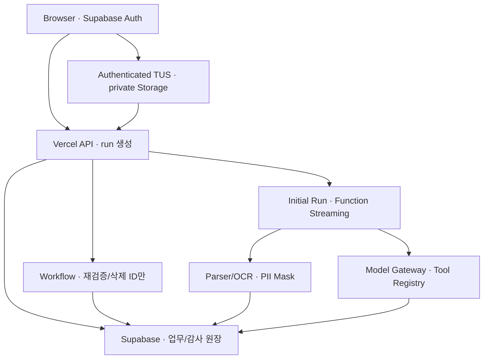

# ADR-001: P0 Provider·외부 연동·실행 인프라

- 결정일: 2026-09-03
- Architecture Decision: `ACCEPTED`
- Implementation Gate (`N-QLT-010`): `NO-GO`
- Release Gate (`N-QLT-009`): `NOT-EVALUATED`
- 적용 범위: FinShield P0 대출 Text·Image·PDF 단일 수직 흐름
- 최상위 기준: `docs/02-integrated-requirements.md`
- 요구사항 기준 Parent Commit: `3b236cc9e03e518eb63fef8a3d70d40881858668`
- 요구사항 문서 Git Blob SHA: `27ce706010344fbcedebe3abd707febff0f1dc26`
- 관련 요구사항: `N-QLT-009`, `N-QLT-010`, `N-PERF-005`, `N-PERF-009`, `N-AVL-001`, `N-AVL-006`, `N-AVL-008`, `N-OPS-003`, `N-OPS-004`, `AI-021`, `PC-005`, `INP-004`, `INP-006`, `INP-009`, `INP-011`, `INP-013`, `E-008`, `E-012`, `E-017`, `E-019`, `E-020`, `E-021`, `E-022`, `SEC-FILE-005`, `SEC-PRI-010`, `SEC-OPS-004`, `REV-001`, `ROLE-001`, `ROLE-003`, `OPS-004`, `EC-025`, `D-008`, `D-010`, `D-012`, `D-014`, `D-016`, `D-021`, `D-025`, `D-029`, `D-030`

> 이 문서는 P0에 사용할 기술 조합과 실패 계약을 승인한다. 실제 자격증명·쿼터·한국어 검색 품질·OCR 정확도·RLS·삭제·재시도 증거가 대응 blocker의 `PASS` policy를 통과하기 전에는 개발 전제인 `N-QLT-010` Implementation Gate를 닫지 않는다. 출시 조건인 `N-QLT-009` Release Gate는 기능 구현 뒤 별도로 평가한다. 문서 선택을 Live 연동 성공으로 계산하지 않는다.

---

## 1. 결정 요약

FinShield P0는 다음 조합으로 구현한다.

| 영역 | 분류 | P0 결정 | 현재 판정 |
|---|---|---|---|
| 생성 모델 | 사용 | Anthropic `claude-sonnet-5` 고정 Snapshot, Structured Output, Strict Tool Use | 1차 실측 합격, 이 개정으로 재측정 대기 |
| 고비용 모델 | 제한 사용 | `claude-opus-5`는 별도 평가를 통과한 고위험 Claim 재판정에만 허용 | 기본 경로 금지 |
| 임베딩 | 사용 | Cohere `embed-v4.0`, 1024차원, cosine, 문서 `search_document`·질의 `search_query` | 1차 후보 생성 단계로 한정, Recall@20 실측 전 |
| Vector 저장 | 사용 | Supabase Postgres `pgvector`, 공용 KB와 Case 임시 Vector 물리 분리, 초기 Exact KNN | 전용 Project·RLS 시험 전 |
| 디지털 PDF | 사용 | Mozilla `pdfjs-dist` native text 우선, 실제 통과 버전을 lockfile에 고정 | Fixture 시험 전 |
| Image·스캔 PDF | 제한 사용 | NAVER Cloud CLOVA OCR General, 원본 외부 전송 별도 동의 후 사용 | 키·1 TPS·정확도·삭제 계약 시험 전 |
| 원본 파일 | 사용 | Supabase private Storage에 인증된 TUS direct upload, one-use slot, 최대 10 MiB·10쪽 | Token/URL·Bucket·RLS·삭제 시험 전 |
| 인증·원장 | 사용 | 전용 FinShield Supabase Auth/Postgres/RLS, Supavisor transaction pooler | 현재 PreCase DB와 분리 확인 전 |
| 모델 실행 | 사용 | Vercel Node.js 24.x Fluid Functions, 모든 모델 호출은 단일 Model Gateway 경유 | 코드 이관 전 |
| 내구 실행 | 제한 사용 | Vercel Workflow에 `job_id` 같은 식별자만 전달, 업무 원장은 Supabase | 설치·Replay·멱등 시험 전 |
| 법령 | 공식 Snapshot | 국가법령정보 공동활용 API에서 수집한 불변 Snapshot을 기본 조회 | 등록 IP·OC·변경감지 실검증 전 |
| 대출 상품 | 공식 Snapshot | 금융위 서민금융상품기본정보와 서민금융진흥원 취급기관 API의 `햇살론15` Snapshot | 키·현재 상품/기관 레코드 실검증 전 |
| 소비자경보 | 공식 Snapshot | 금융감독원 보도자료·금융소비자뉴스 API와 소비자경보 게시판의 최소셋 | API 승인·수집 시험 전 |
| 공개 MCP | P1 이관 | P0에서는 `/api/mcp` 비활성화; 내부 호출은 `INTERNAL`/`내부 도구`로 표기 | conformance 뒤에만 호환 표기 |
| 자동 모니터링 | P1 이관 | Vercel Cron·Vercel Queues·URL Fetch·OpenDART 자동 수집 | P0 비범위 |
| 추가 도메인 | P1 이관 | 저축·투자·OpenDART·동적 Agent 선택·Agent 병렬화 | P0 비범위 |

Architecture Decision은 승인됐지만 Implementation Gate는 `NO-GO`다. §14.2의 Provider·인프라 차단 항목을 격리 배포 환경에서 통과하면 `N-QLT-010`을 `GO`로 바꾸고 기능명세·P0 구현을 진행할 수 있다. 전체 제품을 요구하는 `N-QLT-009` Release Gate는 그 뒤 §14.4의 공개 Live Seed와 회원 Live Vertical Slice까지 통과해야 하며 현재 `NOT-EVALUATED`다.

---

## 2. 문제와 범위

### 2.1 해결할 P0 시나리오

P0가 지원하는 검증 단위는 **`햇살론15`을 사칭하거나 해당 상품이라고 주장하는 대출 권유 한 건**이다. 사용자는 같은 제안서를 Text, Image 또는 PDF 중 하나로 넣고 다음 흐름을 완주한다.

1. Supabase Auth로 로그인한다.
2. Text를 입력하거나 private Storage로 파일을 직접 업로드한다.
3. 파일 검증, native PDF parsing 또는 동의한 OCR, 비모델 PII Mask를 수행한다.
4. 사용자가 Claim을 확인한다.
5. 고정된 대출 Domain Agent 4개가 순차 실행한다.
6. CoVe, Decision Red Team, Evidence Policy를 거친다.
7. Evidence Passport를 불변 버전으로 저장한다.
8. 수동 재검증을 요청하고 같은 Case의 새 결과 버전을 확인한다.
9. 가입 후에는 같은 `financial_case`의 PreCase 보호 상태로 이어진다.

회원 흐름과 별도로 Release 시 비회원 격리 Live Seed가 한 동작으로 같은 실제 Agent Pipeline을 실행해야 한다. 이 경로는 미리 정한 합성 입력만 사용하고 회원 Case를 만들지 않는다. 장애가 발생했을 때만 사용자가 dated 정적 Fallback을 선택할 수 있으며 사전계산 결과를 Live 실행으로 표시하지 않는다.

지원 상품은 금융위원회 `서민금융상품기본정보` API가 현재 `햇살론15` 레코드를 반환하고, 서민금융진흥원 `서민대출상품 취급기관` API와 공식 상품 페이지로 교차 확인할 수 있는 경우로 제한한다. Demo에 고정할 정확한 상품·취급기관 레코드는 API key와 응답을 Live 시험한 뒤 `authority`, `product_record_id`, `institution_record_id`, `official_url`, `published_or_checked_at`, `sha256`을 포함한 Source Snapshot으로 등록한다. 현재 레코드를 받지 못하거나 기관이 일치하지 않는 상태는 성공 Demo가 아니라 차단 사유 `B-SOURCE-03`이다. 일반 은행 개인신용대출로 범위를 바꾸려면 금융감독원 금융상품 한눈에 개인신용대출·금융회사 API를 별도 평가하고 이 ADR을 갱신한다.

### 2.2 P0에 포함하지 않는 것

- 저축·투자·보험 검증
- OpenDART 기업 공시 조회
- 문서에서 추출한 URL의 본문 Fetch 또는 Reputation 조회
- 동적 Agent 선택과 Agent 병렬 실행
- 자동 일정 모니터링과 SMTP 메일
- 금융회사·대부업체·대출모집법인 전체 목록의 자동 복제
- 사용자를 대신한 가입·송금·신고·계약 실행

기관 등록 여부는 공개 자동화 API가 확인되지 않았다. P0는 FINE 금융회사, 등록대부업체 통합조회, 대출모집법인 공식 조회 링크를 Action Guide에 제공한다. 실제 자동 조회를 수행하지 않았다면 기관 상태를 `UNKNOWN`으로 표시하고 확인했다고 표현하지 않는다.

### 2.3 성공의 의미

Provider 장애, 키 부재, 쿼터 초과, Snapshot 만료, OCR 동의 거절, Vector 검색 실패를 Seed 성공으로 바꾸지 않는다. 영향을 받는 Claim만 `UNKNOWN`, `NEED_MORE_INFORMATION`, `CONFLICT` 또는 `WITHHELD`로 종료한다. 정적 Demo는 `STATIC_FALLBACK` Badge와 기준일을 표시하고 Live Vertical Slice 성공률에 포함하지 않는다.

### 2.4 핵심 요구사항 추적

| 요구사항 | 이 ADR의 결정·Gate |
|---|---|
| `N-QLT-010` | Provider·인프라 Spike 실증 전 Implementation `NO-GO`; 통과 뒤 P0 기능 개발 허용 |
| `N-QLT-009` | P0 기능 구현 뒤 Production Build·공개 Live Seed·회원 Live Vertical Slice를 별도 Release Gate로 평가 |
| `N-PERF-005`, `N-PERF-009`, `N-AVL-008` | 최대 10초 간격 진행 신호, Text 120초·Image/PDF 180초, 동기 초기 Run 단절·취소 후 2초 이내 Abort; 연결 독립 Revalidation은 명시 취소 전 계속 |
| `N-AVL-001`, `N-AVL-006` | 저비용 app/DB health, Provider cached status, 배포 전 env/key/migration preflight |
| `N-OPS-003`, `N-OPS-004` | Supabase 공유 원장에서 호출 전 원자 reserve·호출 후 settle, process memory 금지 |
| `AI-021`, `PC-005` | `Product/Institution`, `Fraud/Channel`, PreCase 기반 `Sales Conduct`, `Regulation & Dispute` 4개를 별도 Schema·Tool allowlist·run row로 순차 실행 |
| `E-008`, `E-012`, `E-017`, `E-021` | timeout/retry, Tool 한도, 미연동 오표현 금지, 공개 MCP 비활성화 |
| `INP-004`, `INP-006`, `INP-009`, `INP-011`, `INP-013` | 10 MiB(10,485,760 byte)·10쪽, Locator 보존, 비모델 PII Gate, 최대 24시간 삭제, Quarantine 처리 순서 |
| `SEC-FILE-005`, `SEC-PRI-010` | 짧은 signed URL·고아 객체 추적, 외부 OCR 별도 동의와 거절 시 전송 0회 |
| `REV-001` | Lease·Heartbeat·Retry·Fencing을 가진 수동 재검증 Job |
| `OPS-004` | Live, 정적 Fallback, Snapshot, Cache, 실시간 조회 Badge 분리 |
| `ROLE-001`, `ROLE-003`, `EC-025` | 비회원 격리 Live Seed 실제 Pipeline과 장애 시에만 선택하는 dated 정적 Fallback |
| `D-008`, `D-010`, `D-012`, `D-014`, `D-016`, `D-021`, `D-025`, `D-029`, `D-030` | Source hash, Run manifest, 원본/임시물 분리·삭제, 멱등, KB release, 환경 분리, 안전한 object key와 상태 순서 |

---

## 3. 목표 구조

핵심 경계는 다음과 같다.

- Browser는 Supabase publishable key만 사용하고, 외부 Provider secret과 `service_role`을 받지 않는다.
- 4.5 MB를 넘을 수 있는 파일은 Vercel Function request body를 통과하지 않는다.
- Workflow 입력·출력에는 원문, PII, Prompt, 모델 응답 전문을 넣지 않는다. `job_id`·`run_id`·`input_id`도 DB와 결합 가능한 가명식별자로 분류한다.
- P0 초기 Run은 같은 연결의 Function Streaming으로 완료·부분실패를 반환한다. 새로고침·다른 기기에서 진행 중 Run 복원은 P1이다.
- Model Gateway만 Anthropic을 호출한다. Agent가 SDK를 직접 호출할 수 없다.
- Supabase가 Case, Run, Evidence, 비용, 상태 전이, 삭제 Ledger의 유일한 source of truth다.
- 공용 Knowledge Base와 사용자 임시 문서·Embedding을 다른 Schema와 RLS 경계로 분리한다.

---

## 4. 생성 모델

### 4.1 기본 모델

기본 모델 ID는 Anthropic `claude-sonnet-5`다. Anthropic의 4.6 이후 날짜 없는 모델 ID는 이동 alias가 아니라 고정 Snapshot이다. 모델 가중치는 고정되지만 라우팅·안전 분류기·서빙 인프라는 바뀔 수 있으므로 Prompt·Schema 회귀 테스트는 계속 필요하다.

적용 계약:

- 모든 판단 출력은 `output_config.format` JSON Schema를 사용한다.
- 쓰기 또는 외부 동작 Tool에는 `strict: true`를 적용한다.
- 응답 파싱 전 `stop_reason`을 검사한다.
- `refusal`과 `max_tokens`는 스키마 성공으로 간주하지 않는다.
- SDK schema 성공 뒤에도 Zod post-validation과 enum/const canonicalization을 수행하고 의미 규칙을 다시 검사한다.
- 실제 모든 Agent schema의 grammar compilation, cold-start 지연, unsupported schema, compilation 실패 Fixture를 측정한다.
- Citations 기능과 Structured Output을 한 요청에서 결합하지 않는다. 구조화 결과는 앱이 소유한 `source_snapshot_id`·`evidence_id`를 참조한다.
- Prompt cache는 1,024 token 이상 반복되는 정책·Tool Schema에만 적용하고, cache create/read token을 모두 비용 원장에 기록한다.
- Provider 응답 전문, 사고 과정, 사용자 원문을 Vercel Runtime Log에 남기지 않는다.

### 4.2 모델 배치

| 역할 | 모델 | 실행 정책 |
|---|---|---|
| Intake 구조화 | `claude-sonnet-5` | PII Mask 이후, 확인용 Claim 후보만 생성 |
| 대출 Domain Agent | `claude-sonnet-5` | 고정 4개: 상품·기관(Product/Institution), 사기·채널(Fraud/Channel), 판매행위(Sales Conduct), 규제·분쟁(Regulation & Dispute); 각자 Schema·Tool allowlist·run row |
| CoVe | `claude-sonnet-5` | 초기 결론을 전달하지 않은 독립 Query와 Evidence만 사용 |
| Decision Red Team | `claude-sonnet-5` | 초기 판단을 뒤집을 공식 반대 근거 탐색 |
| Evidence Judge·Guide | `claude-sonnet-5` | 확인된 Claim·Evidence 구조 중심 |
| 고위험 재판정 | `claude-opus-5` 제한 사용 | 별도 평가·Budget 승인을 통과한 Claim만, 자동 fallback 금지 |

개인 적합성은 별도 다섯 번째 Agent를 가장하지 않는다. 금융 프로필 Snapshot이 있으면 Sales Conduct의 구조화 입력과 Evidence Judge·Profile Policy Validator가 상환부담·설명의무 관련 Claim을 평가하고, 프로필을 건너뛰면 적합성 축만 `NEED_MORE_INFORMATION`으로 끝낸다. Regulation & Dispute Agent는 법령·판례·분쟁 근거를, Fraud/Channel Agent는 사칭 기관명·공식 URL/전화·선입금·원격제어·긴급성 신호를 담당한다.

`claude-haiku-4-5-20251001`과 다른 제공사 모델은 P0 기본 경로에 넣지 않는다. 값싼 모델로 조용히 바꾸는 fallback은 실행 Manifest 재현성과 품질 계약을 깨므로 금지한다.

### 4.3 Timeout·Retry·Budget

- 각 Anthropic attempt는 단계별 6~12초 hard budget과 남은 Run 시간을 함께 적용한다. 45초짜리 개별 timeout을 순차 호출마다 허용하지 않는다.
- 네트워크 오류·429·명시적 5xx의 Model 재시도는 Run 전체에서 최대 1회이며 공용 10초 contingency 안에서만 수행한다. `retry-after`를 우선하고 시간이 부족하면 재시도 없이 `WITHHELD`로 끝낸다.
- validation·refusal·정책 오류는 같은 입력으로 자동 재시도하지 않는다.
- 호출 전 `model_id`, 예상 최대 input/output token, 단가 기준일로 비용을 원자 예약한다.
- 종료 후 실제 input, output, cache-create, cache-read token과 비용을 정산한다.
- 요금과 조직 rate limit을 코드 상수로 진실처럼 고정하지 않고, 기준일·응답 헤더·관리 API 대조 결과를 보존한다.

Verification 실행 예산은 다음 상한으로 합이 닫혀야 한다. 한 단계가 남긴 시간을 다음 단계가 쓸 수는 있지만 어느 단계도 전체 deadline을 늘리지 않는다.

| 단계 | Text 상한 | Image·PDF 상한 | 포함 |
|---|---:|---:|---|
| 입력 정규화·PII Mask·Intake Claim 후보 | 10초 | 10초 | Text와 파일 모두; Intake 모델 포함 |
| 파일 검사·Parser/OCR | 0초 | 35초 | 파일 경로만; 실패 시 Text 복구 |
| Preflight·비용 예약·공식 근거 조회 | 8초 | 8초 | 공유 DB·Snapshot 조회 |
| 고정 Domain Agent 4개 순차 실행 | 32초 | 32초 | Agent당 최대 8초 |
| CoVe | 12초 | 12초 | 독립 Query·Evidence |
| Decision Red Team | 12초 | 12초 | 반대 근거 |
| Evidence Judge | 8초 | 8초 | 축·Claim 결과 |
| Action Guide | 6초 | 6초 | 공식 채널만 |
| Run 전체 재시도 contingency | 8초 | 8초 | Model retry 최대 1회 |
| 최종 Transaction·Streaming 종결 | 6초 | 6초 | 실패 상태·비용 포함 |
| 계획 합계 | 102초 | 137초 | Hard deadline보다 18초/43초 짧음 |

합성 지연 Fixture에서 단계 상한과 전체 상한을 모두 검증한다. 정상 전체 흐름의 P95가 §15.1 기준을 넘으면 호출 timeout을 늘리지 않고 Prompt·Tool·출력량을 줄이거나 범위를 변경한다.

Anthropic 자격증명, 조직 한도, Sonnet 5 접근권한, 한국어 금융 Fixture의 schema 성공률·P95·비용이 `B-MODEL-01` policy를 통과하기 전에는 Live Model 판정을 미검증으로 취급한다.

### 4.4 외부 처리자 개인정보 조건

PII Mask는 외부 처리자 계약을 대신하지 않는다. 실제 사용자 데이터 전송 전 Anthropic·Cohere·CLOVA와 회원 Case·프로필·원본 파일을 보관하는 Supabase 각각에 대해 학습 사용 여부, 기본/Zero Data Retention, 법적 보존 예외, DPA, 하위처리자, 처리 region, 지원 인력 접근, 삭제·감사 방법을 조직 설정과 계약에서 확인한다. Anthropic ZDR은 조직별 승인 여부를 확인하며 문서에 기능이 있다는 이유만으로 활성 상태라고 가정하지 않는다.

마스킹 Fixture에는 이름·전화·주민번호·계좌·주소뿐 아니라 금융 프로필, 자유서술 간접식별자와 문서 metadata를 포함한다. 잔존 PII가 의심되면 Anthropic·Cohere 호출과 영구 저장을 모두 fail-closed한다. `B-PROCESSOR-PRIVACY`가 닫히기 전에는 완전한 합성 Fixture만 외부 Provider에 보낸다.

---

## 5. Embedding·Hybrid Retrieval

### 5.1 선택

P0 임베딩은 Cohere `embed-v4.0`을 1024차원으로 사용한다. 공식 문서가 한국어를 포함한 100개 이상 언어를 명시하고 256·512·1024·1536 차원을 지원하기 때문이다.

- 문서 Chunk: `input_type=search_document`
- 사용자 Query: `input_type=search_query`
- 차원: 1024
- 거리: cosine
- 저장: `vector(1024)`
- 공용 자료: `kb.knowledge_embeddings`
- 사용자 임시 자료: `private.case_embeddings`
- 모델 식별: Provider, exact model ID, dimension, input type을 각 row와 execution manifest에 저장

다른 Provider 또는 다른 모델의 Vector를 같은 컬럼에서 비교하지 않는다. 모델을 바꾸면 새 collection/column에 전량 재임베딩하고 평가 결과를 기준으로 cutover한다.

### 5.2 검색 방식

P0 corpus는 작고 재현 가능한 평가가 우선이므로 초기에는 Exact KNN을 사용한다. Keyword 검색 결과와 Vector 검색 결과를 합성하되, 한쪽이 비었다고 Seed 근거를 삽입하지 않는다. HNSW는 corpus 크기와 P95가 Exact KNN 한계를 실제로 보인 뒤 P1에서 recall 손실을 비교해 도입한다.

검색은 `AI-007`이 규정한 `Metadata Filter → Keyword → Vector → Authority/Freshness/Relevance Rerank` 순서를 따르고, 두 단계로 나눠 증명한다.

| 단계 | 역할 | blocker | 무엇을 증명하는가 |
|---|---|---|---|
| Vector 1차 후보 생성 | Filter를 통과한 문서에서 Claim 하나를 질의로 후보 풀 20개 산출. Case 풀은 Claim 풀의 합집합 | `B-EMBED-01` | Claim을 확인하거나 반박할 근거가 후보 풀 안에 빠짐없이 들어오는가 |
| 종단 Retrieval | Filter·Keyword·Vector·Rerank를 거친 최종 top 5 | `B-RETRIEVAL-01` | 최종 결과가 대상·시점이 맞는 근거만 담는가 |

`AI-006`에 따라 기관·상품 식별과 정확한 수치 조회는 Structured Retrieval을 우선하고, Vector 유사도만으로 사실을 확정하지 않는다. 대상 식별자와 시점 판별은 Metadata Filter와 Freshness Rerank가 담당하며 Vector 단계 단독에 요구하지 않는다.

1차 후보 생성에서 빠진 근거는 이후 어떤 단계로도 복구할 수 없으므로 후보 풀에서 부분 회수를 허용하지 않는다. 후보 풀 크기는 Rerank 입력 상한과 corpus 대비 비율에서 정하고 관측된 순위 분포에 맞추지 않는다.

질의 단위는 사용자 문단이 아니라 Claim 하나다. 요구사항은 Intake가 추출한 Material Claim을 CoVe가 별도 질문·검색으로 독립 재검증하도록 정하므로, 근거 검색은 Claim마다 일어난다. 여러 사실을 한 문장에 묶은 문단을 통째로 임베딩해 검색하는 경로는 제품에 없다.

이 결정은 2026-09-05 v3·v4 측정 뒤에 내렸다. 문단 단위 다중 항목 질의는 Filter 없이 Recall@20 0.902, Filter 뒤 0.970으로 두 번 미달했고, 단일 사실 질의는 두 번 다 1.00이었다. 미달을 보고 합격선을 낮춘 것이 아니라 §15.1의 미달 규칙에 따라 검색 단위를 제품 구조에 맞춘 것이며, 합격선·후보 풀 크기·Filter 계약은 그대로다. 측정 뒤 재구성이라는 사실은 제출 문서에 명시한다.

Keyword 단계는 `kb.knowledge_chunks.search_vector`의 실제 Postgres FTS 경로를 사용한다. 따라서 `B-RETRIEVAL-01`은 `B-SUPABASE-01` 통과에 의존하며, FTS를 응용 코드의 근사 구현으로 대체해 통과시키지 않는다. Rerank는 `kb.source_snapshots`의 `authority_level`·`effective_from`·`effective_to`·`source_fingerprint`를 사용하는 결정적 단계이고, 같은 `source_fingerprint`는 독립 근거 수를 늘리지 않는다.

Live Gate 평가셋은 최소 다음을 포함한다.

- 한국어 개인신용대출 상품명·금리·중도상환·부대비용 Query
- 표기 변형, 띄어쓰기, 영문/한글 혼합 기관명
- 유사하지만 다른 상품·기관 hard negative
- 최신/만료 Snapshot 구분
- 소비자경보의 선입금, 원격제어앱, 정부지원 사칭, OTP 요구 표현

수용 기준은 평가셋 버전과 함께 기록한다. 최소 top-k Recall 기준과 P95 목표를 숫자로 확정하지 못한 상태는 Gate 통과가 아니다. 두 단계 모두 새 시나리오 가족의 미측정 평가셋을 사용하고 이미 노출된 평가셋을 재사용하지 않는다. 실제 한국어 금융 평가가 `B-EMBED-01`과 `B-RETRIEVAL-01` policy를 통과하기 전에는 검색 판정을 미검증으로 취급한다. 후보 생성 결과를 종단 품질 합격으로 표시하지 않는다.

---

## 6. 파일·Storage·OCR

### 6.1 Upload 경로

Vercel Function의 요청·응답 body 한도는 4.5 MB이고 FinShield 입력 상한은 10 MiB다. 따라서 파일을 Next.js API로 중계하지 않는다.

1. 서버가 인증 사용자·Case·MIME·크기 상한을 검증하고 random object path의 one-use upload slot을 만든다.
2. Browser가 짧은 수명의 사용자 JWT로 Supabase private Storage `finshield-quarantine`에 `x-upsert:false` TUS resumable upload한다.
3. Browser가 object key, byte size, client hash만 API에 전달한다.
4. 서버가 소유권, object metadata, Magic Byte, MIME, 최대 10 MiB를 다시 검증한다.
5. 결과 PDF도 4.5 MB를 넘을 수 있으므로 Function 응답 대신 짧은 수명의 signed download URL을 사용한다.

Bucket은 public으로 전환하지 않는다. object path에는 `owner_id/case_id/input_id/random.<safe_ext>`를 쓰고 원본 파일명·이름·전화번호를 넣지 않는다. `safe_ext`는 서버가 Magic Byte로 검증한 확장자다. path는 재사용하지 않는다. RLS는 사용자 자신의 열린 upload slot에 대한 제한된 쓰기만 허용하며 서버 검증 전 읽기를 허용하지 않는다. Supabase가 발급한 TUS upload URL의 유효시간을 앱 설정만으로 짧아졌다고 가정하지 않고, slot 폐쇄 뒤 이미 발급된 URL·token으로 PATCH/재업로드가 가능한지 Live Gate에서 검사한다.

### 6.2 Parser 우선순위

| 입력 | 1차 처리 | 품질 검사 | 복구 |
|---|---|---|---|
| Text | Unicode 정규화·크기 제한 | 숫자·부정어·URL·기관명 보존 | 사용자 재입력 |
| digital PDF | Mozilla `pdfjs-dist` `getTextContent()` | page count, 문자수, printable ratio, 숫자·금리 패턴 | 동의한 CLOVA OCR 또는 Text 입력 |
| Image | Magic Byte/MIME/해상도 검사 | OCR Fixture | 동의한 CLOVA OCR 또는 Text 입력 |
| scanned PDF | page count·raster 검사 | 페이지별 OCR 상태 | 전체 재업로드 또는 Text 입력 |

`pdfjs-dist`는 OCR 엔진이 아니다. 실제 Fixture를 통과한 exact package version과 parser version을 lockfile·execution manifest에 고정한다. text layer가 없거나 숫자·부정어를 보존하지 못하면 자동으로 성공 처리하지 않는다.

Parser 전에 확장자·선언 MIME·검출 MIME·Magic Byte를 비교하고 encrypted PDF, active content, embedded file, 의심 signature, polyglot, 손상 문서를 거부한다. Image/PDF decode pixel 수, 압축비, page object 수, CPU·memory·wall-time 상한을 둬 pixel/zip bomb과 parser DoS를 차단한다. Parser는 Provider secret이 없는 격리 실행 단위에서 network egress 없이 동작하고 crash가 Agent Runtime으로 전파되지 않아야 한다. exact dependency version, 보안 advisory 검토, malformed/active/encrypted/bomb Fixture를 `B-FILE-SAFETY`에서 통과하기 전에는 합성 allowlist Fixture 외 파일을 처리하지 않는다.

### 6.3 CLOVA OCR 제한 사용

NAVER Cloud CLOVA OCR General은 한국어와 표를 지원하며 공식 한도상 JPG·PNG·PDF·TIFF, 파일당 50 MB를 다룬다. API PDF는 10쪽, Batch는 30쪽이다. 공식 문서의 서비스 계정당 권장 성능을 따라 기본 운영 안전 한도는 1 TPS로 두고, 고객지원으로 상향 승인된 경우에만 versioned 설정을 바꾼다. FinShield 자체 한도는 더 엄격한 10 MiB·10쪽이다. 30쪽은 Batch 경로를 요구하는데 기본 1 TPS에서 30쪽은 순수 호출만 30초가 걸려 §4.3의 파일 검사·Parser/OCR 35초 예산에 Batch poll과 파일 검증을 담을 여유가 없다. 동기 API 한도와 같은 10쪽으로 낮춰 Batch 없이 예산 안에서 끝낸다.

마스킹 전 원본이 외부 Provider로 전송되므로 다음 동의 없이는 호출하지 않는다.

- Provider 이름과 처리 목적
- 전송되는 파일·페이지 범위
- Provider 처리·로그 정책 링크
- 앱의 기본 원본 삭제 시점과 최대 24시간 상한
- 거절 시 Text 직접입력 경로
- 동의 문구 버전과 시각

P0는 동기 OCR 경로만 사용한다. Batch/Poll은 30쪽 상한을 되살릴 때의 P1 후보이며, 어느 경로도 전체 Run 180초를 넘겨 가짜 완료할 수 없다. 기본 1 TPS를 공유 Rate Store에서 직렬화하고, timeout·429·5xx는 안전하게 보류한다. OCR 실패 페이지를 성공으로 숨기지 않으며 P0 복구는 전체 재업로드 또는 Text 직접입력이다.

### 6.4 삭제 계약

원본과 OCR 임시물은 Claim 확인, 사용자 중단, Case 삭제 중 가장 먼저 발생한 시점에 즉시 삭제를 시도한다. 어떤 경우에도 생성 후 24시간을 넘기지 않는다.

- 각 upload 때 별도 cleanup Workflow를 생성하고 object key가 아닌 `input_id`만 전달한다.
- Claim 확인·취소·Case 삭제 시 upload slot을 먼저 닫아 새 쓰기와 앱 접근을 거부하고, 기존 object를 즉시 삭제 시도한다.
- `upsert=false`와 영구 비재사용 random path를 강제하고, 기발급 upload URL·download URL·CDN cache의 재사용을 시험한다.
- 삭제 직후 object가 다시 생기는 경쟁을 탐지하기 위해 token/URL 만료 뒤 재조회·재삭제한다. 그 전에는 `RAW_DELETED` 최종 상태를 쓰지 않는다.
- cleanup step은 DB에서 현재 삭제 대상을 조회하고 멱등 삭제한다.
- 성공·실패·재시도·최종 상태를 `deletion_ledger`와 `ocr_artifacts`에 기록한다.
- Workflow가 장시간 sleep할 수 있어도 Supabase가 삭제 원장이다.
- Hobby Cron의 하루 1회·±59분 실행은 24시간 상한을 보장하지 못하므로 유일한 삭제 장치로 쓰지 않는다.
- 원본 장기 보관은 P0 기본값이 아니며 별도 동의·암호화·조회·삭제 기능 없이는 금지한다.

Supabase의 실제 TUS URL·JWT·signed URL 수명과 재사용 동작으로 인해 `raw_created_at + 24시간` 전에 물리 부재를 증명할 수 없다면 Image/PDF 기능은 Gate를 통과하지 못하며 Text 입력만 별도 capability로 남긴다.

TUS upload slot, Bucket RLS, token 재사용, 취소 직후 접근 차단, 24시간 물리 삭제, Backup 복원 삭제 Ledger가 대응 Storage·삭제 blocker policy를 통과하기 전에는 파일 Gate를 미검증으로 취급한다.

---

## 7. Supabase 경계

FinShield 전용 Supabase Project를 PreCase Production과 물리적으로 분리한다. 현재 Migration `0001~0006`은 PreCase 기준선이므로 새 FinShield 회원 Project에 그대로 적용하지 않는다.

| 자원 | 결정 |
|---|---|
| Auth | Supabase Auth; P0 이메일·비밀번호, 메일 기반 복구는 P1 |
| Runtime DB | Supavisor transaction pooler, port 6543, prepared statements 비활성 |
| Migration DB | 제한된 관리 경로의 direct connection; 앱 Runtime에 노출 금지 |
| Schema | `public` API surface 최소화, 업무 `private`, 공용 자료 `kb`, Demo `demo` |
| Storage | private `finshield-quarantine`, private `finshield-kb` |
| Vector | `pgvector`, 공용/사용자 물리 분리 |
| RLS | 모든 사용자 소유 table과 object에 owner/case 복합 경계 |
| Secret | `service_role`·Migration DSN·Provider key는 Browser 금지 |

사용자 요청의 DB 접근은 Supabase Data API/client에 사용자의 JWT를 전달해 `authenticated` 역할과 RLS를 적용한다. Raw pooler 연결에 owner·`postgres`·`service_role`을 넣어 사용자 CRUD를 수행하지 않는다. Background 작업은 `NOBYPASSRLS`인 최소권한 `finshield_worker` 역할을 사용하고, 필요한 교차 table 작업만 execute-only `SECURITY DEFINER` RPC로 감싼다. RPC는 고정 `search_path`, 입력 owner/case 검증, revoked `PUBLIC` 권한, audit row를 가져야 한다. `service_role`은 migration·복구 같은 통제된 관리 경로로 제한하고 일반 Agent/Tool 실행에 사용하지 않는다.

RLS 시험은 사용자 A/B 교차 접근뿐 아니라 worker가 owner predicate를 누락한 호출, 임의 case ID, SECURITY DEFINER search-path shadowing, Storage object path 위조를 포함한다. server-side secret이라는 사실만으로 IDOR가 방지됐다고 보지 않는다.

Preview는 Production과 다른 Supabase Project 또는 최소한 격리된 Schema·Bucket·test user를 사용한다. Production credential을 Pull Request의 임의 코드에 주입하지 않는다. `project_ref`, host, bucket, expected migration version은 secret 값 없이 배포 preflight inventory에 고정한다.

전용 Project, Auth, Pooler, `pgvector`, RLS cross-user/worker negative test, Storage upload/delete가 `B-SUPABASE-01` policy를 통과하기 전에는 DB/Storage 연결 판정을 미검증으로 취급한다.

---

## 8. 공식 출처와 Snapshot

### 8.1 국가법령정보

P0 법령 근거는 국가법령정보 공동활용 API에서 수집한 불변 Snapshot을 기본으로 조회한다. 요청 시점 Live 조회 결과를 그대로 판정 근거로 쓰면 같은 판정을 나중에 재현할 수 없고 인용한 조문의 시행일·원문 hash를 고정할 수 없기 때문이다.

실제 호출 제약은 IP가 아니라 등록 도메인이다. 법제처는 신청 시 등록한 도메인과 요청의 `Referer`를 대조한다. 2026-09-05 FinShield 전용 계정에 배포 도메인을 등록하자 Vercel Production의 `law_api` 검사가 통과했고, 그 전 실패는 다른 프로젝트 도메인이 등록돼 있었기 때문이다. 따라서 동적 egress IP는 차단 사유가 아니며, 신청 계정과 등록 도메인을 프로젝트마다 분리해야 한다. 다른 프로젝트의 등록 도메인을 `Referer`로 쓰지 않는다.

수집기는 다음을 검증한다.

- HTTPS 서버 호출, OC URL encoding, JSON/XML 응답
- 정확 법령명 → `LID/MST` → 본문/조문 흐름
- 현행 시행일 기준 `nw=3`, pagination과 `display` 최대 100
- 변경감지 API의 D+1 반영
- 403·429·5xx·timeout 응답과 retry/cache 계약
- 요청 `Referer`가 등록 도메인과 일치하는지, Preview 배포 도메인에서도 통과하는지
- 응답 hash·조회시각·시행일·법령/조문 ID·공식 URL·출처표시 저장

P0 최소 법령 Snapshot:

1. 금융소비자 보호에 관한 법률과 시행령의 광고·설명의무·부당권유 관련 조문
2. 대부업 등의 등록 및 금융이용자 보호에 관한 법률과 시행령의 등록·광고·최고금리·중개수수료 관련 조문
3. 이자제한법과 시행령의 최고이자율 관련 조문

법제처 자료는 출처를 표시하고 왜곡하지 않는다. API 숫자 쿼터는 공식 페이지에 공개돼 있지 않으므로 실제 승인 계정으로 확인한다. Vercel Preview와 Production 각각에서 API를 probe하고 재배포·도메인 변경 후에도 반복한다. Preview는 배포마다 도메인이 달라 등록 도메인과 어긋날 수 있으므로 Preview 실패를 Production 실패로 해석하지 않고, 어느 범위까지 `Referer`가 통과하는지를 `B-LAW-01`에서 확인한다. Production probe 한 번의 성공을 쿼터·안정성 보증으로 보지 않는다.

### 8.2 P0 정책서민금융 상품·취급기관

P0 Snapshot 입력은 금융위원회와 서민금융진흥원의 공공데이터 API를 사용한다.

- 금융위원회 `서민금융상품기본정보`: 상품명·지원대상·금리·한도·상환방식·취급기관
- 서민금융진흥원 `서민대출상품 취급기관`: 기관명·법인번호·주소·상품명
- 두 API 모두 공공데이터포털 `serviceKey`를 쓰며 개발·운영 활용신청의 실제 승인 상태를 확인
- 공식 페이지에 명시된 개발 트래픽 10,000회 조건과 응답 형식을 실제 key로 확인
- 이용료 무료·이용허락범위 제한 없음 표기를 기준일과 함께 source registry에 보존
- 응답 레코드는 상품/기관 record ID, 기준일, fetch time, SHA-256과 함께 불변 저장

공식 `햇살론15` 상품 페이지로 사람과 자동 수집 결과를 교차 확인한다. API의 상품명만 같다고 주장한 전화번호·URL·계좌가 공식 채널이라는 뜻은 아니다. 한국은행연합회 금리비교 페이지는 지원 API와 재이용 조건이 확인되지 않아 Runtime scraping하지 않는다. 금융감독원 금융상품 한눈에는 일반 은행 신용대출로 P0 범위를 바꿀 때의 공식 후보로만 보존한다.

서민금융진흥원 공식 상품 이용안내의 대표 상담번호 `1397`과 “대출 중개수수료를 요구하지 않는다”는 안내, 공식 사칭 신고센터의 명칭·로고·SNS·광고 사칭 유형을 최소 Snapshot에 포함한다. 선입금·중개수수료, 상품권 구매, 개인 계좌 상환, 원격제어 앱, OTP·비밀번호·카드 요구, 공식 도메인·전화 불일치는 위험 신호가 될 수 있지만, 단일 신호만으로 법적 `사기` 확정 결과를 만들지 않는다.

### 8.3 소비자경보

금융감독원 일반 Open API의 보도자료·금융소비자뉴스를 승인 key로 하루 한 번 수집하는 후보로 둔다. 공식 안내상 개인은 API별 30회/일이며 검색기간은 한 달이다. 소비자경보 게시판은 문서화된 API가 확인되지 않았으므로 자동 scraping하지 않고 공식 URL과 선택한 문서의 Snapshot metadata만 관리한다.

P0 최소 경보 주제는 다음 네 가지다.

1. 대출 전 선입금·수수료 요구
2. 원격제어 앱 설치 요구
3. 저금리 대환·정부지원 사칭
4. 개인정보·OTP·인증번호 요구

초기 allowlist에는 금융위원회의 정부·기관 사칭 스미싱, 원격제어 앱 악용 예방, 개인정보 유출·원격 앱 사기 경보 공식 문서를 포함한다. 금감원 소비자경보는 제목·게시일·공식 URL 중심으로 선별하고, 재배포 조건이 확인되지 않은 본문 전문은 저장하지 않는다.

각 Snapshot은 `authority`, `title`, `official_url`, 공식 record ID, published/effective date, `fetched_at`, SHA-256, 출처 라벨을 보존한다. 문서가 만료되거나 원문과 hash가 달라지면 `FRESH`로 표시하지 않는다.

### 8.4 기관 공식 조회

다음 공식 조회는 Action Guide 링크로 제공한다.

- FINE 금융회사 조회
- 등록대부업체 통합조회
- 대출모집법인 조회

공개 자동화 API를 확인하지 못했으므로 P0 Agent가 등록 여부를 자동 확정하지 않는다. Demo 기관의 dated allowlist는 공식 페이지에서 사람이 확인한 시각과 근거 URL을 Snapshot으로 고정할 수 있으나, 전체 등록 목록으로 표현하지 않는다.

금융위원회 공공데이터포털의 `금융회사기본정보` API는 회사명·법인/사업자번호·주소·전화·공식 홈페이지·금융감독원 고유번호를 제공하므로 기관명·도메인·전화의 **보조 교차검증**에 제한 사용할 수 있다. 이 자료는 존재·기본정보 데이터이며 현재 인허가나 대출판매 권한을 보증하지 않으므로 단독으로 `정상 기관` 판단을 만들 수 없다. 공식 안내상 개발·운영 key 자동승인, 개발 10,000회, 영업일 D+1 13시 이후 일 1회 갱신 조건을 실제 계정과 응답 헤더에서 다시 확인한다.

외부 데이터 비교 상태는 `REFERENCE_MATCH`, `REFERENCE_MISMATCH`, `UNVERIFIED`로 제한한다. 이는 공식 기준과 입력의 일치 여부이지 발신자 본인 확인이나 안전·사기 확정이 아니다. 공식 UI/API가 없거나 호출에 실패하면 `UNVERIFIED`이며, 목록에서 찾지 못한 사실만으로 불법 또는 안전을 단정하지 않는다.

### 8.5 Snapshot freshness

| 출처 | 기본 갱신 후보 | 만료 시 동작 |
|---|---|---|
| 법령 현행·조문 | 매일 변경감지 후 변경분 수집 | 영향 Claim `UNKNOWN` 또는 `STALE`, 과거 조문임을 표시 |
| 서민금융상품·취급기관 | 6~24시간 | 상품 조건·취급기관 확정 금지, 공식 원문 확인 안내 |
| 보도자료·금융소비자뉴스 | 하루 1회 | 최신 경보 없음으로 안전 판정 금지 |
| 수동 소비자경보 | 문서별 기준일·다음 검토일 | `STALE` Badge와 확인일 표시 |
| 기관 allowlist | Demo release 전 수동 재검증 | 등록 여부 `UNKNOWN` |

정확 TTL은 실제 변경 빈도·쿼터·P95를 측정해 policy version에 고정한다. 이 표의 범위는 시험 후보이며, 측정 전에는 Gate 통과 숫자가 아니다.

---

## 9. Vercel 실행 인프라

### 9.1 Runtime

P0는 Vercel Node.js 24.x Fluid Functions를 사용한다. `package.json`의 `engines.node`와 CI Node 버전을 같은 작업에서 24.x로 맞춘다.

Vercel이 선택하는 단위는 24.x major이며 minor/patch는 플랫폼 갱신에 따라 달라질 수 있다. 따라서 각 Run manifest에 실제 `process.version`, Vercel deployment ID, region을 기록하고 24.x를 고정 Snapshot으로 표현하지 않는다. 이 ADR 작업에서 `package.json`, root lockfile metadata와 CI는 24.x로 맞추되, Preview/Production의 실제 값은 `B-RUNTIME-01` probe가 증명한다.

Hobby 기준 현재 공식 제한:

- Function 기본/최대 실행시간 300초
- 메모리 최대 2 GB, 1 vCPU
- 요청 또는 응답 body 4.5 MB
- Node/Bun 비압축 bundle 250 MB
- Runtime Log 보존 1시간
- 비상업적 개인 용도만 허용

2026-09-05 Hobby를 유지하기로 결정했다. Hobby에는 DPA가 없으므로 이 제출 범위에서는 실제 사용자의 개인정보와 실제 금융 문서를 처리하지 않는다. 자유 입력 화면은 제공하되 실제 개인정보를 넣지 말라는 고지를 입력 전에 표시하고(`SEC-PRI-001`), 비모델 PII Gate와 원본 삭제로 그 약속을 기술적으로 강제한다. 심사 시연도 합성 Fixture와 데모 입력만 사용한다. 따라서 `B-PRIVACY-VERCEL`은 실데이터 처리 허용 승인이 아니라 Hobby 조건 기록과 미처리 강제 장치의 시험으로 닫는다. 실제 사용자 데이터 처리, 유료 파일럿, 고객 운영, 상업적 사용 전에는 DPA가 가능한 유료 plan을 Launch 조건으로 다시 평가한다.

### 9.2 Deadline

Vercel의 300초를 제품 deadline으로 사용하지 않는다.

- Text Run: 120초
- Image·PDF Run: 180초
- deadline은 서버 구성값이며 `deadline_at`을 DB와 execution manifest에 저장한다.
- 각 단계는 남은 시간에서 cleanup·terminal write 여유를 뺀 timeout을 받는다.
- 긴 Streaming 연결에는 최대 10초 간격의 진행 event 또는 heartbeat를 보낸다.
- 동기 초기 Run의 연결 단절이나 사용자 취소를 감지하면 2초 이내 하위 Model·API `AbortSignal` 전달을 시도하고 종결 이유를 저장한다.
- 단계 경계마다 마지막 안전 진행 상태와 `last_progress_at`을 DB에 먼저 기록한다. 소유권·RLS를 적용한 `GET /api/runs/{run_id}/status`는 연결이 끊긴 뒤에도 마지막 persisted progress와 `CANCELED|WITHHELD|FAILED|COMPLETED` terminal 상태를 복원한다.
- P0 상태 조회는 실행을 백그라운드에서 계속하거나 중간 단계부터 재개한다는 뜻이 아니다. 끊긴 동기 초기 Run은 안전하게 종결하고, 사용자는 종결 상태와 재시도 가능 여부를 확인한다. 진행 중 Run의 background/cross-device resume은 P1이다.
- 연결 독립 수동 Revalidation Job은 화면 연결 단절만으로 취소하지 않는다. 인증된 명시적 Job 취소 API가 상태를 `CANCEL_REQUESTED`로 바꿀 때만 하위 호출 중단을 시도한다.
- Streaming은 `done` 또는 민감정보를 제거한 `error` event로 끝낸다.
- 초과 시 확보 Evidence와 비용을 저장하고 영향 Claim을 `WITHHELD`로 끝낸다.
- Function이 강제 종료된 뒤 완료로 보이는 상태를 만들지 않는다.

### 9.3 Workflow 제한 사용

Vercel Workflow는 수동 재검증과 원본 cleanup처럼 내구성이 필요한 다단계 실행에 제한 사용한다. 전체 Workflow 실행과 sleep에는 장기 실행 여지가 있지만 각 step에는 일반 Function 한도가 적용된다.

Workflow 계약:

- 입력은 `job_id`, `run_id`, `input_id` 같은 opaque ID만 허용한다.
- 이 ID는 익명정보가 아니라 가명식별자다. Workflow region·보존·RBAC·team owner·지원 인력 접근 범위를 Gate에서 검증한다.
- step은 Supabase에서 데이터를 읽고 모든 상태 전이를 Supabase에 쓴다.
- step 반환값은 `void` 또는 사전 승인된 status scalar만 허용하고 exception message·stack을 PII scanner로 검사한다.
- terminal DB write는 idempotency key와 unique constraint를 사용한다. Provider 호출에는 공식 지원이 확인된 경우에만 idempotency key를 사용한다.
- lease, heartbeat, retry count, fencing token은 DB 원장에 둔다.
- step 입력·출력·오류에 PII, 파일 원문, Prompt, Claim 전문, 모델 응답 전문을 넣지 않는다.
- Workflow 보존 기간을 감사 기록 보존으로 간주하지 않는다.
- Replay에서 같은 Evidence·비용·알림을 중복 생성하지 않는 시험을 통과해야 한다.

Provider가 idempotency를 지원하지 않으면 `invocation_intent`에 request hash, attempt, `PREPARED|SENT|SUCCEEDED|FAILED|AMBIGUOUS`, provider request ID의 비민감 부분과 reserve를 먼저 기록한다. 전송 후 응답 유실은 `AMBIGUOUS`로 끝내고 자동 재호출하지 않는다. 운영 reconciliation이 Provider usage와 대조할 때까지 reserve를 유지한다. Cohere Embedding의 최종 DB upsert가 멱등이어도 외부 호출 비용까지 exactly-once가 되는 것은 아니다.

`after()`와 `waitUntil()`은 비핵심 PII-free 분석 로그나 cache 갱신에만 사용한다. Evidence 확정, 비용 정산, 삭제 보장, 재검증 상태의 유일한 경로로 쓰지 않는다.

Cron은 Hobby에서 하루 1회와 ±59분 오차이며 실패 자동 재시도 없이 누락·중복될 수 있으므로 P0 핵심 정합성이나 24시간 삭제의 유일한 장치가 될 수 없다. 자동 모니터링은 P1이다. Vercel Queues는 Beta이고 P0 단일 흐름에 중복 인프라를 만들므로 P1로 이관한다.

Workflow package 설치·배포와 Replay·fault injection·cleanup이 `B-JOB-01` policy를 통과하기 전에는 Job Runner 판정을 미검증으로 취급한다.

---

## 10. Rate Limit·Budget·관측성

### 10.1 공유 상태

현재 Runtime의 process `Map` 기반 Rate Limit은 다중 Serverless 인스턴스에서 일관되지 않으므로 P0에서 사용할 수 없다. Supabase Postgres의 private table과 원자 SQL/RPC를 단일 Rate·Budget 원장으로 사용한다.

- 사용자, Case, Run, Provider, model, tool 차원의 counter
- 원본 IP 대신 일 단위 회전 HMAC으로 만든 보조 key, 최대 24시간 후 삭제
- Provider 1 TPS 같은 제한은 transaction lock 또는 lease로 직렬화
- concurrent request에서도 cap을 넘는 신규 예약 0건
- 계량 저장소가 불가하면 fail-closed하고 Model/Tool 호출을 시작하지 않음

### 10.2 원자 비용 예약

1. 요청의 상한 token·call 수와 기준 단가로 micro-cost를 계산한다.
2. 한 transaction에서 day·case·run budget row를 lock하고 reserve한다.
3. reserve 성공 후에만 Provider를 호출한다.
4. 실제 usage로 settle하고 차액을 반환한다.
5. timeout처럼 실제 usage가 불명확하면 보수적으로 reserve를 유지하고 reconciliation 대상으로 표시한다.
6. Usage/Cost report와 일별로 대조한다.

`input_tokens`, `output_tokens`, `cache_creation_input_tokens`, `cache_read_input_tokens`, elapsed ms, HTTP/status category, retry count, provider request ID의 비민감 부분, pricing version을 기록한다. Secret·원문·PII는 기록하지 않는다.

### 10.3 Health

`/api/health`는 앱과 핵심 DB만 저비용으로 검사한다. 매 요청마다 Anthropic, Cohere, CLOVA, 법제처, 금융감독원에 호출하지 않는다.

- 필수 앱·DB가 비정상이면 올바른 non-2xx 상태
- Provider 상태는 최근 실제 실행 또는 별도 probe cache의 `status`, `checked_at`, `expires_at`
- 외부 장애는 affected capability와 Claim 범위를 표시
- Vercel Runtime Log에는 correlation/run ID, operation, provider, status, error code, elapsed ms, token·cost 숫자 집계만 기록
- Hobby의 1시간 로그를 감사 원장으로 사용하지 않음

원자 reserve 경쟁 시험, multi-instance rate 시험, provider status cache가 대응 Rate·Health blocker policy를 통과하기 전에는 운영 Gate를 미검증으로 취급한다.

---

## 11. MCP·Tool 경계

현재 PreCase `/api/mcp`는 인증, 64 KiB body, Batch 20, 동시 5, 호출별 quota 계약을 충족하지 않는다. P0에서는 `PUBLIC_MCP_ENABLED=false`로 고정해 endpoint를 비활성화하고 404 또는 410을 반환한다.

- Agent가 내부 Function Registry를 호출하면 `transport=INTERNAL`, 사용자 UI에는 `내부 도구`로 표시한다. 명시적 JSON Schema·payload·timeout conformance test를 통과한 Tool만 개발자 실행 기록에서 `MCP-compatible Tool`로 분류한다.
- 실제 MCP Client transport가 있을 때만 `transport=MCP`로 기록한다.
- Citation은 MCP server가 아니라 원 법령·상품·경보의 공식 URL과 Source Snapshot을 가리킨다.
- 공개 MCP를 다시 켜는 작업은 read-only 공용 KB Tool만 노출하고 `E-021` 보안·쿼터 시험을 별도 통과한 뒤 수행한다.

문서에서 추출한 URL은 P0에서 접속하지 않는다. scheme, normalized host, IDN/Punycode, 공식 채널 registry의 exact match만 분석하며 본문·redirect·reputation을 조회했다고 표현하지 않는다.

---

## 12. 환경변수와 Preflight

값은 문서·로그·PR에 기록하지 않는다. 다음은 이름과 책임만 정한다.

| 변수 | Local | Preview | Production | 계약 |
|---|---|---|---|---|
| `DATABASE_URL` | test/local pooler | 격리 pooler | FinShield pooler | Runtime 6543, prepared false |
| `DIRECT_DATABASE_URL` | migration only | 보호된 migration job | 보호된 migration job | 앱 Runtime 금지 |
| `NEXT_PUBLIC_SUPABASE_URL` | local/stage | Preview 전용 | Production | 공개 가능, 예상 project ref 검사 |
| `NEXT_PUBLIC_SUPABASE_PUBLISHABLE_KEY` | local/stage | Preview 전용 | Production | Browser 최소 권한 |
| `SUPABASE_SERVICE_ROLE_KEY` | server test | 신뢰된 server only | server only | Browser·PR 임의 코드 금지 |
| `ANTHROPIC_API_KEY` | dev key | 제한된 Preview key | Production key | secret |
| `ANTHROPIC_MODEL` | `claude-sonnet-5` | 동일 | 동일 | exact Snapshot |
| `COHERE_API_KEY` | dev key | 제한된 Preview key | Production key | secret |
| `EMBEDDING_MODEL` | `embed-v4.0` | 동일 | 동일 | exact model |
| `EMBEDDING_DIMENSION` | `1024` | 동일 | 동일 | DB vector 차원과 일치 |
| `CLOVA_OCR_APIGW_URL` | dev domain | stage domain | Production domain | secret 취급 URL |
| `CLOVA_OCR_SECRET` | dev secret | Preview secret | Production secret | secret |
| `LAW_API_OC` | 등록 dev OC | 등록 Preview 조건 | 등록 Production 조건 | Browser 금지 |
| `LAW_API_BASE` | official HTTPS | official HTTPS | official HTTPS | host allowlist |
| `PUBLIC_DATA_SERVICE_KEY` | dev key | Preview key | Production key | 상품·취급기관 API secret |
| `FINLIFE_API_KEY` | 범위 전환 시 | 범위 전환 시 | 범위 전환 시 | 일반 신용대출 후보; P0 기본 off |
| `FSS_OPEN_API_KEY` | dev/선택 | Preview/선택 | Production | 승인 전 capability off |
| `RUN_DEADLINE_TEXT_SECONDS` | `120` | `120` | `120` | 서버 강제 |
| `RUN_DEADLINE_FILE_SECONDS` | `180` | `180` | `180` | 서버 강제 |
| `PUBLIC_MCP_ENABLED` | `false` | `false` | `false` | P0 고정 |
| `EXTERNAL_OCR_ENABLED` | fixture 후 | consent test 후 | Gate 후 | key만 있다고 자동 on 금지 |
| `LIVE_PROVIDER_DEMO_ENABLED` | `false` 가능 | evidence 후 | Gate 후 | 미검증 시 false |

Preflight는 secret의 존재만 검사하지 않는다.

- Vercel project가 `finshield`인지
- Supabase project ref와 bucket이 environment inventory와 일치하는지
- DB migration version과 `pgvector` dimension이 일치하는지
- Provider model ID가 승인 allowlist와 일치하는지
- Production에 `PRECASE_*`, PreCase DSN·bucket·referer가 남지 않았는지
- required capability의 최근 probe가 유효한지
- `PUBLIC_MCP_ENABLED=false`인지

Preflight 실패 시 해당 기능 또는 배포를 차단한다. Secret 누락을 정적 성공 응답으로 대체하지 않는다.

---

## 13. 실패·Fallback 계약

| 실패 | 사용자 결과 | 허용 복구 | 금지 |
|---|---|---|---|
| Anthropic auth/quota/timeout | 영향 Claim `WITHHELD`, 확보 Evidence 보존 | 명시적 재시도 | 다른 모델로 조용히 교체, Seed 성공 |
| Cohere 실패 | semantic 결과 없음과 영향 표시 | Keyword 근거만 별도 표시, 재검증 | pgvector 성공으로 표시 |
| PDF text layer 부족 | 페이지/숫자 보존 실패 표시 | OCR 동의 또는 Text 입력 | 빈 text를 성공 |
| OCR 동의 거절 | OCR 미실행 | Text 직접입력 | 원본 외부 전송 |
| CLOVA 실패/1 TPS 대기 | 해당 입력 보류 | 재업로드·Text 입력·수동 재시도 | 일부 페이지 성공 숨김 |
| Law Live 실패 | dated Snapshot + `STALE` 여부 | 고정 IP 수집기 재동기화 | 최신 현행으로 오표현 |
| 공공데이터/FSS 실패 | 상품·기관·경보 Claim `UNKNOWN` | 공식 원문 링크·재검증 | 경보 없음=안전 |
| Supabase/RLS 실패 | Run 시작 차단 | 복구 후 재시도 | process memory만으로 계속 |
| Workflow replay/orphan | DB lease/fencing으로 재개 또는 실패 확정 | 멱등 재시도 | 중복 Evidence·비용·알림 |
| deadline 초과 | 부분 결과와 `WITHHELD` | 수동 재검증 | 가짜 완료 |
| 정적 Demo 사용 | `STATIC_FALLBACK` Badge·기준일 | Live 재시도 | Live 성공률 포함 |

Keyword-only 결과는 존재하는 공식 근거를 찾은 범위만 표시할 수 있다. 요구사항이 Hybrid Retrieval을 P0 필수로 유지하는 한 Cohere/pgvector 실패 상태를 전체 P0 성공으로 계산할 수 없다.

---

## 14. Live Spike 증거 원장

### 14.1 현재 확보한 증거

| ID | 항목 | 상태 | 확인 내용 |
|---|---|---|---|
| `EVID-DEPLOY-01` | GitHub↔Vercel | OBSERVED | Project `prj_aBYCkjjqdix6jKB14gQPtqtBoeOQ`, Production deployment `dpl_EHbdaLMfwo1CjHcpZqwLtM95XksK`가 `main` `3b236cc9e03e518eb63fef8a3d70d40881858668`에서 `READY`; project Node 설정 `24.x` 확인 |
| `EVID-CI-01` | 저장소 baseline | OBSERVED | typecheck·lint·test와 Vercel Preview status를 `check` job이 확인 |
| `EVID-DOC-01` | Provider 공개 기술 문서 | DOCUMENTED | Anthropic·Cohere·Supabase·CLOVA·Vercel 공개 문서의 명시된 모델 ID·기술 제한·API 동작을 2026-09-03 확인; DPA·보존·리전·계약 승인이 아님 |
| `EVID-LAW-01` | Law 등록 IP 위험 | DOCUMENTED | 공식 공지에서 OC 등록 IP와 요청 IP 불일치 오류 가능성 확인 |
| `EVID-MODEL-01` | Anthropic Sonnet 5 Live Spike | STALE | run `33912191567`이 합격했으나 이 ADR 변경으로 decision digest가 바뀌어 채택이 무효; run `33783765337`·`33883439885`와 함께 결과 파일을 보존하고 같은 harness로 재측정한다 |
| `EVID-EMBED-01` | Cohere embed-v4.0 1차 후보 생성 Live Spike | STALE | 사전등록 구성(Metadata Filter → Exact KNN, 후보 풀 20)으로 v4 평가셋을 main run `33955613801`에서 측정. 관련 unit Recall@20 0.97, 전량 회수 88/100, 위험 핵심 Recall 1.00, Query P95 466ms. 합격선 1.00 미달. Filter 없이 잰 v3 run `33954521524`(Recall 0.902)은 사전등록 구성이 아니라 기준선 관측으로만 보존. 두 측정 모두 문단 단위 질의라 Claim 단위로 바꾼 현재 계약의 증거가 아니며 이력으로 보존 |

위 PASS는 제품 Live Vertical Slice PASS가 아니다. GitHub의 Vercel status는 build/deploy 성공을 뜻하며 Provider key·OCR·RLS·Workflow 기능 성공을 증명하지 않는다.

### 14.2 Implementation Gate 차단 항목

| 차단 ID | 실제로 필요한 증거 | 현재 상태 | 해제 조건 |
|---|---|---|---|
| `B-MODEL-01` | Anthropic Sonnet 5 auth·quota·structured output·strict tool·P95·cost | NOT-EVALUATED | §15.1 Model schema·policy·비용 합격 + sanitized artifact |
| `B-EMBED-01` | Cohere Claim 단위 1차 후보 생성 Recall@20·P95·cost | NOT-EVALUATED | §15.1 후보 생성 합격 + versioned raw metric artifact |
| `B-RETRIEVAL-01` | Metadata Filter·Keyword FTS·Vector·Rerank 종단 top 5 품질 | NOT-EVALUATED | §15.1 종단 Retrieval 합격 + query별 단계 원장; `B-SUPABASE-01` 선행 |
| `B-OCR-01` | PDF.js·CLOVA 한국어 숫자·부정어·기관명·URL·표 Fixture | NOT-EVALUATED | §15.1 OCR·Parser 합격 + page별 diff |
| `B-FILE-SAFETY` | encrypted/active/polyglot/bomb·격리 parser·dependency advisory | NOT-EVALUATED | §15.1 File safety 합격 |
| `B-CONSENT-01` | OCR 동의/거절·외부 전송·삭제 격리 prototype | NOT-EVALUATED | §15.1 동의 거절 전송 0건 + 감사 row |
| `B-STORAGE-01` | authenticated TUS·one-use slot·10 MiB·MIME/Magic Byte·cross-user/worker RLS | NOT-EVALUATED | positive/negative test와 발급 URL/token 재사용 거부 |
| `B-DELETE-01` | 확인·중단·Case 삭제·기발급 URL·24시간 cleanup | NOT-EVALUATED | §15.1 물리 삭제 합격 + deletion ledger |
| `B-SUPABASE-01` | 전용 Project·최소권한 role·pooler 6543·pgvector·Migration/RLS | NOT-EVALUATED | §15.1 cross-user/worker 시험과 preflight 합격 |
| `B-PROCESSOR-PRIVACY` | Anthropic·Cohere·CLOVA·Supabase 학습/보존/DPA/region/하위처리자·PII fail-closed | NOT-EVALUATED | §15.1 Processor privacy + 계약 inventory |
| `B-PRIVACY-VERCEL` | Hobby plan·고객 콘텐츠 조건·region·Log 보존·Workflow RBAC과 실개인정보 미처리 강제 | NOT-EVALUATED | plan 조건 기록 + §15.1 Processor privacy 합격; 실데이터 운영 시 DPA plan 재평가 |
| `B-LAW-01` | OC·등록 도메인 `Referer`·Preview/Production 403/429/5xx·D+1 | NOT-EVALUATED | sanitized response ledger와 snapshot hash |
| `B-SOURCE-02` | 공공데이터/FSS key·quota·pagination·license label | NOT-EVALUATED | API response metadata와 source registry |
| `B-SOURCE-03` | Demo `햇살론15` 정확 product/institution record | BLOCKED | 두 API의 immutable snapshot과 official product URL |
| `B-JOB-01` | Workflow deploy·replay·retry·orphan·fencing·cancel·ambiguous Provider | NOT-EVALUATED | §15.1 Workflow 합격 + fault run/DB state |
| `B-RATE-01` | 원자 reserve/settle·multi-instance rate·CLOVA 기본 1 TPS | NOT-EVALUATED | §15.1 Rate·Budget 합격 |
| `B-DEADLINE-01` | Text 120초·Image/PDF 180초 abort·status 조회·partial save | NOT-EVALUATED | §4.3 예산 합·§15.1 P95/단절 복원 합격 + terminal row |
| `B-HEALTH-01` | 저비용 health와 cached provider status | NOT-EVALUATED | §15.1 Health 합격 + provider 호출 없는 trace |
| `B-RUNTIME-01` | Preview/Production 실제 Node minor/patch·deployment·region | NOT-EVALUATED | §15.1 Runtime 합격 + manifest |
| `B-SPIKE-01` | 실제 Provider·Source·Storage·DB·Workflow component vertical | NOT-EVALUATED | §15.1 합성 Text·Image·PDF spike 합격; 제품 UI 요구 없음 |

### 14.3 Implementation Gate 전환 규칙

`Implementation Gate (N-QLT-010): GO`로 바꾸려면 한 PR에서 다음을 수행한다.

1. 각 차단 ID를 재현 가능한 evidence 파일, CI run, sanitized Provider metadata 또는 DB 검증 query에 연결한다.
2. secret, 원문, PII, Provider response 전문을 증거에 넣지 않는다.
3. 정확 모델·package·policy·snapshot version과 기준일을 execution manifest에 고정한다.
4. 실패 Fixture와 fallback 표시를 함께 통과시킨다.
5. Provider별 success·timeout·quota·ambiguous outcome과 인프라 retry/replay를 포함한 component vertical spike를 통과한다.
6. 이 ADR, `HANDOFF.md`, README와 CI validator의 Implementation 상태를 같은 PR에서 갱신한다.
7. P0 Claim 판정 품질 평가셋과 수용식을 `B-CLAIM-01` 기준으로 사전등록한다. 기능을 만든 뒤 판정 품질을 처음 정의하지 않는다.

키가 존재한다는 사실, Dashboard의 초록 Deploy, 공식 문서 링크, mock response만으로는 차단을 해제할 수 없다.

각 blocker 상태는 `NOT-EVALUATED`, `PASS`, `FAIL`, `BLOCKED` 중 하나다. 부분 검증의 sanitized artifact와 이력은 독립적으로 보존하지만, `PASS`는 아래 TTL·policy pin·채택 provenance가 계속 유효한 동안만 유지한다. 만료되거나 관련 harness·합격식이 바뀌면 이력은 남기고 상태를 `NOT-EVALUATED`로 되돌려 재측정한다. 모든 blocker가 `PASS`일 때만 Implementation Gate가 `GO`다.

Implementation `PASS`는 schema v3 `evidence/provider-stack-gate.json`에 해당 blocker entry가 있고 아래 저장소 수준 P0 통제를 모두 통과할 때만 허용한다. main Ruleset은 active·bypass actor 0명·`strict_required_status_checks_policy=true`이고, required `check`는 SHA로 고정한 Action·최소 읽기 권한·validator mutation test를 사용한다. Commit A는 검토된 harness·policy가 이미 squash merge된 정확한 `main` head다. `main`에서 dispatch한 Workflow Run W는 임의 target을 받지 않고 `A = W = github.sha`를 시험해 단일 `result.json` Actions artifact를 만든다. 그 뒤 별도 채택 PR은 PR 번호를 index에 기록하고 sanitized 결과 snapshot·index·상태·동기화 문서만 변경한다. 결과 안에는 A/W SHA, 요구사항 Blob SHA, Gate metadata·blocker 상태·strict 증거 행만 정규화한 ADR decision digest, blocker별 scope digest, raw 관측값, 실행 환경, redaction 여부를 넣되 artifact ID·archive digest·채택 commit SHA는 넣지 않는다. 따라서 결과가 자기 자신을 포함한 commit SHA를 미리 알아야 하는 순환은 없다.

CI는 성공한 exact workflow/run attempt/job/step, main에서 실행한 trusted workflow·harness Git Blob pin, artifact ID·이름·GitHub SHA-256과 실제 다운로드 ZIP digest, 단일 `result.json`·크기·symlink·경로, 저장한 결과 SHA-256을 모두 대조한다. 채택 PR이 열려 있을 때는 A가 현재 merge candidate의 직계 기준 main인지 확인하고, merge 뒤에는 GitHub REST `2022-11-28` PR 응답의 실제 채택 `merge_commit_sha`가 현재 main의 ancestor인지 확인한다. 이 API 계약은 지원 종료 전인 2028-03-10 이전에 GraphQL `potentialMergeCommit`·`mergeCommit`으로 이관한다. A에서 그 채택 commit까지의 변경만 `evidence/**`, 이 ADR, README, `docs/README.md`, `HANDOFF.md`로 제한하고 rename의 이전 경로도 검사한다. 지정 채택 commit에서 result, exact index entry, 해당 Gate 표의 유일한 `PASS` 행, ADR digest도 다시 읽는다. 이후 일반 코드 commit은 이미 확인한 채택 범위에 다시 섞이지 않으므로 기존 근거를 무조건 무효화하지 않는다.

ADR digest는 Markdown AST에서 실제 14.1로 확인한 strict `EVID-*` table 행만 하나의 marker로 정규화하고, 숨겨진 HTML·code의 가짜 heading을 포함한 다른 prose·heading·합격선은 보존한다. 14.1은 정확한 4열 table과 고정 disclaimer 외 임의 문장을 거부한다. blocker별 scope digest는 정책이 지정한 관련 파일의 경로와 Git Blob SHA를 결박한다. `B-MODEL-01`은 evidence workflow, model harness, 공용 ADR digest 모듈, `.env.example`, `package.json`, `package-lock.json`을 감시하며 이 중 하나가 바뀌면 기존 `PASS`를 재사용할 수 없다. 새 실제 adapter가 harness 입력이 되면 실행 전에 scope 목록에 추가한다. artifact의 `PASS` 문자열은 신뢰하지 않고 validator에 사전 등록한 blocker별 raw-metric 합격식으로 다시 계산한다.

Actions artifact retention은 30일이고 `PASS` evidence TTL은 27일이다. artifact 생성 시각보다 이른 채택, 미래 시각, 27일 초과 artifact는 거부한다. main의 일일 scheduled `check`가 이미 채택된 근거의 만료·삭제를 탐지하며, 만료 전에 동일 정책으로 다시 실행·채택하거나 blocker를 `NOT-EVALUATED`로 되돌려 재측정한다. 문서 표가 아직 갱신되지 않았더라도 27일이 지난 `PASS`는 의미상 만료다. 근거를 상속한 열린 PR은 현재 merge SHA에서 required `check`를 다시 통과해야 하고, validator는 artifact/run 존재·다운로드·TTL과 채택 provenance를 재검사한다. 각 blocker는 실제 harness와 합격식을 검토해 등록하기 전에는 `PASS`를 거부한다. `B-MODEL-01` harness는 합성·마스킹 Fixture 50건을 Sonnet 5에 실제 호출하고 Text/File-derived 각 20건의 P95·비용을 계산한다. 429·timeout·refusal·schema error는 외부 장애를 유발하지 않는 deterministic adapter fixture 20건이며 evidence에 그 모드를 명시한다. main 전용 branch policy의 `provider-spike` environment에서만 secret을 주입하고, main 실행 artifact를 별도 Adoption PR로 채택하기 전에는 상태를 `PASS`로 바꾸지 않는다.

이 P0 통제는 PR 코드가 workflow·validator를 함께 바꾸는 시도를 mutation test와 검토로 탐지하지만 권한이 분리된 외부 불변 attestation은 아니다. 따라서 제출 문서에는 `repository-controlled evidence`로 표시하고 독립 감사 증거로 표현하지 않는다. 외부 불변 통제는 §14.5의 제출 후 강화 항목으로 보존한다.

### 14.4 Release Gate 차단 항목

Implementation Gate가 `GO`가 된 뒤 기능을 구현하고 다음을 별도 평가한다.

| 차단 ID | 출시 전 필요한 증거 | 현재 상태 | 해제 조건 |
|---|---|---|---|
| `B-DEMO-01` | 비회원 격리 Live Seed가 한 동작으로 실제 Agent Pipeline 실행 | NOT-EVALUATED | `ROLE-001`, `ROLE-003`, `EC-025` E2E; 정적 Fallback 명시 |
| `B-E2E-01` | Auth→File→OCR→Mask→Claim→Agent→CoVe/Red Team→Policy→Passport→완료 결과의 다른 기기 조회 | NOT-EVALUATED | Production-like Live Vertical Slice; skip 0개 |
| `B-BUILD-01` | Production Build·Migration·env/key preflight·보안 Gate | NOT-EVALUATED | `N-QLT-009`, `N-AVL-006`, `SEC-OPS-004` 증거 |
| `B-CLAIM-01` | 사전등록 Claim 평가셋의 판정 품질과 금지 동작 0건 | NOT-EVALUATED | §15.1 Claim 판정 품질 합격 + query별 상태 원장 |

Release blocker도 같은 네 상태를 사용한다. Implementation Gate가 `GO`이기 전에는 평가를 시작할 수 없다. `PASS`는 release 전용 trusted harness·raw-metric policy를 먼저 추가한 뒤 schema v3 `evidence/release-gate.json`과 동일한 `A = W`·채택 PR provenance와 27일 TTL로 검증하며, policy가 등록되지 않은 blocker는 `PASS`를 거부한다. 모두 `NOT-EVALUATED`이면 Release Gate는 `NOT-EVALUATED`, 평가가 시작됐지만 하나라도 PASS가 아니면 `NO-GO`, 모두 PASS이면 `GO`다.

공개 Live Seed는 회원 Case를 만들거나 사용자 데이터를 재사용하지 않는다. 실제 Pipeline 장애 때만 사용자가 정적 Fallback을 선택할 수 있고, `STATIC_FALLBACK`·기준일을 표시하며 Live 성공으로 집계하지 않는다. P0 완료 결과의 다른 기기 조회는 Release 조건이지만, 진행 중 초기 Run의 새로고침·다른 기기 복원은 `N-AVL-004` P1 경계다.

### 14.5 제출 후 CI 무결성 강화

| 강화 ID | 상태 | 목표 통제 | P0 Gate 영향 |
|---|---|---|---|
| `B-CI-INTEGRITY` | DEFERRED | GitHub Team 이상 Organization Required Workflow 또는 동등한 외부 App attestation | Implementation·Release Gate 비차단; 제출 후 별도 검증·채택 |

권한이 분리된 외부 control은 trusted validator를 target 저장소 밖에서 고정하고, 열린 PR의 현재 merge SHA·policy pin·artifact/run·27일 TTL을 검증하며 target이 위조할 수 없는 attestation을 발행해야 한다. 이 강화가 완료되기 전에는 현재 P0 증거를 외부 독립 CI가 보증했다고 표현하지 않는다. 2026-09-04 현재 저장소가 개인 계정 소유이고 상위 `N-QLT-010`은 Provider·실행 인프라 Spike를 요구하지만 특정 유료 GitHub 조직 기능을 요구하지 않는 점을 검토해, 제출 일정의 선행조건에서는 제외하고 이력을 보존하기로 승인했다.

---

## 15. Live 시험 계획

### 15.1 사전 고정 합격선

측정 결과를 본 뒤 합격선을 낮추지 않도록 다음 값을 첫 Live 실행 전에 고정한다. 합격선을 바꾸면 기존 결과를 무효화하고 ADR 변경 PR에서 이유·위험·새 평가 버전을 승인받은 뒤 전량 다시 측정한다.

| Gate | 최소 표본 | 합격선 |
|---|---:|---|
| Model schema·policy | 정상 50 + refusal/timeout/429/schema 오류 20 | 정상 100% Zod post-validation, 오류의 성공 오표현 0건, 단일 호출 P95 ≤10초 |
| Model 전체 비용 | 대표 Text 20 + Image/PDF 20 | Text P95 ≤105초·Run당 ≤USD 0.50, Image/PDF P95 ≤155초·Run당 ≤USD 0.80 |
| 1차 후보 생성 | versioned 한국어 금융 Claim ≥100 (참·거짓 Claim 각 ≥30 포함), hard negative ≥30 | Claim별 후보 풀 20에서 관련 unit Recall =1.00, Case 합집합 풀 Recall =1.00, 위험 핵심문서 Recall =1.00, P95 ≤1.5초 |
| 종단 Retrieval | 같은 평가셋의 Filter·Keyword·Vector·Rerank 종단 결과 | Recall@5 ≥0.90, 위험 핵심문서 Recall@5 =1.00, Precision@5 ≥0.80, 모든 slice Recall@5 ≥0.90, 가족별 Precision@5 ≥0.80, P95 ≤1.5초, Filter의 정답 제외 0건, 중복 `source_fingerprint`의 독립 근거 증가 0건 |
| OCR·Parser 정확도 | Text/Image/digital/scanned PDF ≥30문서·총 ≥100쪽 | 숫자·금리·부정어 exact 100%, 기관·상품·URL field F1 ≥0.98, 지원 페이지 성공 ≥0.95, 10쪽 P95 ≤35초 |
| File safety | encrypted/active/embedded/polyglot/bomb/malformed ≥50 | 위험 입력 거부 100%, secret/network 접근 0건, process crash가 Agent Runtime에 전파 0건 |
| Storage·RLS | cross-owner/worker 200 + closed slot/token reuse 20 | 허용되지 않은 read/write 0건, `upsert` 0건, 즉시 앱 접근차단 P95 ≤2초 |
| 물리 삭제 | 확인·취소·Case 삭제 각 10 + 24시간 경계 10 | 24시간 내 object·임시 OCR·case vector·기발급 URL/CDN 접근 잔존 0건 |
| Source | 법령·상품·기관·경보 최소셋 전량 | 필수 metadata/hash/attribution 100%, stale 최신 오표현 0건, 현재 불명확 판정 0건 |
| Workflow | replay/retry/orphan/cancel/ambiguous provider fault ≥20 | 중복 Passport·Evidence·알림 0건, 중복 확정 비용 0건, 모든 terminal state 원장 일치 |
| Rate·Budget | 동일 cap에 동시 예약 ≥50 | cap 초과 승인 0건, 예약·정산 원장 불일치 0건, 429 retry time 누락 0건 |
| Processor privacy | 직접·간접 PII category ≥100 fixture | 동의 거절 외부 전송 0건, Mask 뒤 잔존 PII 외부 전송·영속 저장 0건 |
| Health·Runtime | health 100회 + DB fault + Preview/Production 각 3 deploy | health의 외부 Provider 호출 0건, DB fault HTTP 오표현 0건, 실제 Node/region/deploy ID 기록 100% |
| 연결 단절·상태 복원 | Text/Image/PDF 각 단절·취소 10 + Revalidation 단절 10 | 동기 하위 Abort 전달 P95 ≤2초, terminal 상태 누락 0건, 소유자 상태 조회 일치 100%, Revalidation 오취소 0건 |
| Component vertical spike | 합성 `햇살론15` Text·Image·PDF 각 3회 + Provider fault 각 1회 | 실제 Provider·Source·Storage·DB·Workflow 경로 skip 0개, 기대 terminal·비용·삭제 원장 100% 일치 |
| Claim 판정 품질 | 사전등록 Claim 평가셋. `N-QLT-004`가 요구하는 6개 상태 표본을 모두 포함 | 금지 동작 0건: 근거 없는 확정, 검색 0건의 안전 판정, 유사사례로 사기·위법 확정, 없는 Citation·URL·수치, 복제 출처의 독립 근거 증가, 미확인 OCR 숫자·부정어 확정, 모든 정상 사례 보류. Claim extraction·verification precision·unsupported rate·coverage·conflict/abstention·정상 오탐의 표본 배분과 수용값은 평가셋과 함께 별도 PR에서 사전등록한다. 분모 0은 `N/A`이며 상태 표본 누락은 평가 실패다 |

Model 비용은 2026-09-04 공식 Sonnet 5 표준 단가인 input USD 2/MTok, output USD 10/MTok Snapshot으로 계산한다. OCR·Embedding은 각 실행일의 실제 청구 단가를 별도로 고정한다. 한 합격선이라도 미달이면 해당 blocker는 해제하지 않고 최적화·범위 변경·Provider 변경 중 하나를 ADR 변경으로 결정한다.

### 15.2 시험 묶음

| 시험 묶음 | 최소 시험 | 저장할 증거 |
|---|---|---|
| Model | 합성 50건 실제 auth·structured schema·strict tool·quota header·token/cost; refusal·timeout·429·schema error adapter fixture 20건 | model ID, latency/P95, sanitized usage·비용, request ID hash, fixture/fault mode |
| 1차 후보 생성 | Korean claim set, 참·거짓 Claim, hard negative, Metadata Filter, dimension, cosine, exact KNN, 후보 풀 20 | eval version, Claim별 Recall@k, Case 합집합 풀 크기·Recall, Claim별 최소 k, P50/P95, cost |
| 종단 Retrieval | Metadata Filter 대상·기준일, Postgres FTS, Vector, Authority/Freshness/Relevance Rerank | 단계별 후보 수, 최종 top 5 ID/score, Filter 제외 사유, fingerprint 그룹, P50/P95 |
| Parser/OCR | Text·digital PDF·scanned PDF·Image, 숫자·부정어·표·URL | fixture hash, page result, expected/actual diff |
| Storage | direct upload, 4.5MB 초과, 10MiB reject, RLS, signed download | object metadata, HTTP code, deletion ledger |
| Supabase | owner isolation, profile snapshot, immutable result, vector separation | migration hash, policy test output |
| Law | current law, exact article, registered IP, pagination, change detect | OC redacted, status, IDs, snapshot hash |
| 상품/FSS | 공공데이터/FSS key, quota, pagination, product/institution join, source label | record IDs, checked time, snapshot hash |
| Workflow | start, retry, replay, orphan, fencing, cancel, cleanup sleep | run ID, DB transitions, duplicate count |
| Rate/Budget | 20+ concurrent reservation, cap boundary, settle mismatch | reserved/settled totals, rejected count |
| Deadline·단절 | 119/120초 Text, 179/180초 file, forced provider hang, stream disconnect, owner/non-owner status 조회 | terminal status, persisted progress, status HTTP/RLS, preserved evidence, elapsed |
| 공개 Demo·회원 E2E | Implementation GO 뒤 actual browser, Live Seed, API, DB, Passport, second-device completed-result read | Release CI/deploy URL, run IDs, no-skip checklist |

Live 시험은 Preview 격리 환경에서 먼저 수행한 뒤 Production과 동일한 제약으로 반복한다. 테스트 계정·문서는 비식별 Fixture만 사용한다. 외부 OCR에는 실제 개인정보를 보내지 않는다.

---

## 16. 현재 코드와의 차이

이 ADR을 승인해도 현재 PreCase 기반 코드가 자동으로 바뀌지 않는다.

| 현재 코드 | P0 목표 | 이관 작업 |
|---|---|---|
| `ANTHROPIC_MODEL=claude-opus-5` 예시 | Sonnet 5 기본, Opus 제한 | env/schema/model gateway 동시 변경 |
| 일부 Agent의 Anthropic SDK 직접 호출 | 단일 Model Gateway | 직접 import 금지 lint/test |
| process `Map` rate limit | Supabase atomic shared store | reserve/settle RPC 구현 |
| 현재 DB 5432 예시와 pooler 주석 충돌 | Runtime 6543·migration direct 분리 | env와 preflight 수정 |
| 매 health 요청마다 외부 Provider probe | 저비용 app/DB + cached status | health 계약 재구현 |
| PreCase referer/OC | FinShield 등록과 Snapshot 수집기 | 별도 key·domain/IP 검증 |
| 공개 `/api/mcp`가 runtime 404로 차단됨 | P0 disabled | drift validator 유지; P1 활성화 전 보안·쿼터·conformance 재검증 |
| 300초 route 설정 | 제품 deadline 120/180초 | AbortSignal·partial terminal write |
| 법령 cache row 덮어쓰기 | immutable Source Snapshot | ingestion/version migration |
| Supabase/OCR/Embedding/Workflow SDK 없음 | 본 ADR 조합 | Spike harness 통과 후 의존성 추가 |

이 차이를 해결하는 PR은 요구사항 ID, Migration, RLS, test, environment migration note를 함께 변경해야 한다. 이름만 `PRECASE_*`에서 바꾸거나 기존 Production 자원을 재사용하지 않는다.

---

## 17. 결과와 트레이드오프

### 장점

- 한국어 지원을 공식 명시한 Embedding과 OCR을 선택한다.
- 10 MiB 파일이 Vercel 4.5 MB body 제한을 우회한다.
- Workflow 장애·Replay와 Serverless instance 소실에 대응할 수 있다.
- 공용 근거, 사용자 데이터, Workflow 기록, Runtime Log의 책임을 분리한다.
- 외부 연동을 못 한 상태를 성공으로 꾸미지 않고 Release 판단을 재현할 수 있다.

### 비용과 제약

- Anthropic, Cohere, CLOVA, Supabase, FSS/Law 계정과 운영 관리가 필요하다.
- 외부 OCR은 명시적 동의 UX와 삭제 검증 비용이 든다.
- Exact KNN은 corpus 성장 시 느려질 수 있다.
- 법제처는 등록 도메인 `Referer`를 대조하므로 배포 도메인이 바뀌면 재등록이 필요하고 Preview 도메인은 통과하지 못할 수 있다.
- Workflow와 Supabase를 함께 쓰되 원장을 하나로 유지하는 멱등 설계가 필요하다.
- Hobby를 유지해 DPA가 없으므로 제출 범위는 합성 Fixture와 데모 입력 전용이고, 실제 개인정보 미처리를 제품이 강제해야 한다.

### 기각한 대안

- 사용자 문단 단위 Vector 1차 검색: v3·v4 측정에서 다중 항목 질의 Recall@20이 0.902·0.970으로 두 번 미달. 제품은 Claim마다 검색하므로 Claim 단위로 전환하고 기각
- Anthropic 자체 Embedding: 공식적으로 제공하지 않으므로 기각
- Voyage를 P0 기본 Embedding으로 즉시 채택: 한국어 금융 평가 없이 한국어 지원을 추정할 수 없어 제한 후보
- AWS Textract: 한국어 P0 OCR 지원 근거가 부족해 P1 비교 후보에서도 우선순위 낮음
- Vercel Function을 통한 파일 업로드: 4.5 MB body 한도와 충돌해 기각
- `after()`/`waitUntil()`을 Job Runner로 사용: durable 보장이 없어 기각
- Hobby Cron을 cleanup 보장으로 사용: ±59분·누락·중복·재시도 없음 때문에 기각
- Vercel Queues와 Workflow 동시 채택: P0 단일 흐름에 불필요한 중복, Queues Beta이므로 P1
- Runtime page scraping: 이용조건·구조 안정성·재현성이 확인되지 않아 기각
- Seed 또는 오래된 cache를 Live 성공으로 표시: 요구사항 위반이므로 기각

---

## 18. 공식 참고자료

확인 기준일은 2026-09-03이다. 수치·정책은 구현과 Release 직전에 다시 확인한다.

### Anthropic

- [Models overview](https://platform.claude.com/docs/en/models/overview)
- [Model IDs and versions](https://platform.claude.com/docs/en/about-claude/models/model-ids-and-versions)
- [Claude Sonnet 5 변경사항](https://platform.claude.com/docs/en/models/sonnet-5/whats-new-sonnet-5)
- [Structured outputs](https://platform.claude.com/docs/en/build-with-claude/structured-outputs)
- [Tool use](https://platform.claude.com/docs/en/agents-and-tools/tool-use/overview)
- [Embeddings 안내](https://platform.claude.com/docs/en/build-with-claude/embeddings)
- [API·data retention](https://platform.claude.com/docs/en/manage-claude/api-and-data-retention)
- [Rate limits](https://platform.claude.com/docs/en/api/rate-limits)

### Cohere·PDF.js·NAVER

- [Cohere Embeddings](https://docs.cohere.com/docs/embeddings)
- [Cohere Models](https://docs.cohere.com/docs/models)
- [Mozilla PDF.js](https://github.com/mozilla/pdf.js/)
- [PDF.js examples](https://mozilla.github.io/pdf.js/examples/)
- [CLOVA OCR Domain](https://guide.ncloud-docs.com/docs/clovaocr-domain)
- [CLOVA OCR General](https://guide.ncloud-docs.com/docs/clovaocr-general)
- [CLOVA OCR 사양](https://guide.ncloud-docs.com/docs/clovaocr-spec)

### Supabase

- [Database overview](https://supabase.com/docs/guides/database/overview)
- [Connecting to Postgres](https://supabase.com/docs/guides/database/connecting-to-postgres)
- [Row Level Security](https://supabase.com/docs/guides/database/postgres/row-level-security)
- [Vector indexes](https://supabase.com/docs/guides/ai/vector-indexes)
- [Storage resumable uploads](https://supabase.com/docs/guides/storage/uploads/resumable-uploads)
- [Storage access control](https://supabase.com/docs/guides/storage/security/access-control)

### Vercel

- [Functions limitations](https://vercel.com/docs/functions/limitations)
- [Node.js versions](https://vercel.com/docs/functions/runtimes/node-js/node-js-versions)
- [Workflow](https://vercel.com/docs/workflows)
- [Workflow pricing·limits](https://vercel.com/docs/workflows/pricing)
- [Cron usage·pricing](https://vercel.com/docs/cron-jobs/usage-and-pricing)
- [Cron 관리와 전달 특성](https://vercel.com/docs/cron-jobs/manage-cron-jobs)
- [4.5 MB body 우회](https://vercel.com/kb/guide/how-to-bypass-vercel-body-size-limit-serverless-functions)
- [Hobby plan](https://vercel.com/docs/plans/hobby)
- [Vercel Terms](https://vercel.com/legal/terms)

### 국가법령정보·금융감독원

- [국가법령정보 공동활용 이용 안내](https://open.law.go.kr/LSO/information/guide.do)
- [공동활용 회원가입·OC 등록](https://open.law.go.kr/LSO/usrJoin.do)
- [현행법령 시행일 검색](https://open.law.go.kr/LSO/openApi/guideResult.do?htmlName=lsEfYdListGuide)
- [법령 본문 API](https://open.law.go.kr/LSO/openApi/guideResult.do?htmlName=lsEfYdInfoGuide)
- [일자별 변경 조문](https://open.law.go.kr/LSO/openApi/guideResult.do?htmlName=lsDayJoRvsListGuide)
- [등록 IP 오류 공식 공지](https://open.law.go.kr/LSO/support/noticeView.do?seq=6)
- [금융소비자 보호에 관한 법률](https://www.law.go.kr/LSW/lsInfoP.do?ancYnChk=0&lsId=013704)
- [대부업 등의 등록 및 금융이용자 보호에 관한 법률](https://www.law.go.kr/법령/대부업등의등록및금융이용자보호에관한법률)
- [이자제한법](https://www.law.go.kr/법령/이자제한법)
- [최고이자율 규정](https://www.law.go.kr/법령/이자제한법제2조제1항의최고이자율에관한규정)
- [금융상품 한눈에 API key·약관](https://finlife.fss.or.kr/finlife/api/finlifeApiKey/list.do?menuNo=700034)
- [개인신용대출 API](https://finlife.fss.or.kr/finlife/api/indvlCrdtApi/list.do?menuNo=700057)
- [금융회사 API](https://finlife.fss.or.kr/finlife/api/fncCoApi/list.do?menuNo=700051)
- [금융위원회 서민금융상품기본정보 API](https://www.data.go.kr/data/15094787/openapi.do)
- [서민금융진흥원 서민대출상품 취급기관 API](https://www.data.go.kr/data/15074508/openapi.do)
- [서민금융진흥원 상품 이용안내](https://loan.kinfa.or.kr/tot/setupLoanProductsGuideSupri.ke)
- [서민금융진흥원 사칭 신고센터](https://www.kinfa.or.kr/cyber/customerServiceCenter/customerDeclareCenter.do)
- [금융감독원 Open API 안내](https://www.fss.or.kr/fss/main/contents.do?menuNo=200269)
- [금융소비자뉴스 API](https://www.fss.or.kr/fss/api/apiInquiryFcnInfo/view.do?menuNo=200280)
- [보도자료 API](https://www.fss.or.kr/fss/api/apiInquiryBodoInfo/view.do?menuNo=200281)
- [소비자경보](https://www.fss.or.kr/fss/bbs/B0000175/list.do?menuNo=200204)
- [금융위원회 정부·기관 사칭 스미싱 경고](https://www.fsc.go.kr/no010101/81462)
- [금융위원회 원격제어 앱 악용 예방](https://www.fsc.go.kr/edu/news/84142)
- [금융위원회 개인정보 유출·원격 앱 사기 경보](https://www.fsc.go.kr/po010105/85772)
- [FINE 금융회사 조회](https://fine.fss.or.kr/fine/fncco/systemFncCo/list.do?menuNo=900038)
- [등록대부업체 통합조회](https://fines.fss.or.kr/fines/plis/moneyLenderSearch/MoneyLenderSearch.getMoneyLenderList.do)
- [대출모집법인 조회](https://www.fss.or.kr/fss/bbs/B0000315/list.do?menuNo=200754)
- [금융위원회 금융회사기본정보 API](https://www.data.go.kr/tcs/dss/selectApiDataDetailView.do?publicDataPk=15043232)
- [금융위원회 Open API FAQ](https://www.fsc.go.kr/in060501)

---

## 19. 변경 통제

다음 변경은 ADR 수정과 Live 증거 재검증 없이 수행하지 않는다.

- Provider 또는 exact model ID 변경
- Embedding dimension·distance·index 변경
- OCR Provider 또는 원본 외부 전송 범위 변경
- Supabase project·bucket·schema·pooler 변경
- Snapshot authority·수집 주기·freshness policy 변경
- Workflow 대신 다른 Job Runner 채택
- Vercel plan 또는 function duration에 의존하는 설계 변경
- 공개 MCP 활성화
- P0 범위에 저축·투자·OpenDART·URL Fetch 추가

Implementation Gate 전환 PR에는 최소 한 명의 구현 검토와 한 명의 실패 안전성 검토를 남긴다. Implementation Gate가 `NO-GO`인 동안 허용되는 작업은 Spike harness, 격리 인프라, Fixture, CI, 관측성, 보안·삭제 검증이다. `GO` 뒤 기능명세와 P0 사용자 기능을 구현하되, 별도 Release Gate가 통과되기 전에는 Production Live 성공이나 출시 완료를 홍보하지 않는다.
